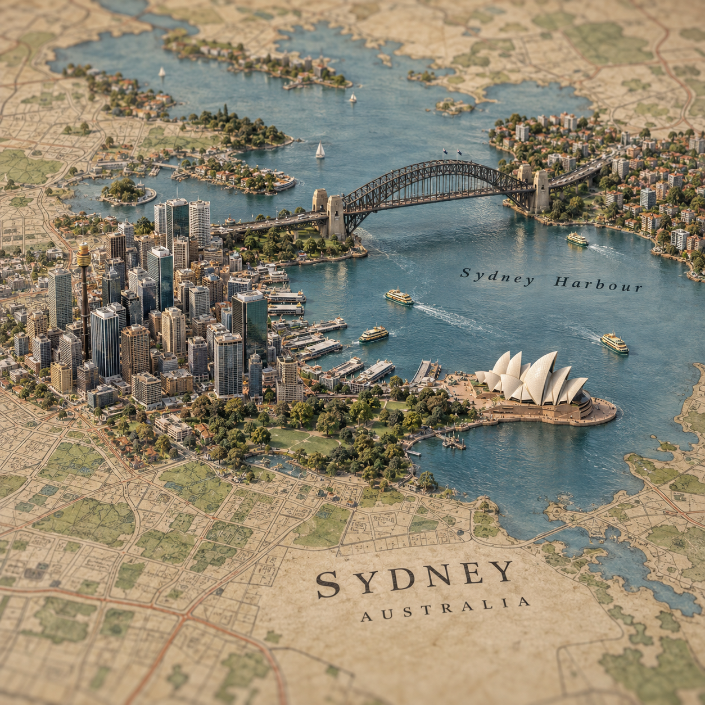

# 地图立体城市

新增[多主题实际生成案例](examples/cases/README.md)，包含提示、图片与复核说明。

输入城市与国家，生成从复古地图中自然升起的写实微缩城市。地图道路、水面和地形与立体景观连续衔接，不是白底模型换一个背景。

## 用法

把完整目录交给具备生图和看图能力的Agent：

> 用city-map-diorama做悉尼、澳大利亚。复古地图，重点是歌剧院和海港大桥，方形构图。

> 做巴黎、法国，让塞纳河从平面地图变成立体水面，再回到地图，不要独立底座。

> 做一座内陆城市的地图微缩，不要为了装饰添加不存在的海湾。

规则见[SKILL.md](SKILL.md)，生成提示见[references/generation.md](references/generation.md)。无厂商绑定、无Python依赖、无命令行工具。它需要图像生成能力，纯文本模型只能准备提示。

## 实际示例

本图从城市主题生成，地图道路和海岸是艺术化表达，不是测绘成果。提示、来源与局限见[示例记录](examples/README.md)。

## 与已有Skill的区别

| Skill | 输入 | 核心输出 |
|---|---|---|
| city-map-diorama | 城市与国家，可选地图参考 | 连续地图表面上升起的微缩城市 |
| photo-miniature-diorama | 原照片 | 保留照片场景身份的白底独立微缩图 |
| photo-to-3d | 原照片，可选深度图 | 深度、视差或浅浮雕网格 |

本Skill不交付3D模型，不保证逐街精确，不替代导航或GIS。当前已检查一个悉尼实例，不能据此声称所有城市与地理关系均已验证。
