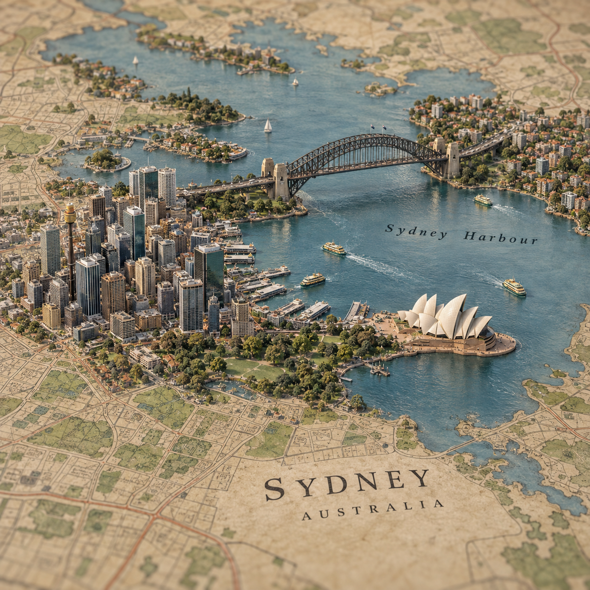

# 地图立体城市

以复古纸质地图为承载面，让道路、水系和地形逐渐升起成为微缩城市。适合城市主题封面和旅行视觉，重点是地图与立体景观的连续过渡，而不是把模型放在地图上。

悉尼主题生成示例，地图关系经过艺术压缩。素材依据与地标核对范围见文末。

## 1. 输入与需求示例

必填城市名称；存在同名歧义时补充国家或地区。可提供重点地标、参考地图、画幅和地图文字语言。执行流程见[SKILL.md](SKILL.md)。

> 为巴黎制作一张方形地图立体城市图。以塞纳河组织画面，突出埃菲尔铁塔，桥梁连接两岸。道路从纸面延续成立体街道，水面向外围逐渐变回地图。采用暖米色纸面和斜俯视，只保留少量准确地名。

默认输出一张1:1图片，采用暖色纸面、柔和光线和三分之四俯视。城市核心清晰，外围保留可辨认的地图，不附动画或3D文件。

## 2. 视觉规格

以下为构图与生成约束，不是程序接口参数。

| 控制项 | 规范 | 作用 |
| --- | --- | --- |
| 构图 | 默认1:1，三分之四俯视 | 中央立体核心与外围平面地图同时可读。 |
| 空间骨架 | 3至5项城市识别线索 | 以地标、街区、水系或地形组织城市，而非堆砌名胜。 |
| 表面过渡 | 道路、水系、地形中至少两类连续变化 | 从印刷图形逐步形成体积，避免独立底座或切割缝。 |
| 文字 | 少量经核对的地名 | 随纸面透视排布，不伪造比例尺和导航信息。 |

## 3. 生成流程

本目录以Markdown执行规范、参考说明和图例组织生成，不含Python像素处理程序。运行环境需具备生图与看图能力；陌生城市的身份核对还需可靠地理资料。

1. 确认城市与国家，选取少量能够建立身份的地标、街区和水体。地标名称与大致连接关系由资料支持，距离压缩属于构图处理。
2. 用河流、海湾、山地或街道网格建立空间骨架。主要建筑可以适度放大，但桥梁需连接两岸，道路与水系需保持连贯。
3. 将平面地图与立体核心组织为同一表面。建筑高度、细节密度和阴影向外围递减，避免完整模型底座。
4. 采用斜俯视显示屋顶、立面与纸面，统一材质和暖光，仅添加少量经过核对的地名。
5. 查看完整构图和地标局部，优先修正道路、水系、地名或地标结构。最多两轮针对性修正，未满足条件的结果保留为候选。

构图分型与衔接规则见[艺术指导](references/art-direction.md)，提示结构见[生成说明](references/generation.md)。

## 4. 结果检查

城市应当从地图表面自然升起，外围建筑高度和细节逐渐递减。出现完整厚底座、环形切割缝或漂浮岛，说明衔接没有做好。地名需逐字核对，不能用模糊文字掩盖错误。

成品是二维艺术图片，不提供GIS坐标、可靠距离、导航精度或可旋转网格。使用真实底图作为参考，也不代表生成后底图保持不变。

## 5. 示例与素材依据

悉尼示例由模型生成。地标选题经过资料核对，但道路、海岸线和距离经过艺术压缩。查看[素材说明与生成提示](examples/README.md)及[其他城市案例](examples/cases/README.md)。
