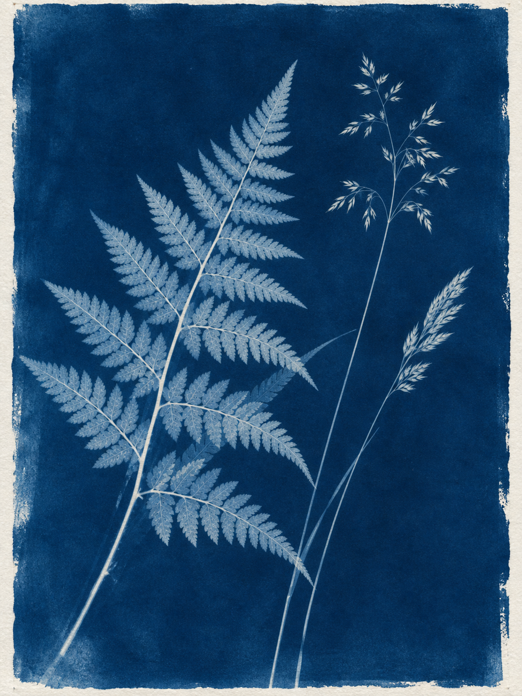

# 蓝晒植物印相

新增[多主题实际生成案例](examples/cases/README.md)，包含提示、图片与复核说明。

将植物主题或植物参考生成普鲁士蓝底、浅色植物光影痕迹的蓝晒接触印相风格图片，强调平面负像、透光层次和感光涂布边缘。适用于艺术植物印相，不用于蓝色滤镜照片、蓝图工程图或植物学鉴定。

## 使用

将完整目录交给能够生图与看图的Agent，输入主题或提供参考：

> 做一张蕨叶与两枝细草的蓝晒印相，深蓝、浅色负像、纸边，无标题。

详细执行规则见[SKILL.md](SKILL.md)。默认直接生成图片，不只返回提示。没有相应工具的纯文本模型只能准备制作规格，不能假装已经生图。

## 实际示例

完整实际提示见[prompt.txt](examples/prompt.txt)。此图为主题生成，不使用他人的照片或艺术作品作素材；保存提示可以复现方向，不保证不同模型逐像素一致。

## 复核与限制

已看到普鲁士蓝、浅色蕨叶及两枝细草、纸纤维和不规则涂布边。没有三维投影或多色拼贴。限制：这是生成的艺术植物形态，不证明蕨类品种或叶序具有植物学准确性。

目前仅完成这一个主题实例的视觉检查，不代表跨主体稳定性已验证。本Skill无脚本、无专属厂商配置，不自动发布或推送。
