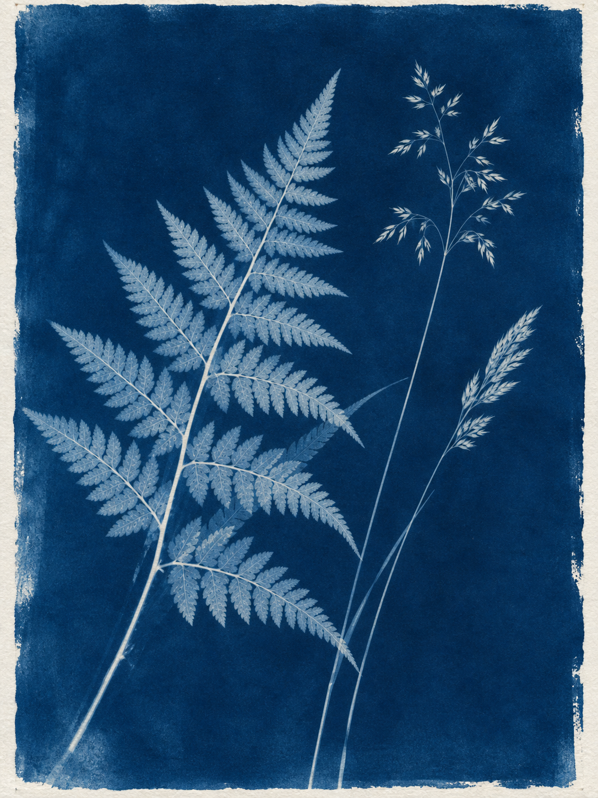

# 蓝晒植物印相

将植物主题或枝叶参考图转为数字蓝晒：深蓝感光底、浅色遮光痕迹、细茎透光和自然纸边。适合植物装饰画和蓝白印相作品。

数字蓝晒生成示例。完整提示与其他植物题材见文末。

## 1. 输入与需求示例

提供植物主题或清晰枝叶参考，可指定主枝方向、植物组数、疏密和纸边处理。执行流程见[SKILL.md](SKILL.md)。

> 用一枝银杏和两枝细草做3:4竖版数字蓝晒。主枝向右上伸展，左侧留较大蓝色空白。植物呈平面遮光负像，细茎略透光，露出不规则感光涂布边缘，不加标题。

默认3:4竖版、1至3组植物、无文字，交付一张蓝晒风格图片。

## 2. 视觉规格

以下为构图与生成约束，不是程序接口参数。

| 控制项 | 规范 | 作用 |
| --- | --- | --- |
| 画幅 | 默认3:4竖版 | 主枝方向与蓝色负空间共同平衡画面。 |
| 植物表现 | 1至3组平面遮光痕迹 | 保留分枝和细茎，不使用白色立体植物。 |
| 曝光层次 | 深蓝底，白至浅蓝植物痕迹 | 通过薄叶和重叠处的透光差异形成层次。 |
| 纸面 | 棉纸纤维，不规则涂布边缘 | 材料痕迹克制，不扩展为多色印刷或装饰拼贴。 |

## 3. 印相视觉构建

本目录使用Markdown指令组织数字印相生成，不含Python滤镜或实际化学冲印程序。输入照片时，需要可读取参考图的图像生成能力。

1. 从参考中确定主枝、分枝和叶片轮廓，区分必须保留的结构与可简化的细节。
2. 按主枝方向与疏密安排画面，用大面积蓝色负空间平衡植物，不默认对称或堆成花束。
3. 以曝光和遮光关系重构形体：背景为深蓝，遮挡区为浅色，细薄组织与重叠位置形成不同透光层次。
4. 添加棉纸纤维和不规则感光涂布边缘。质感来自纸面与印相关系，不叠加多色印刷、霓虹描边或立体植物阴影。
5. 对照参考检查枝叶连贯与细茎完整性，局部问题只修对应枝条，最多两轮修正。

植物名称用于确定主题，不自动提供准确分类结构；需要特定叶序或分枝时，以清晰参考为依据。

## 4. 交付与质量控制

### 4.1 交付与质量判断

交付一张蓝晒风格图片。先检查蓝白曝光关系，再检查枝叶、细茎和重叠。植物应保持平面痕迹，局部清晰度可有变化，但不能以全幅虚化替代细节。

如果结果像白色植物雕塑，需修正体积与投影；如果像水彩，需回到遮光痕迹与纸面逻辑。增加蓝色饱和度不能解决这两类结构问题。

### 4.2 使用边界

结果是数字生成，不验证植物物种，也不提供药液、曝光时间或冲洗工艺。生成可能改变叶脉和叶序。文字环境仅交付提示词，生图但未查看的结果需标记待复核。

## 5. 示例与素材依据

图片为生成式作品，不是实际化学印相。查看[本例提示](examples/prompt.txt)及[银杏、草穗等案例](examples/cases/README.md)。
