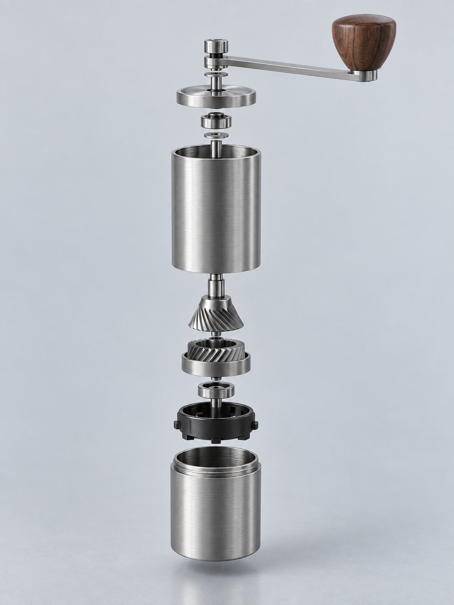

# 工业产品爆炸图

新增[多主题实际生成案例](examples/cases/README.md)，包含提示、图片与复核说明。

将产品概念、物件照片或结构资料转为克制精密的工业产品爆炸视图，强调部件层级、共同装配轴与真实材质。适用于产品结构展示和概念设计图，不用于制造图纸、维修指令或未知内部结构的真实复原。

## 使用

将完整目录交给能够生图与看图的Agent，输入主题或提供参考：

> 做一个手摇咖啡磨豆器的概念爆炸图，金属和胡桃木材质，无文字，不作为制造图。

详细执行规则见[SKILL.md](SKILL.md)。默认直接生成图片，不只返回提示。没有相应工具的纯文本模型只能准备制作规格，不能假装已经生图。

## 实际示例

完整实际提示见[prompt.txt](examples/prompt.txt)。此图为主题生成，不使用他人的照片或艺术作品作素材；保存提示可以复现方向，不保证不同模型逐像素一致。

## 复核与限制

已看到共同纵轴、分离外壳、手柄、锥形刀盘和接粉杯，金属与木材有清楚区别。限制：内部组件来自概念生成，轴系与支撑关系没有工程资料验证；只作为工业视觉示例，不标为真实结构通过。

目前仅完成这一个主题实例的视觉检查，不代表跨主体稳定性已验证。本Skill无脚本、无专属厂商配置，不自动发布或推送。
