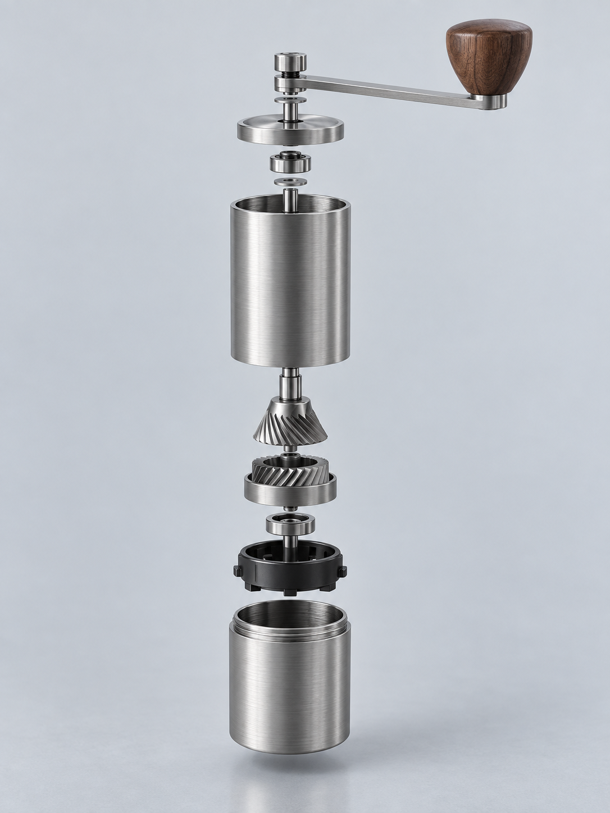

# 工业产品爆炸图

将物件照片、产品概念或结构资料转为组件分离的概念展示图。用共同装配轴、适当间距和统一材质说明结构层级，适合产品视觉与设计提案。

概念爆炸图生成示例，不作为真实装配依据。提示及各产品案例见文末。

## 1. 输入与需求示例

提供产品概念、物件照片或结构资料。要求准确装配关系时，需有剖面图、零件清单等结构证据；外观照仅支持可见组件或概念拆解。执行流程见[SKILL.md](SKILL.md)。

> 根据这份手电筒结构资料生成3:4竖版爆炸图。沿筒身纵轴展开灯头、透镜、反光杯、电路、电池和尾盖，保持装配次序与孔位对应。采用近似正交的三分之四视角、浅冷灰背景，不添加尺寸或文字标签。

默认输出一张无字图片，不输出CAD、工程尺寸或零件文件。

## 2. 视觉规格

以下为构图与生成约束，不是程序接口参数。

| 控制项 | 规范 | 作用 |
| --- | --- | --- |
| 视角 | 默认3:4，近似正交三分之四视角 | 兼顾组件厚度、孔位与整体层级。 |
| 组件组织 | 5至9个有解释价值的组件组 | 展开方向由装配关系决定，可按子组件分组。 |
| 空间关系 | 共享轴线与清晰间隙 | 保留次序、比例和连接逻辑，不靠增加零件制造复杂感。 |
| 材质 | 统一照明下的金属、玻璃等材料 | 边缘和高光服务结构识读。 |
| 标注 | 默认无字 | 仅使用已确认零件名，不生成工程尺寸或认证信息。 |

## 3. 生成流程

本目录以Markdown结构分析与生成指令制作概念图片，没有CAD建模或Python拆解程序。结构资料的证据等级决定结果能说明到什么程度。

1. 区分外观可确认、资料明确和需要推测的组件。仅有外观照时，内部构造必须保持概念属性。
2. 选择外壳、功能组件、连接件与基座等5至9个主要组件组，避免无解释价值的螺丝堆叠。
3. 按实际开合或装配方向展开。圆柱结构沿纵轴，复杂物件可按子组件分组，不强制所有部件排成竖列。
4. 使用统一镜头、比例、材质与照明，保留孔位对应、共同轴线和组件之间的可读间隙。
5. 根据原始资料核对组件数量和连接关系，关键错误优先局部修正，最多两轮，不通过新增零件掩盖漏拆或重复。

有文字需求时，只采用已确认零件名，并另行检查引线和字形；默认不输出标签。

## 4. 交付与质量控制

### 4.1 交付与质量判断

默认交付一张3:4概念爆炸图。先检查结构是否可读，再检查材料表现。相连子组件可以保留连接，但与下一组件组之间应有可辨空隙；不能仅凭颜色变化认定已完成拆解。

金属高光、玻璃厚度与倒角应服从统一照明。零件孔位、轴线与数量优先于精密纹理，材质漂亮不能抵消装配关系错误。

### 4.2 使用边界

图片不包含可制造尺寸、公差或真实CAD数据。没有结构资料时不作为维修、制造或安全依据；资料驱动的生成也需逐项对照，不能因外观可信而自动认定机械结构正确。

## 5. 示例与素材依据

示例是生成的概念结构图。查看[生成提示](examples/prompt.txt)及[手电筒、钢笔等案例](examples/cases/README.md)，不能据此推断产品内部真实结构。
