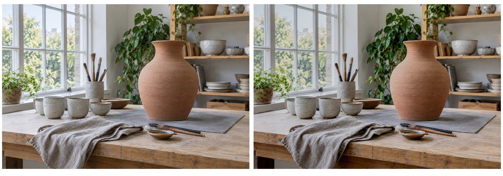
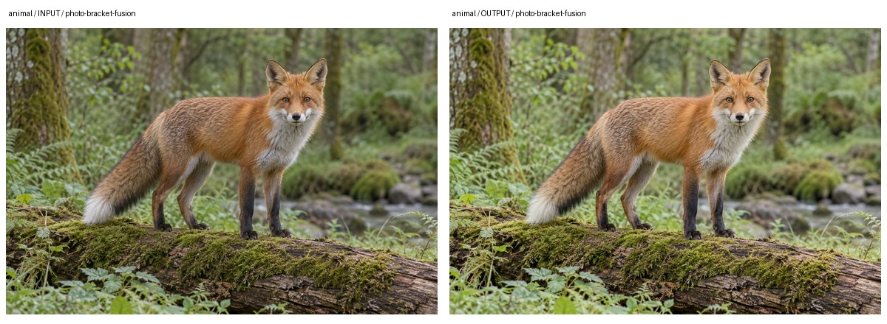
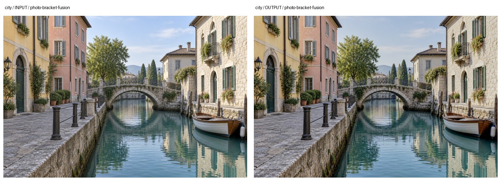
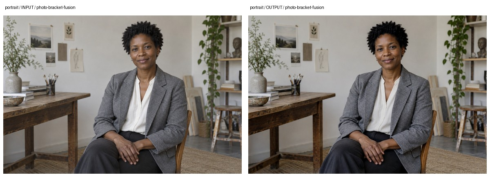

# 包围曝光融合

将同一视角的多张真实曝光照片融合为一张显示用图片。利用不同曝光中已有的细节，兼顾亮部和暗部，不从单张照片生成虚构曝光。



图示为随附案例的实际处理输出。素材、参数和验证范围见文末。

## 1. 输入要求

输入至少两张同一视角的真实曝光照片。各帧需包含有效曝光差异，曝光时间按照片顺序提供；相机移动与主体运动会增加配准风险。执行规范见[SKILL.md](SKILL.md)。

> 融合这组真实包围曝光照片。先检查配准和局部运动，保留自然对比，不做过强HDR效果。运动区域优先参考帧，输出风险图供我复核。

## 2. 处理流程与依赖

[photo_bracket_fusion.py](scripts/photo_bracket_fusion.py)执行显示空间曝光融合。它使用多帧已有信息，不从单张图预测新的亮暗细节。

1. 检查帧数、路径、尺寸、曝光关系与输入重复情况，确认各帧包含有效互补信息。
2. 根据曝光和画面信息选取参考帧，通过AlignMTB与相位相关候选估计平移，评估共同有效区域与配准质量。
3. 对帧间亮度差异做光度补偿后估计运动风险，避免直接把正常曝光变化视为物体移动。
4. 使用MergeMertens按对比度、饱和度和曝光适宜度融合。
5. 按运动策略处理高风险区域并输出风险图，供用户核对运动人物、树叶和水面。

NumPy处理多帧数组与风险计算，OpenCV执行配准与Mertens融合，Pillow负责读写和联系表。运行要求为Python3.10+，版本见[requirements.txt](requirements.txt)。

## 3. 核心接口与参数

`analyze_bracket`检查曝光关系、配准与风险，返回`blockers`；无阻断项后使用`fuse_bracket`生成融合结果。

下表列出关键参数。默认值与当前接口定义一致，完整参数以源码为准。

| 参数 | 默认值或要求 | 说明 |
| --- | --- | --- |
| `exposure_times` | `None` | 与输入一一对应的曝光秒数；有可靠数据时显式提供。 |
| `motion_handling` | `reference-frame` | 融合接口的运动处理策略，风险区域使用参考帧约束。 |

## 4. 调用示例

以下代码在本skill根目录的Python会话中运行，直接调用处理接口：

```python
from pathlib import Path
import sys

sys.path.insert(0, str(Path("scripts").resolve()))
from photo_bracket_fusion import analyze_bracket, fuse_bracket

photos = ["dark.jpg", "middle.jpg", "bright.jpg"]
exposure_times = [0.005, 0.01, 0.02]

analysis = analyze_bracket(photos, exposure_times=exposure_times)
if not analysis["blockers"]:
    result = fuse_bracket(
        photos, "fusion-review",
        exposure_times=exposure_times,
        motion_handling="reference-frame",
    )
```

曝光时间单位为秒，应替换为真实值。示例先调用`analyze_bracket`，遇到阻断项不融合；通过后调用`fuse_bracket`并采用参考帧运动处理。见[调用示例](examples/basic_usage.py)与[图片复现函数](examples/reproduce.py)。

## 5. 交付文件与质量控制

### 5.1 文件与结果解释

- `exposure_fused_16bit.tif`：融合结果，16位保存不表示源图新增了真实动态范围。
- `exposure_fused_preview.jpg`：显示预览。
- `ghost_risk_mask.png`与`alignment_contact_sheet.jpg`：运动风险及对齐情况。
- `bracket_fusion_report.json`：曝光来源、配准和处理记录。

### 5.2 参数选择与失败条件

`motion_handling`可选reference-frame或report-only。前者在风险区域采用参考帧约束，后者仅报告风险，不能视为已经去除重影。曝光秒数需为正值，并与输入一一对应。

出现阻断项时不融合。曝光剪切覆盖所有帧、明显视差或非平移运动时，已有处理未必能恢复细节。该结果不是经标定的场景辐射HDR，文件位深和真实记录范围应分开解释。

## 6. 示例与应用

### 6.1 基础案例

基础示例从同一生成底图模拟3档曝光，再执行实际配准与融合。它用于验证受控处理路径，不能证明真实高动态范围恢复。查看[曝光构造与风险记录](examples/README.md)及[其他题材案例](examples/cases/README.md)。

### 6.2 多题材实际对照

下列图片来自仓库已有处理记录。输入为独立生成的合成摄影素材，对照板仅缩放排版；示例不等同于实拍验收。

| 动物 | 城市 | 人物 |
| --- | --- | --- |
|  |  |  |

实际设置：由同一生成底图在线性光中模拟-1、0、+1EV，并提供模拟曝光比。案例经光度补偿后，静态运动比例为0。

| 题材 | 看图重点 |
| --- | --- |
| 动物 | 观察动物轮廓与暗部，验证融合路径，不证明运动动物不会重影。 |
| 城市 | 观察天空、建筑高光和接缝；已截白区域无法凭融合恢复。 |
| 人物 | 观察人物边缘与面部层次；模拟静态序列不覆盖人物真实移动。 |

验证范围：模拟曝光没有增加底图中原本不存在的信息，不能证明真实拍摄的动态范围恢复或运动处理效果。

输入、输出与复现方式见[案例记录](examples/cases/README.md)及[实际调用](examples/cases/reproduce.py)。报告中的待复核、阻断与警告状态均应保留，不能以程序执行成功代替质量验收。

### 6.3 应用请求示例

以下请求用于新任务，不是上面案例的实际调用记录。应按自有素材、处理目标与确认状态调整。

#### 6.3.1 静态室内窗景

> 融合这组真实拍摄的室内包围曝光照片，曝光时间按文件顺序提供。保留窗外亮部与室内暗部的自然层次，先检查配准和运动，输出风险图，不生成虚构曝光帧。

复核重点：检查各源帧是否真实包含互补细节，并确认窗框附近没有重影或过度局部对比。

#### 6.3.2 有人经过的建筑曝光组

> 检查这组建筑包围曝光，其中有人经过。先报告运动区域和参考帧选择，运动部位优先保留参考帧；若配准或运动风险过大，暂不把结果作为成片。

复核重点：检查人物数量、位置和轮廓，不能把融合后出现的重复人影当作正常细节。
