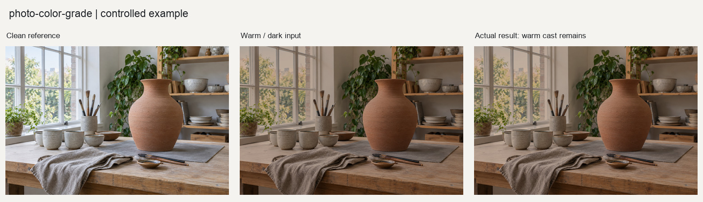

# photo-color-grade

## 功能定位

完成非生成式全局校色和调色，包括曝光、白平衡、曲线、综合色偏、饱和度、参考色彩关系和系列统一。它不处理空间蒙版、降噪、裁切或内容生成。

## 四种模式

- `correct`：只修正技术性偏差
- `look`：在技术底片上建立明确风格
- `match`：匹配参考图的色彩关系
- `series`：以确认锚片统一一组照片

## 输入与输出

输入为照片，`match`还需要参考图，`series`还需要锚片。输出包括预览对照板、成片、配方JSON和验证JSON，原图不覆盖。

## 使用示例

技术校色示例见[`examples/basic_usage.py`](examples/basic_usage.py)：

```python
result = run_example("source.tif", "grade-review")
```

## 图片示例

[输入、参数、实际输出及验证边界](examples/README.md)。随附[可复现调用](examples/reproduce.py)，不是只有调用占位符。



## 验收重点

- 先看预览再确认最终强度
- 不把日落、舞台灯和霓虹错误中和
- 技术校色与创意参数必须分层记录
- 最终状态在视觉检查前保持`review_required`

完整工作流和按模式参考资料见[`SKILL.md`](SKILL.md)。
