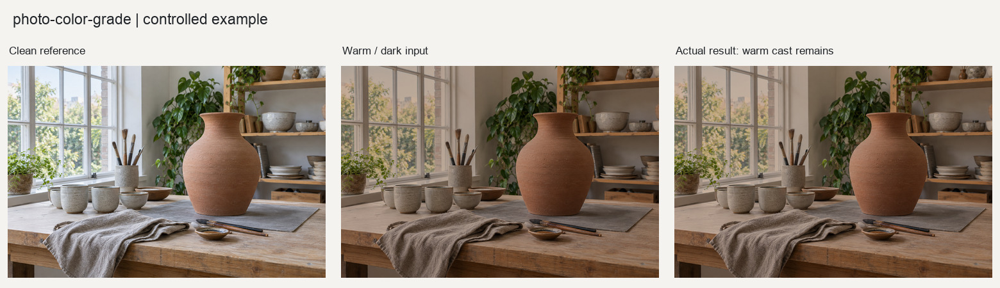
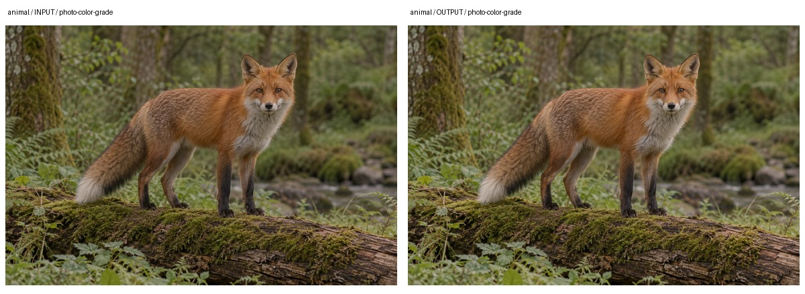
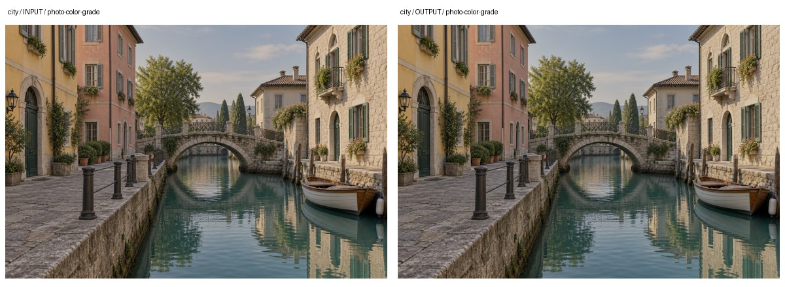
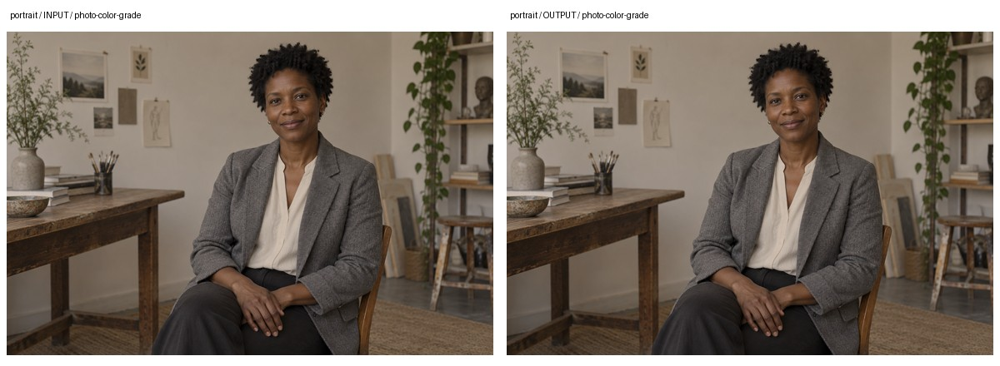

# 照片校色与风格调色

调整照片的白平衡、曝光和色彩关系，可用于技术校色、风格配方、参考图匹配及组照统一。处理现有像素，不调用生图模型重绘内容。



图示为随附案例的实际处理输出。素材、参数和验证范围见文末。

## 1. 输入要求

输入为照片及校色目标。准确校色需有可信中性区域或校准参照；参考匹配需额外提供参考照片；组照处理需指定锚定照片。执行规范见[SKILL.md](SKILL.md)。

> 先检查这张照片的白平衡和曝光，生成技术校色预览。保留夕阳本身的暖色，不把自然光色全部消除。若自动判断置信度不足，请保留原色并说明原因。

## 2. 处理流程与依赖

入口为[photo_color_grade.py](scripts/photo_color_grade.py)，像素运算集中在[color_engine.py](scripts/color_engine.py)。技术校色、人工校准、创意调色和参考匹配分别记录处理依据。

1. 读取图片、方向、位深、EXIF和ICC信息，分析亮度、剪切、综合色偏与饱和度。
2. `correct`从可靠的低饱和中间调估计白平衡，并限制通道增益与曝光变化。低置信度时保留现场光色，不强行中和夕阳、舞台灯或暖灯。
3. 已知曝光或通道偏差时使用`calibrate_photo`。用户给定增益或中性区域是校准依据，不与自动场景猜测混为一谈。
4. `look`在技术底片上应用风格配方；`match`按参考图的Lab统计关系进行有限强度匹配，不复制其内容或逐像素颜色。
5. 预览提供不同强度对照，确认后输出成片；组照通过`grade_series`以锚定照片建立统一关系，保留不同现场光线的合理差异。

NumPy处理数组与颜色数值，OpenCV进行颜色空间转换和图像运算，Pillow处理常见格式与元数据，tifffile支持TIFF读写。RAW另需rawpy。运行要求为Python3.10+，版本见[requirements.txt](requirements.txt)，方法分别见[技术校色](references/correction.md)、[创意调色](references/creative-grading.md)、[参考匹配](references/reference-matching.md)及[色彩管理](references/color-management.md)。

## 3. 核心接口与参数

`analyze_photo`分析输入；`build_preview`生成预览；`grade_photo`另存成片。`calibrate_photo`处理已确认的校准参数，`grade_series`处理以锚定图为基准的组照。

下表列出关键参数。默认值与当前接口定义一致，完整参数以源码为准。

| 参数 | 默认值或要求 | 说明 |
| --- | --- | --- |
| `mode` | 因接口而异 | `build_preview`默认`look`，`grade_photo`默认`correct`；调用时显式指定。 |
| `look` | `natural-clean` | 风格配方名称。 |
| `strength` | `1.0` | 成片接口的处理强度；预览接口不接受此参数。 |
| `reference_path` | `None` | 参考图路径，供匹配流程使用。 |
| `anchor_path` | 组照必填 | `grade_series`的锚定照片。 |

## 4. 调用示例

以下代码在本skill根目录的Python会话中运行，直接调用处理接口：

```python
from pathlib import Path
import sys

sys.path.insert(0, str(Path("scripts").resolve()))
from photo_color_grade import analyze_photo, build_preview

analysis = analyze_photo("photo.jpg")
preview = build_preview(
    "photo.jpg", "grade-preview", mode="correct"
)
```

预览确认后调用`grade_photo`另存成片。`calibrate_photo`和`grade_series`分别用于校准与组照；调用方式见[调用示例](examples/basic_usage.py)，展示图片的实际调用见[reproduce.py](examples/reproduce.py)。

## 5. 交付文件与质量控制

### 5.1 文件与结果解释

预览对照板用于确认方向和强度；成片另存，并附`recipe.json`与`validation.json`记录处理方案及检查结果。技术校色和创意调整的目的应在记录中分开，不能把风格偏色描述为恢复真实色彩。

### 5.2 参数选择与失败条件

单张成片接口的`mode`只接受correct、look和match；系列统一通过`grade_series`调用，series不是该参数的合法值。`available_looks`可查询当前配方，不能使用未经定义的名称。match缺少参考图时拒绝处理。

准确校色优先采用已确认的校准信息。中性采样区域被剪切、受彩色光污染或不是中性物体时，不能继续作为可靠参照。检查肤色、中性色、高光渐变及色阶断层；输出成功不等于色彩准确。

## 6. 示例与应用

### 6.1 基础案例

基础示例人为加入暖偏色和欠亮。自动白平衡置信度不足，程序未强行纠偏，仅小幅提亮；结果没有完整恢复基准颜色。这是保守校色的边界案例，不是成功复原示范。查看[参数与结果](examples/README.md)、[校准示例](examples/calibration/README.md)及[其他题材案例](examples/cases/README.md)。

### 6.2 多题材实际对照

下列图片来自仓库已有处理记录。输入为独立生成的合成摄影素材，对照板仅缩放排版；示例不等同于实拍验收。

| 动物 | 城市 | 人物 |
| --- | --- | --- |
|  |  |  |

实际设置：每组分别运行保守自动校色与风格配方。动物为natural-clean，城市为cool-urban，人物为warm-documentary，风格强度均为0.7。

对照板仅展示所选处理结果，不应解释为两种模式的共同结果。各案例目录分别保存技术校色与风格调色输出，可查看以下原尺寸文件：

| 题材 | 技术校色 | 风格调色 |
| --- | --- | --- |
| 动物 | [校色结果](examples/cases/animal/output/correct/degraded_corrected.png) | [natural-clean](examples/cases/animal/output/look/source_graded-natural-clean.png) |
| 城市 | [校色结果](examples/cases/city/output/correct/degraded_corrected.png) | [cool-urban](examples/cases/city/output/look/source_graded-cool-urban.png) |
| 人物 | [校色结果](examples/cases/portrait/output/correct/degraded_corrected.png) | [warm-documentary](examples/cases/portrait/output/look/source_graded-warm-documentary.png) |

| 题材 | 看图重点 |
| --- | --- |
| 动物 | 观察动物颜色与植被层次，区分曝光调整和风格性颜色变化。 |
| 城市 | 观察冷色建筑、天空与暖色灯光，避免用全局冷色覆盖全部色彩关系。 |
| 人物 | 观察肤色与环境暖光，判断暖色配方是否改变人物颜色判断。 |

验证范围：自动校色不保证逆转已知偏色。需要精确恢复时，应提供可信校准参数；已有[校准案例](examples/calibration/README.md)记录了已知曝光与通道增益的处理。

输入、输出与复现方式见[案例记录](examples/cases/README.md)及[实际调用](examples/cases/reproduce.py)。报告中的待复核、阻断与警告状态均应保留，不能以程序执行成功代替质量验收。

### 6.3 应用请求示例

以下请求用于新任务，不是上面案例的实际调用记录。应按自有素材、处理目标与确认状态调整。

#### 6.3.1 有中性参照的校色

> 校正这张含灰卡参照的照片，先确认参照区域可信，再调整白平衡和曝光。提供技术校色结果，不叠加创意风格；置信度不足时说明原因，保留原图。

复核重点：先看中性区域是否中性，再看主体颜色和高光是否合理，不能以主观好看替代校色依据。

#### 6.3.2 城市冷色调色

> 为这张城市照片生成cool-urban预览，先用0.7强度。保留暖窗灯与冷天空的区分，不把整幅统一染蓝，输出对照并记录实际配方。

复核重点：比较原图与调色图的色彩分工、暗部层次和建筑细节；这属于风格处理，不是颜色复原。
