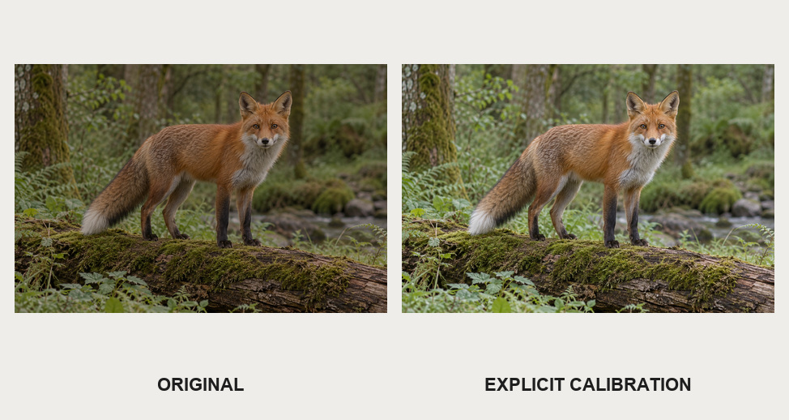
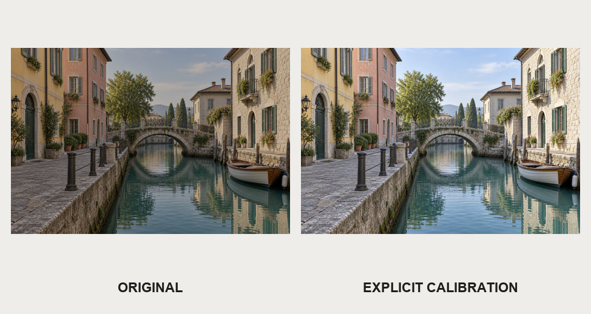
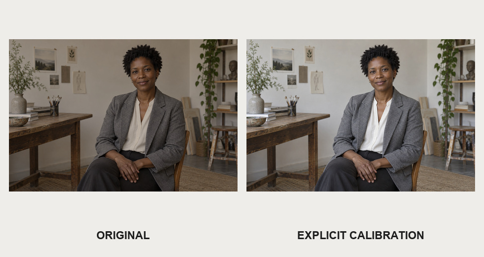

# 已知偏差的人工校准

三张合成摄影底图在线性RGB中降低1EV，并施加1.15、1、0.85通道增益。通过明确相反参数调用calibrate_photo，不猜测场景中性色。相对已知参考的PSNR分别为动物53.162dB、城市53.197dB、人物53.029dB；该指标只验证受控偏差还原，不是普遍画质评分。

调用[reproduce.py](reproduce.py)中的reproduce_case，题材可选animal、city、portrait，输出目录需不存在。各目录包含input.png、reference.png和实际输出。输出仍要求视觉复核，本地测试记录不随Skill发布。

