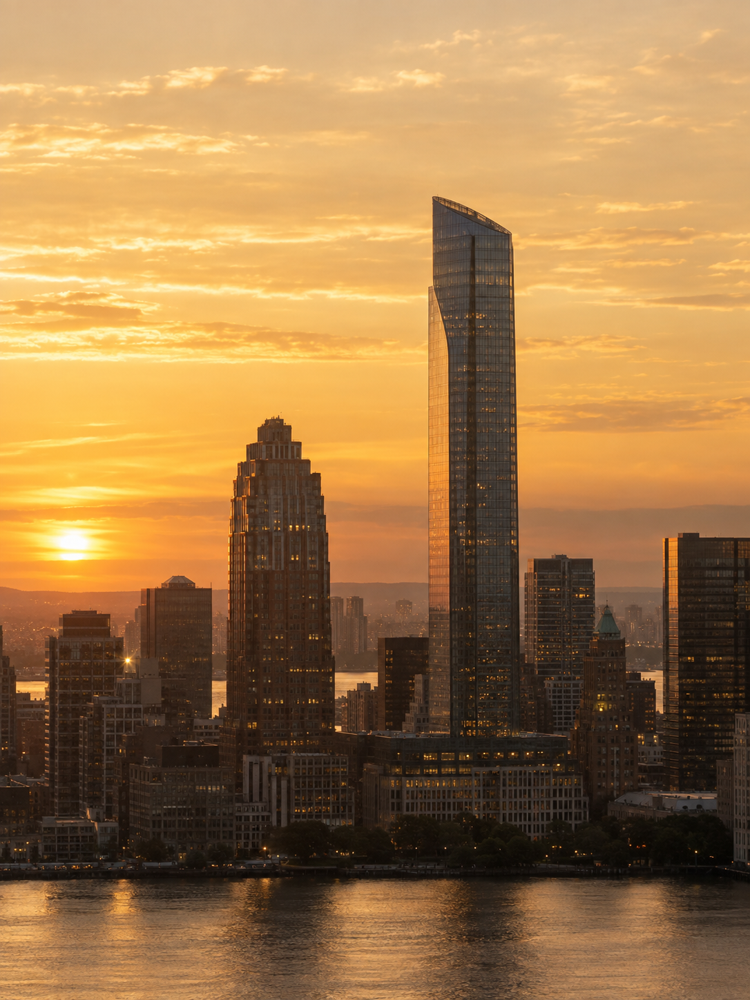
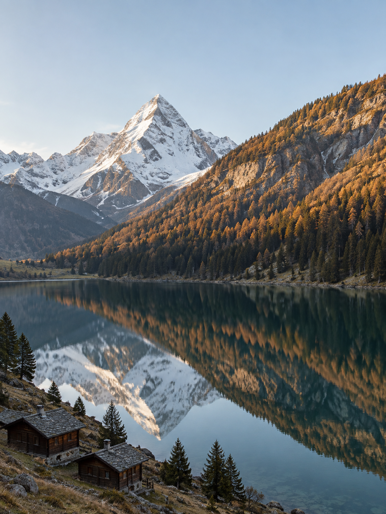
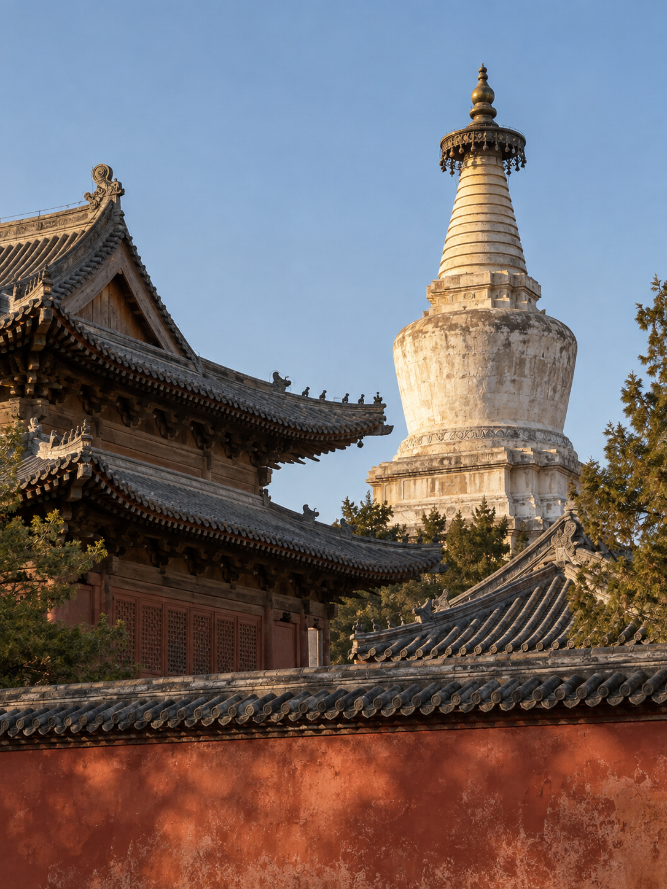

# 照片横向色带重构

将照片主体保留为清晰的摄影区域，把周围背景重构为连续的水平色带。目标是细密、平滑的颜色拉丝，同时保留建筑轮廓、山体层次或湖面倒影。

| 城市建筑 | 山水倒影 | 传统建筑 |
| --- | --- | --- |
|  |  |  |

图示记录初版效果；当前加强的拉丝与背景连续性要求尚未完成新一轮出图验证。

## 1. 输入与需求示例

必需原照；可选局部纹理或配色参考。需说明必须保留的主体和空间关系，以及辅助参考仅影响材质、颜色还是构图。执行流程见[SKILL.md](SKILL.md)。

> 用这张雪山湖泊照片做横向色带重构。山体、岸线和倒影保持为连续摄影区域，上缘沿山脊起伏。背景自上而下对应原照的银灰、雾蓝、深青和少量金棕色，形成细密、不等距的横向拉丝。顶部与两侧属于同一个连续背景，不做装饰边条。保留完整构图，不加文字或边框。

默认沿用原照比例，另存结果，不覆盖输入。不需要先制作精确蒙版；主体复杂时，应明确必须保留的轮廓和空间关系。

## 2. 视觉规格

以下为构图与生成约束，不是程序接口参数。

| 控制项 | 规范 | 作用 |
| --- | --- | --- |
| 画幅 | 默认沿用原照比例 | 不为增加背景面积而裁掉关键主体。 |
| 摄影区域 | 建筑轮廓或连续山水区域 | 保留塔尖、屋脊、山体和倒影的主要关系。 |
| 背景结构 | 宽色域与不等距细丝 | 粗细、疏密与明暗变化不机械重复。 |
| 颜色组织 | 对应原照自上而下的颜色层次 | 局部参考仅补充色彩关系，不强制统一为蓝金色。 |
| 连续性 | 顶部与两侧属于同一背景 | 同高度自然对接，不形成独立装饰边条。 |
| 材质 | 平滑横向颜色拖曳 | 亮线无自发光，暗部有颜色，避免金属或织物纹理。 |

## 3. 色带材质与颜色组织

宽色域确定整体冷暖和明暗，条带承接场景层次，细丝提供近距离纹理。三者需要同时存在：只有宽色域会退化为渐变，只有细线则容易形成条码或光轨。

背景颜色按原照的高度关系展开，不使用全图平均色替代分层。指定配色参考时，先判断冷暖、饱和度和暖色占比，再映射到当前场景。没有取样工具时仅描述可观察的颜色关系，不编造精确色值。

## 4. 生成流程

本目录使用Markdown规则指导参考图生成，没有Python逐行取样或真实像素拉伸程序。摄影主体保留是生成目标，不是逐像素锁定承诺。

1. 区分原照与辅助参考。原照提供身份、结构、光线和细节；局部裁片只提供指定纹理与颜色，不能把其狭长比例误用为成品画幅。
2. 记录主体数量、轮廓、位置、遮挡与倒影，划定连贯摄影区域。建筑沿屋脊与塔尖形成上缘；山水保留山体、岸线与倒影整体。
3. 将画面组织为全幅连续拉丝背景与其前方摄影区域。这里是视觉层级，不要求工具实际输出可编辑图层。
4. 把原照或参考的冷暖、浅中深关系映射到相应高度，仅在可修改背景中生成细丝。工具支持可靠蒙版时，可限制背景范围。
5. 先检查完整构图，再检查拉丝局部与主体纹理。最多两轮定向修正，每轮优先处理一个主要失败原因，保留已合格区域。

## 5. 交付与质量控制

### 5.1 分项验收

背景材质、主体摄影质感和整体构图分别检查。背景需呈现宽色域、条带和细丝三个尺度；主体需保留可辨的数量、比例、纹理和遮挡；整体需保持原画幅与自然轮廓穿插。

在主体上方与两侧选取数个高度，检查色带是否可以横向对接。局部直切仅定义摄影区域结束位置，不应沿该位置向上形成背景竖缝。窗格、瓦片、山石和树叶即使边缘清晰，也需排除绘画化。

### 5.2 常见偏差与修正

| 偏差 | 判断依据 | 修正方向 |
| --- | --- | --- |
| 色块或渐变过平 | 缺少中尺度条带与近色细丝 | 增加色域内部层次，不加全图噪点。 |
| 扫描线或条码 | 线宽、间距和反差机械重复 | 打散规律，降低细线反差，保留宽色域。 |
| 霓虹光轨 | 孤立亮线发光或出现泛光 | 使亮线回到源图亮部色阶。 |
| 三栏相框 | 顶部与两侧独立，背景出现竖缝 | 重建同一连续色场，不压窄主体。 |
| 主体绘画化 | 细节清楚但失去摄影材料表现 | 回到原照约束主体，仅限定背景修改。 |
| 白边或光晕 | 轮廓存在额外描边 | 局部修边，不模糊全图。 |

仅背景合格的结果属于材质候选，不能标为完成。细丝在缩略图中可能出现显示摩尔纹，验收应查看完整尺寸。

## 6. 适用边界

生成模型可能改变细小文字、窗格、人物和建筑细节，不保证逐像素保真。复杂枝叶、透明体与反射更容易发生边界错误，不适用于证据图或测绘记录。

只有文字能力时交付提示词，并注明未生成图片；不能把提示词当作成品。当前示例也不证明跨模型表现一致。

## 7. 示例与使用场景

示例分为图片案例和请求示例。图片案例保留已有输入、输出与当时的复核结论；请求示例说明新任务如何准备素材、限定修改范围和判断结果，不代表已完成生图。

### 7.1 图片案例

以下3组输入均为独立生成的虚构摄影场景。成品记录初版效果；当前加强的细密拉丝与背景连续性要求，仍需在实际生成中重新验收。完整提示及历史记录见[示例说明](examples/README.md)。

#### 7.1.1 城市建筑：保留天际线，展开暖色层次

| 输入 | 初版输出 |
| --- | --- |
|  |  |

保留对象为斜顶高楼、左侧阶梯塔楼和前景建筑。摄影区域的上缘随建筑轮廓变化，天空与周围背景形成水平色带。

颜色组织依据原图的夕阳层次，从浅金、金棕向较深的建筑背景过渡。塔尖与屋顶应从拉丝中突出，而不是整座建筑被模糊成条纹。

历史记录中，主楼位置与形状可辨，但背景金色和窗灯亮度有变化，保留的摄影区域也比提示要求更宽。该例用于展示轮廓与暖色拉丝，不证明建筑细节或主体曝光完全不变。

[本例实际生成提示](examples/city/prompts.md)

#### 7.1.2 山水倒影：保留连续场景，组织冷暖色域

| 输入 | 初版输出 |
| --- | --- |
|  |  |

山体、树林、岸线、湖面与倒影作为连续摄影区域保留。上缘沿山脊起伏，侧边可以局部直切，但不能切断倒影或核心山体。

颜色依次承接天空蓝灰、雪面浅色、山坡金棕与湖水深青。暖色只占局部层次，不需要将整个背景统一染成蓝金配色。

历史记录中，山体与倒影连贯，侧切边缘明确；左上仍有局部直角边界，树林色彩也更浓。该例可用于理解冷暖分层，但不能作为最新背景连续性规则全部通过的证明。

[本例实际生成提示](examples/mountain/prompts.md)

#### 7.1.3 传统建筑：保留塔尖与屋檐，避免碎片化抠图

| 输入 | 初版输出 |
| --- | --- |
|  |  |

保留白塔、层叠屋顶、右下屋檐和红墙的遮挡关系。复杂建筑宜扩大连贯摄影区域，不把每栋建筑拆成带描边的独立贴片。

蓝灰天空与灰棕建筑背景形成宽细交替的色带，红墙仍作为摄影内容承托画面。塔尖、屋脊和檐口是边界复核的重点。

历史记录中，主体关系可辨，但下部保留了较多完整摄影内容，红墙底部有轻微横向延展，石材与植物纹理也存在生成变化。该例不保证古建筑的精确形制和细节。

[本例实际生成提示](examples/temple/prompts.md)

### 7.2 新题材请求示例

以下为可提交给模型的使用请求，尚未附对应新增成品。颜色描述应按实际原照调整，不能直接套用到所有照片。

#### 7.2.1 海岸灯塔

适合天空、灯塔、岸线与海面层次较清楚的照片。灯塔与前景岩石构成摄影主体，远处天空和海面背景用于横向延展。

> 将这张海岸灯塔照片制作成横向色带重构图。保留单座灯塔、前景岩石、岸线和海面的空间关系，保持灯塔原有位置与比例。背景按原照自上而下的浅灰天空、蓝灰远海和较深海面展开，在宽色域内形成疏密不同的细丝。不要增加夕阳或将海面改为发光纹理。摄影区域边缘清楚，无白边，沿用原画幅。

重点检查灯塔是否完整、海平线是否错位，以及背景露出部分是否仍属于同一色场。海面存在复杂反射时，扩大保留区域，不强行细抠浪花。

#### 7.2.2 夜间城市

适合主体楼体轮廓可辨、照明关系明确的夜景。色带应表现原图灯光的颜色延展，不把所有细丝变成霓虹光轨。

> 将这张夜景照片的背景重构为细密横向拉丝。保留主楼、前景道路和原有灯光方向，不移动建筑，不放大或压窄主体。背景以原照的深蓝灰、近黑和少量暖窗灯色组织明暗，亮线来自照片中的亮部颜色，不自发光、不加泛光。暗色区域仍有细小层次，不能糊成黑块。顶部与两侧连续，不添加文字。

重点检查窗灯是否重复、楼体是否变形、暗部是否仍有层次。只有文字要求锁定标牌时，需要逐字复核，不能承诺生成后字样完全不变。

#### 7.2.3 秋季树林与湖岸

适合岸线、树群和倒影形成明确层次的照片。密集枝叶作为连贯区域保留，背景颜色来自树冠与水面，而不是逐片树叶重绘。

> 将这张秋季湖岸照片做成摄影主体与横向拉丝融合的图片。树群、岸线和倒影保持连续，保留原有树木数量关系与主要轮廓，不把密集枝叶抠成碎片。背景沿原照高度展开浅灰天空、克制的赭金与橄榄色、深绿湖面，细丝粗细与间距自然变化。只改背景，保持主体颜色和摄影纹理，沿用原比例。

重点检查枝叶是否出现涂抹、倒影是否断裂，以及暖色是否过度扩散到整幅画面。无法自然处理细枝边缘时，应保留更完整的摄影区域。

### 7.3 控制修改范围

#### 7.3.1 仅增强拉丝质感

适用于已有构图合适，但背景过平、纹理过粗或出现等距扫描线的候选。提交原照和候选图，分别注明主体来源与布局来源。

> 原照负责主体身份与摄影细节，候选图只负责已经确认的布局。保持画幅、摄影区域边界、主体位置和比例，只修改背景材质。保留现有宽色域，在内部增加同色系深浅细丝，打散等距线条和重复线宽，降低孤立亮线的反差。不要重调主体，不改变背景颜色顺序，不新增光效。

复核重点是修改是否局限于背景。拉丝更细不代表整体通过，主体纹理与背景连续性仍需检查。

#### 7.3.2 使用局部配色参考

适用于指定冷暖关系，但不希望复制参考图布局的任务。至少提供原照与参考裁片，并指定需要提取的部分。

> 原照是唯一的主体与构图依据，参考裁片只提供拉丝纹理和配色。提取其银灰、雾蓝、深青与少量金棕的冷暖关系，映射到原照自上而下的场景层次。忽略裁片的狭长比例和旁边残留主体，不复制其布局。摄影主体的颜色、光线和位置保持原照关系，背景同一高度横向连贯。

复核时分开判断颜色迁移与构图保留。辅助参考不应引入新的山峰、建筑或狭窄摄影窗口。

#### 7.3.3 主体贴边或轮廓复杂

适用于高塔贴边、屋檐密集、树枝交错等素材。默认优先保留主体，不为露出更多拉丝而改变画幅。

> 保持原照比例、主体位置和完整轮廓。仅在实际可替换的背景区域露出横向拉丝，不设置等宽左右边条，不缩小主体，也不裁掉贴边部分。复杂枝叶与屋檐采用较宽的连贯摄影保留区，边缘无白边、投影或光晕。若必须扩展画幅才能达到指定布局，先说明方案，不自行补造内容。

复核重点是主体是否被无意裁切、压窄或强制居中。效果面积有限可以如实交付，不能以破坏主体换取更明显的抽象背景。
