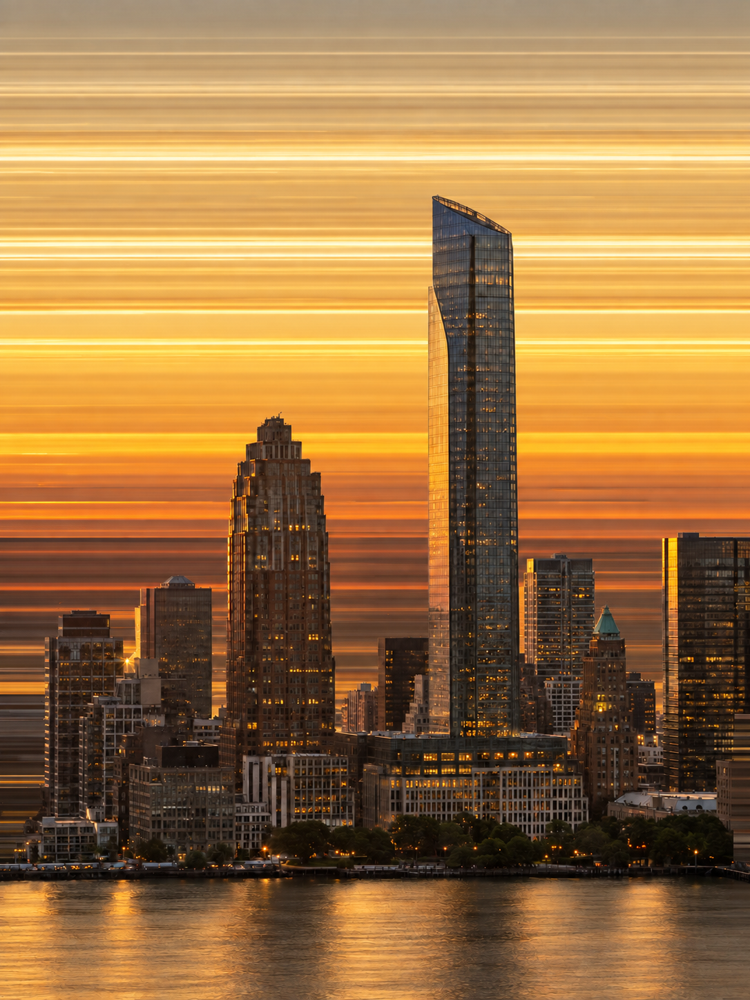
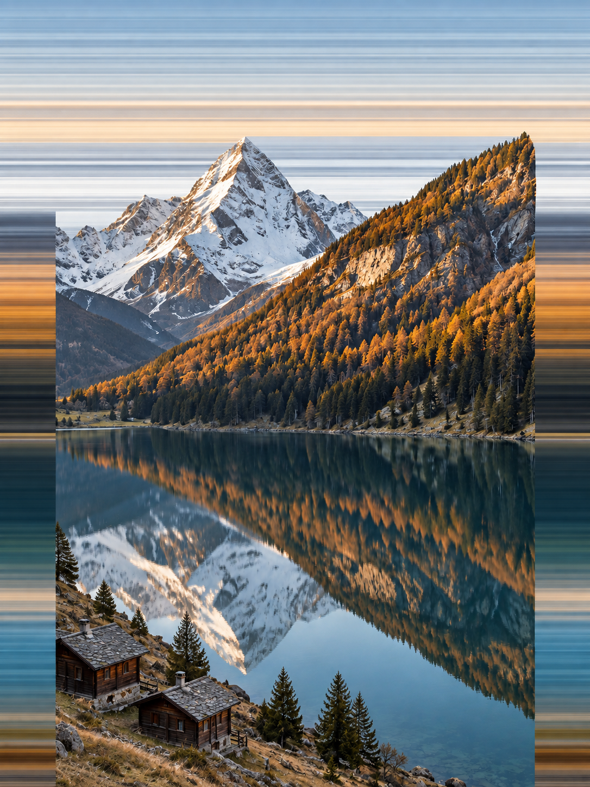
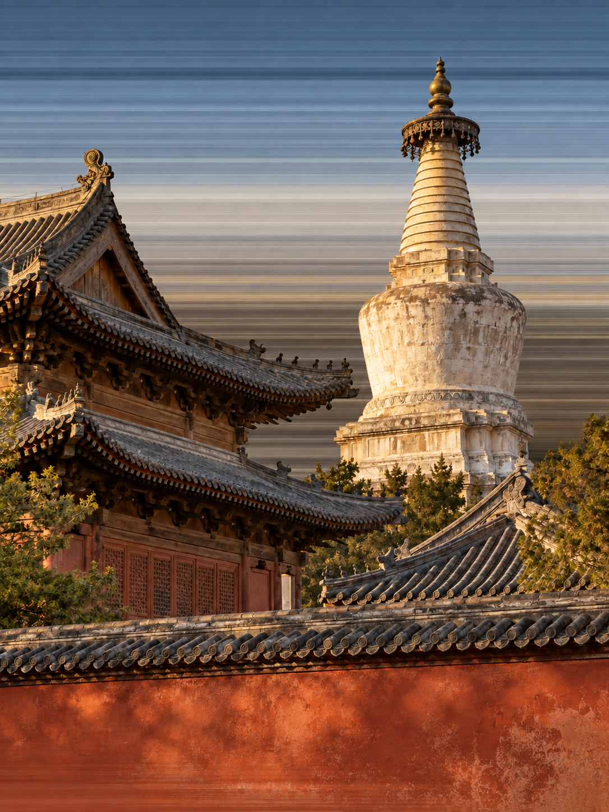

# 照片横向色带重构

将照片中的建筑、山水等主体保留为清晰的摄影视觉区域，把周围背景重构成水平延展的色带。主体轮廓从条纹背景中突出，颜色仍能对应原场景，形成兼具真实细节与抽象秩序的图片。

## 能做什么

适合旅行摄影再创作、城市视觉、山水装饰图和社交图片。高楼、塔尖、山脊与屋顶等轮廓明确的题材更容易形成主体突破背景的效果。输入场景可以不同，色带应随照片变化，不固定为金黄或蓝灰配色。

背景的宽色带与细条纹模拟像素被水平拉伸的观感，清晰主体保持摄影质感。这里采用参考图生成，不是实际执行像素采样算法，也不提供可复现到相同像素的处理脚本。

## 拉丝与配色

构图以一整张连续拉丝背景承托摄影主体。顶部和两侧露出的颜色属于同一个背景，同一高度的色带应自然对接。摄影区域允许局部直切，但不能因此形成独立左右装饰边、三栏相框或顶部竖直拼缝，也不为露出拉丝而擅自裁去主体。

默认质感是细密、平滑、连续的横向颜色拖曳：远看有大面积冷暖色域，近看是大量同色系深浅细丝。纹理疏密与粗细不等，边缘略柔，局部仍有清楚的明暗层次。亮线不自发光，暗部保留颜色，不添加金属划痕或织物纹理。

可以提供一小条局部图片作为材质与配色参考，无须把它当成构图模板。例如银灰、雾蓝、深青和少量金棕的组合，适合表现冷暖交织的山水色带。模型应将这些色彩关系映射到原照的上下层次，不能把不同题材一律染成同一套蓝金色。

> 重点参考这张局部图左侧的细密拉丝和冷暖关系。保留完整照片构图，背景以蓝灰、深青和近黑为主，穿插克制的金棕色；色域内有细密同色层次，线条连续、不等距，不要霓虹光轨或发光横杠。只调整背景，不重调主体。

纹理符合目标与整张图片通过验收需要分别判断。背景拉丝改善后，仍需检查主体是否绘画化，以及顶部和两侧是否连续。

## 如何使用

原照决定主体，局部参考只决定指定的纹理或颜色，背景修改不自动改变摄影内容。只要求优化skill时仅编辑指令与说明，不自动生成图片或更换示例。

让具备看图与参考图生成功能的模型读取同目录的[SKILL.md](SKILL.md)，然后提供原照及要求。整个文件夹可供不同模型环境使用，具体加载方式由所用环境决定。第一版没有Python依赖、命令行入口或厂商专用配置。

建议提供清晰、主体边缘可辨的照片，并说明必须保留的建筑、人物或空间关系。默认沿用原照比例，不新增标题、边框和装饰；不必先自己制作蒙版。

> 用这张照片制作横向色带重构图。保留中央高楼及前景建筑的位置、比例和夕阳光线，让高楼轮廓从背景中突出。天空和周围区域转为水平延展的色带，颜色自上而下对应原照，宽带与细纹交替。主体保持清晰，不要整张模糊，不加文字或边框。

山水照片可以补充：

> 山体、岸线和湖面倒影作为一个连续摄影区域保留，上边界沿山脊起伏。背景使用原照的蓝灰、雪白和深绿，水平延展。不要切断倒影或增加山峰。

## 会得到什么

默认交付一张经过看图复核的图片，另存而不覆盖输入。生成过程会检查主体结构、横向条纹、颜色次序和边界，必要时进行有限次数的定向修正。没有生图能力时只能提供提示词；图片尚未生成或尚未查看会明确说明。

## 图片示例

示例覆盖城市建筑、山水倒影和传统建筑。输入素材均为独立生成的虚构摄影场景，不是实拍记录，也不是小红书作者的照片。每例包含输入、结果、实际提示及复核说明，见[示例目录](examples/README.md)。这些图片展示初版效果，不代表最新拉丝与背景连续性规则已完成验证。

| 城市建筑 | 山水倒影 | 传统建筑 |
| --- | --- | --- |
|  |  |  |

城市示例强调金色宽带与高楼轮廓，山水示例强调两侧直切和倒影连贯，古建筑示例强调塔尖、屋檐与背景穿插。它们不是同一张构图换主题；生成结果仍可能调整细节和颜色浓度。

## 如何判断效果是否合格

先看能否认出原主体，再看背景是否真正转为水平色带。好的结果同时保留摄影区域与抽象背景，颜色在上下位置上呼应原照。检查塔尖、屋檐、山脊和倒影，避免白边、光晕、错位和重复物体。细条纹在缩略图中可能出现显示摩尔纹，判断时也应查看完整尺寸。

## 能力边界

验收分别检查背景材质、主体摄影质感和整体构图。山石、树叶、瓦片与窗格即使边缘清楚，只要呈现明显绘画化，也不能标为完成。背景合格而主体或构图失败的结果仅作候选。生成过程可能只替换天空或把拉丝做成独立左右边条；当前指令将连续背景和主体保护列为验收条件。最新规则尚未完成出图验证，也未作跨模型验证。

生成模型可能改变窗格、瓦片、细小文字、人物和建筑细节；本skill不能保证逐像素不变，也不能用于需要精确保真的证据图或测绘记录。密集树枝、透明体和复杂反射更容易发生边界错误。示例只能证明所展示题材的视觉表现，不能代替对每张新照片的复核。

视觉方向参考了小红书笔记《世界是个调色盘》中的横向色带与摄影轮廓关系。示例场景及文档独立制作，未打包或复制参考作者的原始图片。
