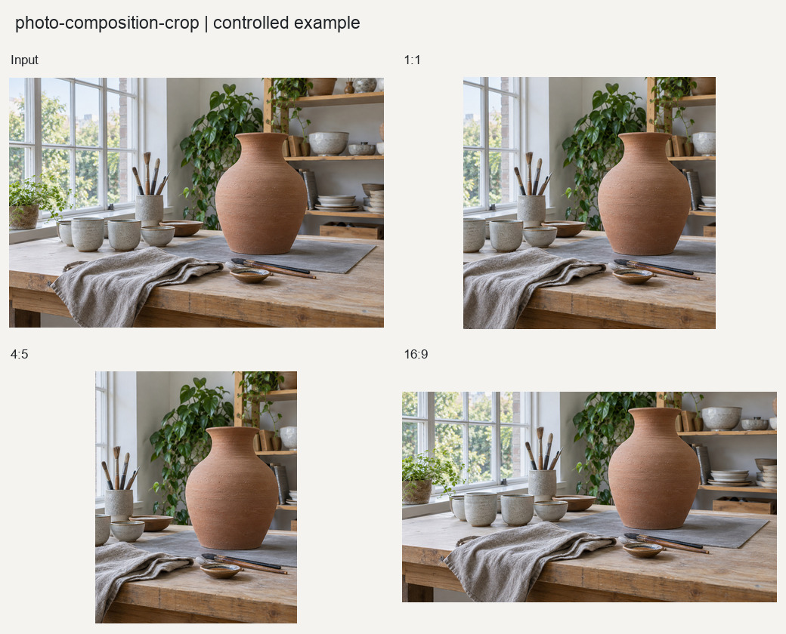

# 照片构图裁切

根据显著性、边缘密度、目标比例和用户焦点生成可复现的裁切方案。

## 输入与输出

输入为单张照片，可选0至1归一化焦点坐标。输出包括坐标JSON、构图叠加图和非覆盖裁切副本。

## 使用示例

> 为这张照片生成方形和竖版裁切方案，保留完整主体，并展示裁切框。

提供照片与需求后，按[执行说明](SKILL.md)处理。Python调用方式见[函数示例](examples/basic_usage.py)。

## 图片示例

查看[输入、参数与处理结果](examples/README.md)，或使用[复现代码](examples/reproduce.py)运行随附案例。

## 使用说明

支持指定焦点和主体保护区域；保护范围无法容纳于目标画幅时会拒绝该方案。
