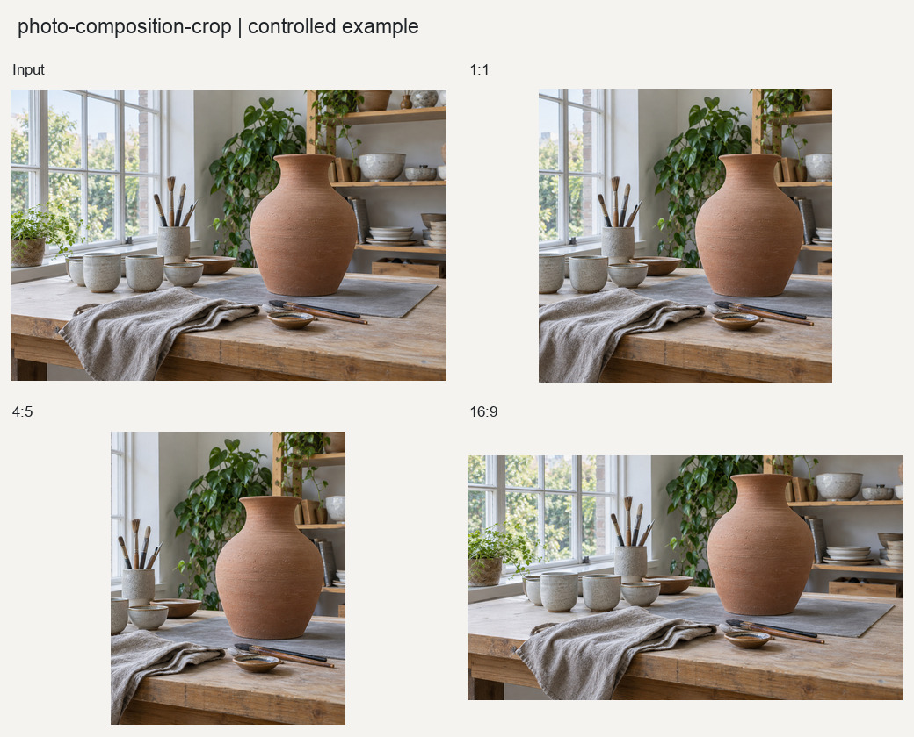

# 照片多比例裁切

为同一张照片生成不同画幅的裁切草案，兼顾主体位置、内容保留与边缘拥挤程度。只改变取景范围，不重绘主体或扩展画面。



图示为随附案例的实际处理输出。素材、参数和验证范围见文末。

## 1. 输入要求

输入为照片、目标比例及必须保留的内容。可用焦点约束候选位置，或用保护矩形要求保留完整区域。执行规范见[SKILL.md](SKILL.md)。

> 为这张照片生成1:1、4:5和16:9三种裁切。保留花瓶完整轮廓，标出每种裁切范围，不放大补画，也不覆盖原图。

## 2. 处理流程与依赖

[photo_composition_crop.py](scripts/photo_composition_crop.py)在原图范围内搜索裁切窗口，不执行扩图或物体移除。

1. 读取照片并计算显著性、边缘密度和视觉中心。用户焦点优先于自动中心。
2. 将保护矩形作为硬约束，确认目标比例能够完整容纳该区域。
3. 对各比例搜索候选位置，综合显著内容保留、边缘拥挤和构图关系评分。
4. 保留候选框及归一化、像素坐标；默认另存各比例的首选裁切。
5. 同时输出叠加图与JSON，供用户比较裁切造成的内容损失。

NumPy承担窗口与分数计算，OpenCV承担视觉特征与图像操作，Pillow承担方向处理、读写和副本保存。运行要求为Python3.10+，版本见[requirements.txt](requirements.txt)，评分口径见[评分说明](references/scoring.md)。

## 3. 核心接口与参数

`analyze_composition`提供视觉中心与构图分析；`create_crop_set`生成裁切、范围叠加图和坐标清单。

下表列出关键参数。默认值与当前接口定义一致，完整参数以源码为准。

| 参数 | 默认值或要求 | 说明 |
| --- | --- | --- |
| `aspect_ratios` | `1:1`、`4:5`、`3:4`、`16:9` | 输出比例集合；可显式缩减或调整。 |
| `focus_point` | `None` | 归一化坐标`(x, y)`，范围0至1。 |
| `protected_region` | `None` | 归一化矩形`(left, top, right, bottom)`，要求完整保留。 |
| `safe_area_only` | `False` | 为True时仅输出构图框和坐标，不保存裁切副本。 |

## 4. 调用示例

以下代码在本skill根目录的Python会话中运行，直接调用处理接口：

```python
from pathlib import Path
import sys

sys.path.insert(0, str(Path("scripts").resolve()))
from photo_composition_crop import analyze_composition, create_crop_set

analysis = analyze_composition("photo.jpg", focus_point=(0.675, 0.48))
result = create_crop_set(
    "photo.jpg", "crop-review",
    aspect_ratios=("1:1", "4:5", "16:9"),
    focus_point=(0.675, 0.48),
)
```

该例调用`analyze_composition`和`create_crop_set`，生成三种比例。坐标只是示意，应按自有照片调整。[调用示例](examples/basic_usage.py)展示接口，[reproduce.py](examples/reproduce.py)保存随附图片的实际参数。

## 5. 交付文件与质量控制

### 5.1 文件与结果解释

`_crop_overlay.jpg`显示各比例窗口，`_crop_plan.json`记录候选、坐标和焦点来源，`_crop_比例`文件为实际裁切副本。坐标清单可用于复核与后续排版，但不构成主体识别或人物姿态判断。

### 5.2 参数选择与失败条件

重点物体完整性由`protected_region`保证，焦点只决定优先位置，两者不能互换。`safe_area_only=True`仅输出叠加图和规划JSON，不保存裁切副本；它不改变候选搜索规则。

保护区域与目标比例不兼容、坐标越界或比例重复时应先修正输入。程序不含人体关键点检测，头顶、下巴、手脚和动物尾部需逐张检查。裁切只能舍弃内容，不能补回画面外的环境。

## 6. 示例与验证

基础示例由用户显式指定花瓶焦点，生成1:1、4:5和16:9裁切。它验证了指定焦点的路径，不证明自动定位或自动审美。查看[各比例结果](examples/README.md)、[保护区域案例](examples/protected/README.md)及[其他题材案例](examples/cases/README.md)。
