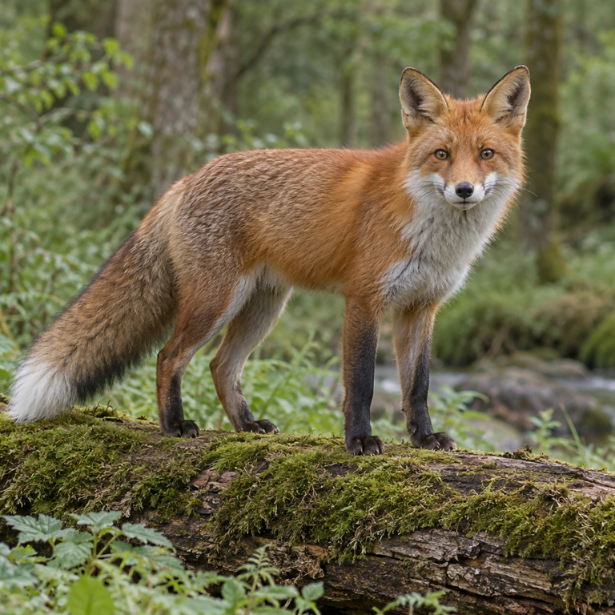

# 主体保护裁切

原焦点评分只是软约束，不能保证尾巴或头顶完整。新版protected_region限定必须保留的矩形，再在可行位置中评分。容纳不下时拒绝该组输出，不能靠修改比例或补画悄悄通过。

使用[reproduce.py](reproduce.py)的reproduce_case生成动物、城市和人物结果。动物保留头尾与四足，城市保留桥与船，人物保留头部至可见身体。动物和城市使用1:1、16:9；人物使用1:1、4:5。宽主体强制4:5的拒绝行为另有独立回归测试。

