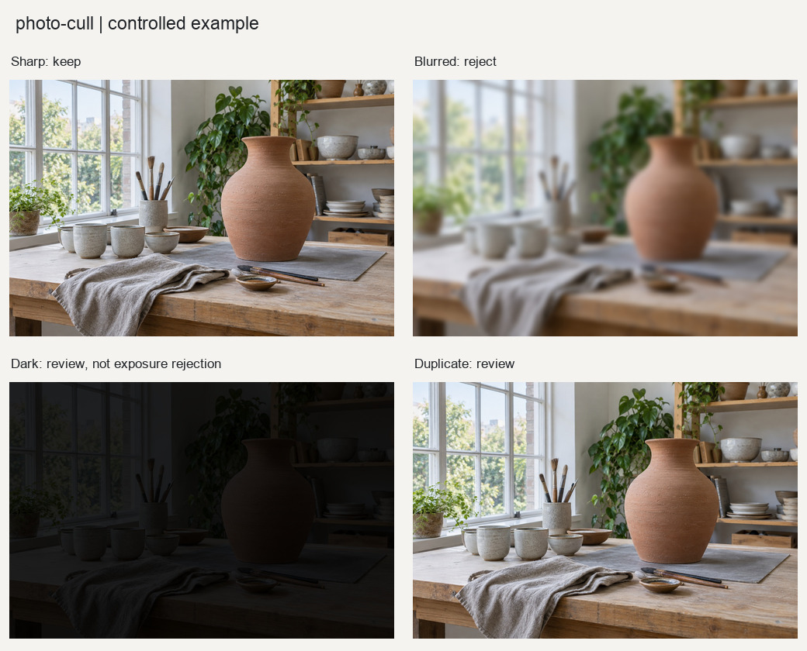

# 技术筛片

对一批照片进行客观技术筛选，识别明显失焦、相机抖动、曝光溢出和连拍重复。

## 输入与输出

输入为照片目录。分析阶段输出CSV、JSON和废片联系表，不修改原图。只有人工看过报告后，才能另行调用XMP写入接口。

## 使用示例

> 检查这批旅行照片的清晰度、曝光和重复情况，生成候选清单，先不要写入评级。

提供照片与需求后，按[执行说明](SKILL.md)处理。Python调用方式见[函数示例](examples/basic_usage.py)。

## 图片示例

查看[输入、参数与处理结果](examples/README.md)，或使用[复现代码](examples/reproduce.py)运行随附案例。

## 使用说明

筛选结果需要人工复核；写入XMP需另行确认，原图不移动、不删除。

## 适合什么任务

适合旅行、街拍、人像或动物连拍后的第一轮技术检查。将明显清晰度问题、抖动、曝光溢出和近似帧集中列出，减少逐张查看的负担。

## 如何准备素材和选择设置

提供照片目录和题材。可选择wildlife、portrait、landscape或street预设，并按实际拍摄条件调整阈值。具有刻意虚焦、剪影或运动拖影的照片应单独说明，避免误判创作意图。

## 完整请求示例

> 检查这批街拍照片的技术问题，保留刻意运动模糊的可能性。输出CSV、JSON和疑似废片联系表，先只做分析，不写评级。

这段请求可连同素材交给能读取本目录[执行说明](SKILL.md)的模型。图片处理需要相应Python依赖；生成式图片需要运行环境提供生图能力。文字对话本身不等于已经执行处理。

## 如何阅读和验收结果

报告记录每张照片的指标与理由，候选需要看图复核。表情、事件意义和氛围不会由锐度决定。XMP评级是单独步骤，会影响现有边车评级字段；原始照片不移动、不删除。
