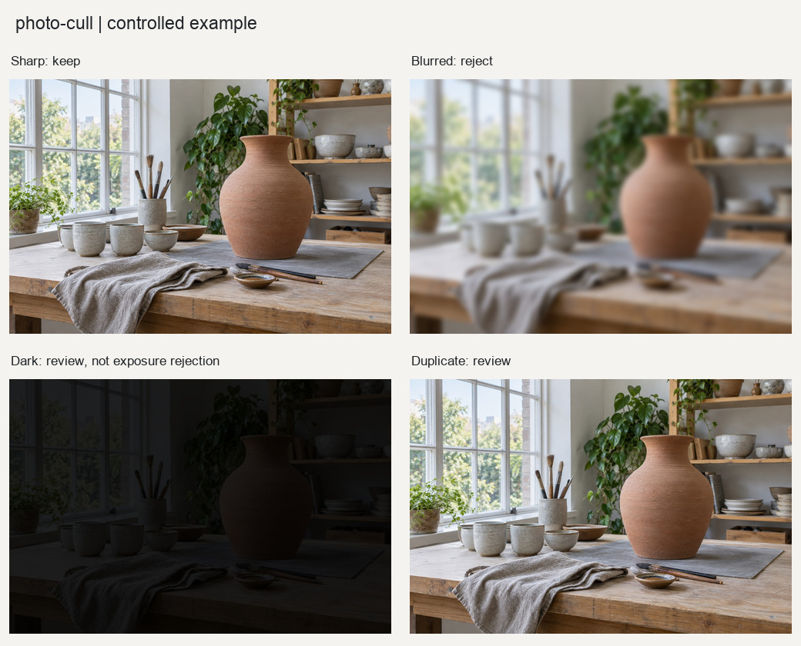

# 照片技术筛选

对一批照片检查清晰度、曝光和重复情况，给出保留、复核或淘汰建议。适合拍摄后初筛，不代替最终选片，也不会删除或移动照片。



图示为随附案例的实际处理输出。素材、参数和验证范围见文末。

## 1. 输入要求

输入为照片目录或受支持的文件集合。提供拍摄题材和筛选重点；阈值由题材预设与配置共同确定。执行规范见[SKILL.md](SKILL.md)。

> 检查这批风景照片的失焦、抖动和重复情况。先生成报告与淘汰建议联系表，保留需要人工复核的照片，不删除文件，不写XMP。

## 2. 处理流程与依赖

入口为[photo_cull.py](scripts/photo_cull.py)，指标计算、评分、报告和XMP写入分离。分析阶段不修改照片，也不写入边车文件。

1. 读取照片及拍摄信息。RAW优先使用内嵌预览；预览不可用时再进入解码路径，报告中的检测依据不应与完整RAW画质评价混淆。
2. 从局部强边缘估计归一化边缘宽度，并比较不同方向的展宽。局部区域用于减轻浅景深背景对主体清晰度判断的影响。
3. 统计高光剪切、暗部和相对对比度，按题材阈值生成技术提示，而不是仅凭平均亮度淘汰夜景。
4. 结合dHash和拍摄时间建立相似组，在组内比较锐度。分组结果可能包含表情或动作不同的照片，需要人工选择。
5. 汇总keep、review和reject建议及对应理由，生成报告和淘汰建议联系表。确认后才进入独立XMP写入流程。

NumPy承担数组计算，OpenCV承担边缘、图像读取与Haar候选检测，rawpy读取RAW，ExifRead读取拍摄信息，PyYAML加载配置。运行要求为Python3.10+，库版本见[requirements.txt](requirements.txt)。指标定义、参数和工作流分别见[算法说明](references/metrics.md)、[参数说明](references/parameters.md)与[工作流说明](references/workflow.md)。

## 3. 核心接口与参数

`analyze_photos`生成筛选报告；`create_cull_sidecars`单独写入XMP。写入边车文件需在报告复核后明确确认。

下表列出关键参数。默认值与当前接口定义一致，完整参数以源码为准。

| 参数 | 默认值或要求 | 说明 |
| --- | --- | --- |
| `preset` | 可选 | 题材预设；示例使用`landscape`，不是统一淘汰阈值。 |
| `overrides` | `None` | 覆盖配置项，用于调整技术筛选阈值。 |
| `jobs` | `1` | 分析并行度；单任务便于核对处理记录。 |

## 4. 调用示例

以下代码在本skill根目录的Python会话中运行，直接调用处理接口，输入为照片目录，输出使用新目录：

```python
from pathlib import Path
import sys

sys.path.insert(0, str(Path("scripts").resolve()))
from photo_cull import analyze_photos

report = analyze_photos(
    "photos", "cull-review", preset="landscape", jobs=1
)
```

该例调用`analyze_photos`，使用landscape预设，只生成报告。确需写入XMP时，另行确认后调用`create_cull_sidecars`，不能把分析和写边车文件混为同一步。

## 5. 交付文件与质量控制

### 5.1 文件与结果解释

- `cull_report.csv`：逐张指标、建议和理由，便于复核及二次筛选。
- `cull_report.json`：结构化分析记录。
- `rejected_sheet.jpg`：淘汰建议联系表，检查是否误判关键主体。
- XMP仅在另行确认后写入。边车记录星级、色标和说明，不能把报告生成视为已经写入XMP。

### 5.2 参数选择与失败条件

wildlife侧重连拍与抖动，portrait侧重人像相关提示，landscape采用较严格的技术标准，street保留较高容忍度。修改阈值时应使用`overrides`并保留本次配置，不能跨题材照搬淘汰标准。

闭眼与人脸检测仅作候选提示；墨镜、侧脸及漏检不能直接构成淘汰依据。浅景深、低纹理和运动摄影应重点复核。既有同名报告默认不覆盖，重复分析使用新输出目录。

## 6. 示例与验证

基础示例包含清晰图、人工模糊图、暗图和重复副本。清晰图被保留，模糊图被建议淘汰；暗图进入复核并不是欠曝检测命中。查看[完整记录](examples/README.md)及[动物、城市、人物案例](examples/cases/README.md)。
