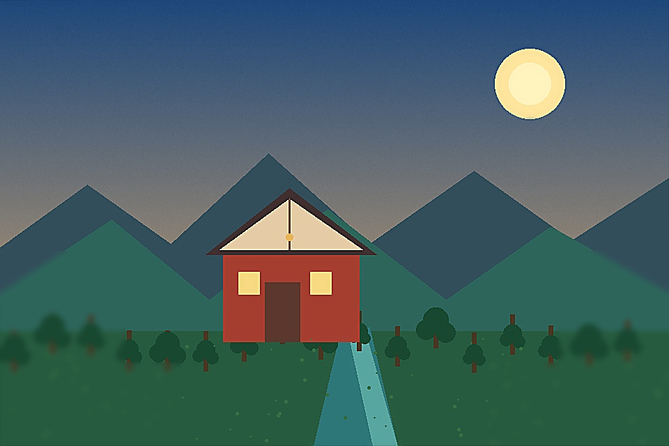

# photo-focus-stacker

## 功能定位

把同一场景、同一视点、不同焦平面的真实照片合成为扩展景深结果，并报告主体运动与对焦呼吸风险。它不是筛片工具，也不恢复所有帧都没有记录的细节。

## 适用场景

- 微距昆虫、花卉和产品摄影
- 静物与风光的多焦平面合成
- 需要来源地图和低置信度区域审计的景深合成

## 输入与输出

输入至少两张不同焦平面照片。输出16bit TIFF、JPEG预览、来源地图、置信度图、风险蒙版、联系表和JSON报告。

## 使用示例

分析优先的合成示例见[`examples/basic_usage.py`](examples/basic_usage.py)：

```python
result = run_example(input_paths, "focus-stack-review")
```

## 图片示例

输入：[`sample_scene.png`](../example-assets/sample_scene.png)生成的不同焦平面变体



## 验收重点

- 输入必须保持同一视点和基本一致构图
- 只允许旋转和平移的刚性配准
- 查看运动、呼吸效应和低置信度接缝
- 来源地图只能指向真实输入帧

完整合成契约和风险解释见[`SKILL.md`](SKILL.md)。
