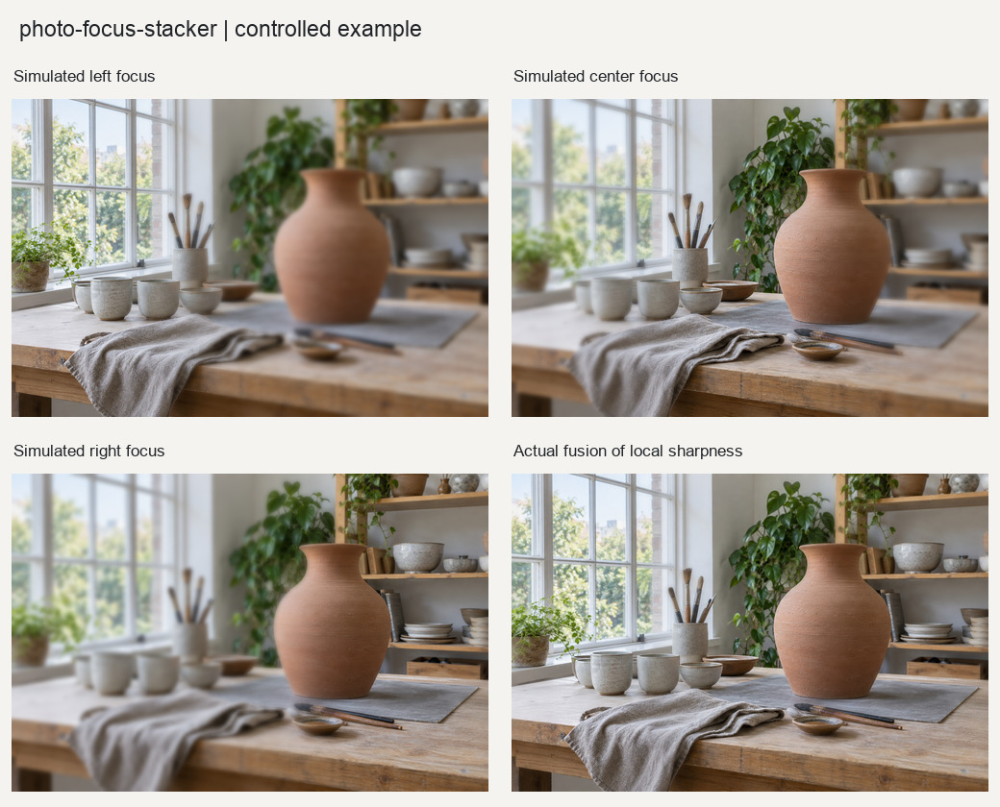

# 多焦点景深合成

把同一场景、同一视点、不同焦平面的真实照片合成为扩展景深结果，并报告主体运动与对焦呼吸风险。

## 输入与输出

输入至少两张不同焦平面照片。输出16bit TIFF、JPEG预览、来源地图、置信度图、风险蒙版、联系表和JSON报告。

## 使用示例

> 合成这组同一视点、不同焦平面的照片，展示清晰区域来源和低置信度位置。

提供照片与需求后，按[执行说明](SKILL.md)处理。Python调用方式见[函数示例](examples/basic_usage.py)。

## 图片示例

查看[输入、参数与处理结果](examples/README.md)，或使用[复现代码](examples/reproduce.py)运行随附案例。

## 使用说明

实际处理需要不同焦平面的照片；主体运动和对焦呼吸可能影响接缝，所有输入都缺失的细节无法恢复。
