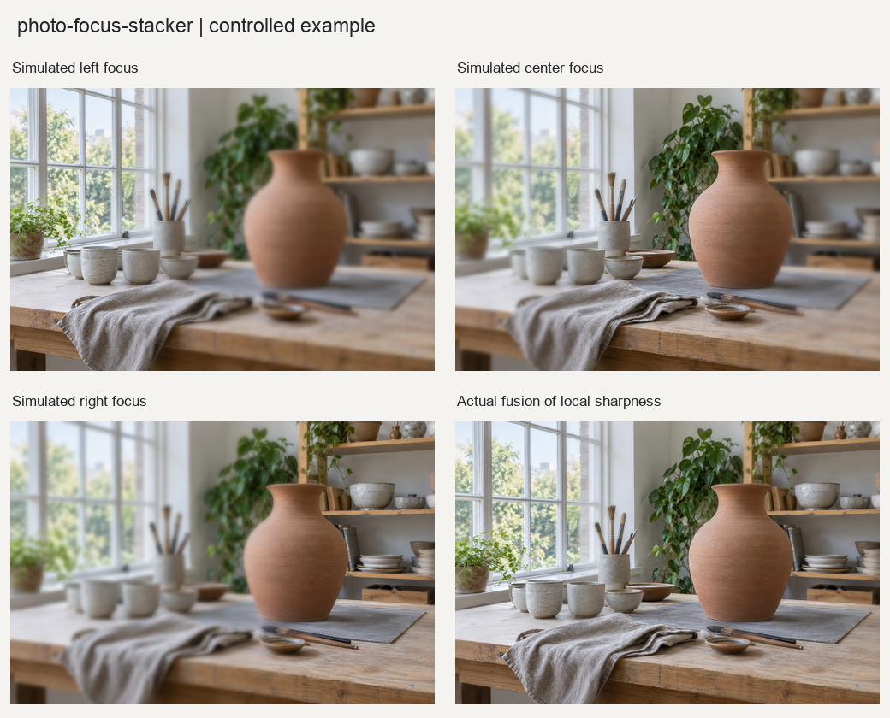
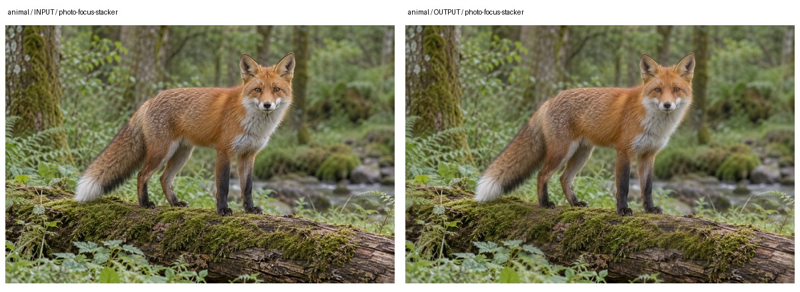
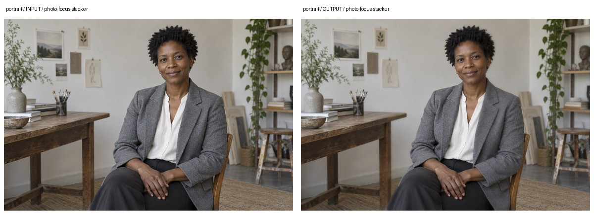

# 焦点堆栈

把同一视角、不同焦点位置的多张照片合成为更大清晰范围的图片。适合静物、微距和产品摄影，前提是各帧真实记录了互补的清晰区域。



图示为随附案例的实际处理输出。素材、参数和验证范围见文末。

## 1. 输入要求

输入至少两张同视角、不同焦点位置的真实照片。保持相机、照明和主体稳定，邻近帧应有互补且适当重叠的清晰区域。执行规范见[SKILL.md](SKILL.md)。

> 合成这组真实焦点序列，先检查配准和各帧的有效清晰区域。保留细枝与产品边缘，输出清晰来源图和风险图；有明显运动或尺度变化时先说明问题。

## 2. 处理流程与依赖

[photo_focus_stacker.py](scripts/photo_focus_stacker.py)通过局部清晰度选择源帧，不从模糊区域生成纹理。

1. 检查帧数、唯一性和尺寸。未指定参考帧时选择序列中间帧。
2. 用ECC欧氏变换配准平移与旋转，记录置信度和有效覆盖。
3. 计算多尺度局部Laplacian能量，得到清晰源帧索引与选帧置信度。
4. 在有效区域内组合各帧清晰内容，并按过渡半径平滑边界。
5. 输出运动或焦点呼吸风险，检查是否出现双边、漏选或明显尺度变化。

NumPy承担多帧选择与权重计算，OpenCV承担ECC配准、清晰度与风险运算，Pillow负责结果保存及联系表。运行要求为Python3.10+，版本见[requirements.txt](requirements.txt)。

## 3. 核心接口与参数

`analyze_focus_stack`返回配准与输入风险；无阻断项后调用`stack_focus`，生成合成图、选帧来源与置信度图。

下表列出关键参数。默认值与当前接口定义一致，完整参数以源码为准。

| 参数 | 默认值或要求 | 说明 |
| --- | --- | --- |
| `reference_index` | `None` | 配准参考帧索引；未指定时选序列中间帧，索引从0开始。 |
| `blend_radius` | `7` | 局部过渡半径，单位为像素。 |

## 4. 调用示例

以下代码在本skill根目录的Python会话中运行，直接调用处理接口：

```python
from pathlib import Path
import sys

sys.path.insert(0, str(Path("scripts").resolve()))
from photo_focus_stacker import analyze_focus_stack, stack_focus

photos = ["focus-near.jpg", "focus-middle.jpg", "focus-far.jpg"]
analysis = analyze_focus_stack(photos)
if not analysis["blockers"]:
    result = stack_focus(photos, "focus-review", blend_radius=7)
```

该例先调用`analyze_focus_stack`，存在阻断项时不合成；通过后调用`stack_focus`，过渡半径为7。参数见[调用示例](examples/basic_usage.py)，随附图片的实际调用见[reproduce.py](examples/reproduce.py)。

## 5. 交付文件与质量控制

### 5.1 文件与结果解释

`focus_stacked_16bit.tif`和`focus_stacked_preview.jpg`为合成结果；`focus_source_map.png`标记各处来自哪一帧；`focus_confidence.png`反映选帧可信度；`motion_or_breathing_risk_mask.png`与报告用于定位风险。

来源索引只表示帧编号，不能直接转换为真实距离或深度。细节不应仅凭合成后整体清晰度判断，需逐处对照源帧。

### 5.2 参数选择与失败条件

`reference_index`从0开始，未指定时取序列中间帧；`blend_radius`接受0至64像素。较大过渡半径可能减轻接缝，也可能软化细边，需针对局部检查。

各帧尺寸不一致、有效区域不足或分析存在阻断项时停止。欧氏配准不能完整解决焦点呼吸产生的尺度变化，透明体、反射和复杂遮挡仍需人工复核。所有输入都失焦的区域无法补回真实纹理。

## 6. 示例与应用

### 6.1 基础案例

基础示例通过人工模糊构造3张互补清晰区域，再运行堆栈。它验证区域选取与合成，不代表真实焦点呼吸或复杂遮挡已通过。查看[来源图与处理记录](examples/README.md)及[其他题材案例](examples/cases/README.md)。

### 6.2 多题材实际对照

下列图片来自仓库已有处理记录。输入为独立生成的合成摄影素材，对照板仅缩放排版；示例不等同于实拍验收。

| 动物 | 城市 | 人物 |
| --- | --- | --- |
|  |  |  |

实际设置：从同一底图人工构造3种互补清晰区域，再运行选源与融合。

| 题材 | 看图重点 |
| --- | --- |
| 动物 | 观察毛发与轮廓的选源边界，此类素材不代表运动动物适合实拍堆栈。 |
| 城市 | 观察细线与建筑边界，检查选源是否产生双边或局部突变。 |
| 人物 | 观察头发与衣物边缘；真实人物移动仍需要独立评估。 |

验证范围：案例未拍摄真实焦点序列，没有验证焦点呼吸、复杂前后遮挡或新增清晰细节。

输入、输出与复现方式见[案例记录](examples/cases/README.md)及[实际调用](examples/cases/reproduce.py)。报告中的待复核、阻断与警告状态均应保留，不能以程序执行成功代替质量验收。

### 6.3 应用请求示例

以下请求用于新任务，不是上面案例的实际调用记录。应按自有素材、处理目标与确认状态调整。

#### 6.3.1 静物产品焦点序列

> 合成这组固定机位的产品焦点照片，保持原比例。先检查对齐与互补清晰区域，输出来源图和风险图，重点保留产品边缘与刻纹，不以锐化替代堆栈。

复核重点：逐处确认清晰部分来自哪张源帧，并检查细小刻纹是否重影或断裂。

#### 6.3.2 微距植物序列

> 检查这组微距植物焦点序列，重点关注细茎与前后叶片。先评估移动和尺度变化，存在明显风险时说明，不强行合成；输出边缘局部预览。

复核重点：检查细茎是否被错误选源、叶片是否出现透明重影，区分真实景深扩展与边缘伪影。
