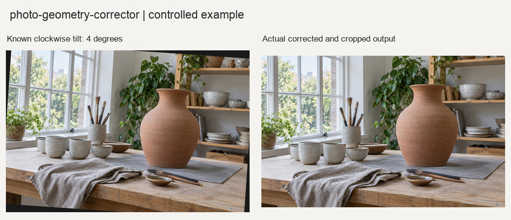

# 照片几何校正

校正可定义、可复现的几何关系，包括水平倾斜、四点透视和基于真实标定参数的镜头几何畸变。

## 输入与输出

输入为照片及对应几何参数。输出校正副本和报告JSON，记录变换矩阵、输出尺寸和无效边裁切范围。

## 使用示例

> 按确认的倾斜角度扶正照片，裁掉无效边，另存校正结果。

提供照片与需求后，按[执行说明](SKILL.md)处理。Python调用方式见[函数示例](examples/basic_usage.py)。

## 图片示例

查看[输入、参数与处理结果](examples/README.md)，或使用[复现代码](examples/reproduce.py)运行随附案例。

## 使用说明

透视校正需确认四点顺序；镜头畸变校正需要真实标定参数。
