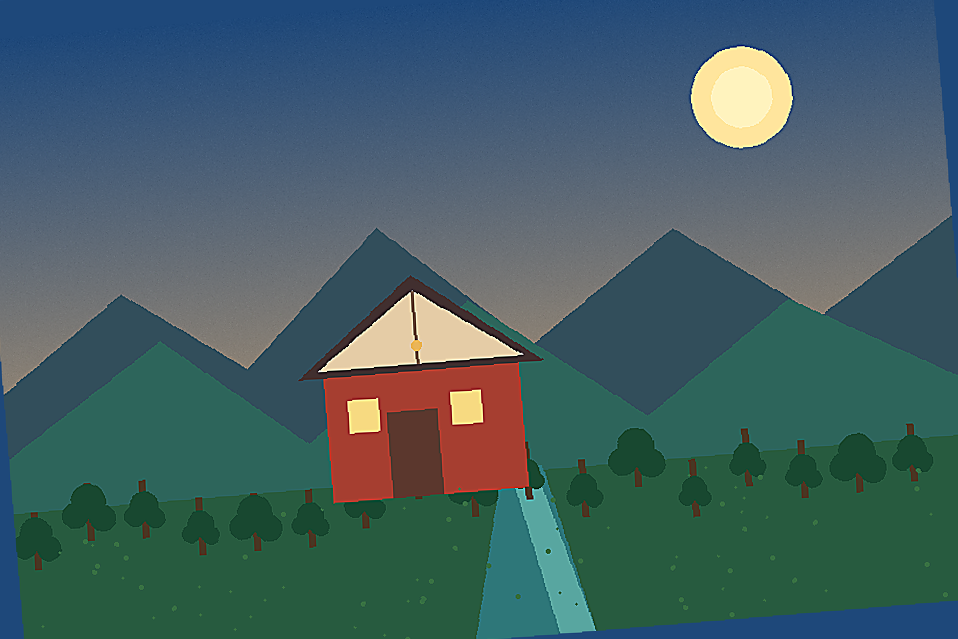

# photo-geometry-corrector

## 功能定位

校正可定义、可复现的几何关系，包括水平倾斜、四点透视和基于真实标定参数的镜头几何畸变。它不负责审美裁切和内容补边。

## 三种模式

- `horizon`：旋转并裁掉无效边
- `perspective`：把确认的四点平面映射为矩形
- `calibrated-distortion`：使用相机矩阵和畸变系数校正镜头

## 输入与输出

输入为照片及对应几何参数。输出校正副本和报告JSON，记录变换矩阵、输出尺寸和无效边裁切范围。

## 使用示例

显式角度校正示例见[`examples/basic_usage.py`](examples/basic_usage.py)：

```python
result = run_example("tilted.jpg", "geometry-review", confirmed_angle_degrees=2.4)
```

## 图片示例

输入：[`sample_scene.png`](../example-assets/sample_scene.png)的本地倾斜变体



## 验收重点

- 自动水平线只能作为建议，不能静默执行
- 四点顺序必须为左上、右上、右下、左下
- 镜头校正必须使用真实标定参数
- `status="pass"`不等于视觉验收完成

完整坐标和有效边规则见[`SKILL.md`](SKILL.md)。
