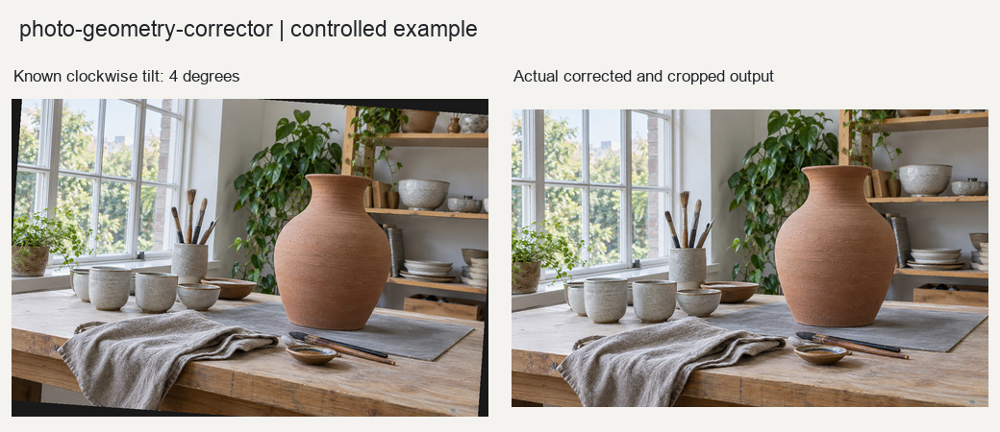

# 照片几何校正

校正水平倾斜、四点透视与已有标定参数对应的镜头畸变。适合建筑、文档及含明确直线的照片，不通过生成式填充修补空角。



图示为随附案例的实际处理输出。素材、参数和验证范围见文末。

## 1. 输入要求

输入为照片和需校正的几何结构。水平校正需确认倾角；透视校正需给定四角；镜头校正需提供相机矩阵与畸变系数。执行规范见[SKILL.md](SKILL.md)。

> 检查这张建筑照片的水平线。先给倾角建议和有效裁切范围，确认后再旋转。不要把斜屋顶当作地平线，不用生成式填充补角。

## 2. 处理流程与依赖

[photo_geometry_corrector.py](scripts/photo_geometry_corrector.py)分别处理水平旋转、平面透视和已标定镜头畸变，不把三种几何问题合并为一次自动校正。

1. 通过边缘与Hough直线提出倾角建议。斜屋顶、道路透视和装饰线可能干扰估计，需结合场景确认。
2. 水平校正按显式角度或已确认检测结果旋转，再裁取有源图支持的区域。
3. 四点透视按左上、右上、右下、左下建立单应变换，将指定平面映射到目标矩形。
4. 镜头校正采用用户提供的相机矩阵及畸变系数，不从一张照片推断可靠镜头参数。
5. 查看变换后直线、比例和裁边，另存校正结果与记录，不使用生成填充补角。

NumPy承担坐标与矩阵计算，OpenCV承担边缘、直线、旋转和透视变换，Pillow负责图像读写。运行要求为Python3.10+，版本见[requirements.txt](requirements.txt)。

## 3. 核心接口与参数

水平、透视和镜头校正分别使用`correct_horizon`、`correct_perspective`、`correct_calibrated_distortion`。镜头接口要求`camera_matrix`与`distortion_coefficients`，不从单张图自动标定。

下表列出关键参数。默认值与当前接口定义一致，完整参数以源码为准。

| 参数 | 默认值或要求 | 说明 |
| --- | --- | --- |
| `angle_degrees` | `None` | 水平校正角度，单位为度；示例4.0不是通用设置。 |
| `automatic_detection_confirmed` | `False` | 是否确认采用自动检测的倾角。 |
| `source_points` | 透视必填 | 按左上、右上、右下、左下排列的四点。 |
| `points_normalized` | `False` | 四点是否为0至1归一化坐标，默认按像素解释。 |

## 4. 调用示例

以下代码在本skill根目录的Python会话中运行，直接调用处理接口：

```python
from pathlib import Path
import sys

sys.path.insert(0, str(Path("scripts").resolve()))
from photo_geometry_corrector import analyze_geometry, correct_horizon

analysis = analyze_geometry("tilted.jpg")
result = correct_horizon(
    "tilted.jpg", "geometry-review", angle_degrees=4.0
)
```

4.0是示例角度，不能直接用于任意照片。完整接口见[调用示例](examples/basic_usage.py)，随附图片的调用见[reproduce.py](examples/reproduce.py)。

## 5. 交付文件与质量控制

### 5.1 结果解释

水平校正关注直线方向与空角裁切；透视校正关注指定平面的四边与宽高比例；镜头校正关注标定模型对应的径向或切向变形。三者需依据各自目标复核，不能仅凭画面更整齐判断真实性。

### 5.2 参数选择与失败条件

四点默认采用像素坐标，只有`points_normalized=True`时才按归一化坐标解释。点序错误、四边形退化或目标尺寸不合理，会导致翻转、拉伸或无有效画面。

水平角度未确认时不应直接接受自动建议。平面透视无法统一消除不同深度物体的透视，人物与立体建筑可能发生比例变化；没有镜头参数时不承诺精确畸变校正。

## 6. 示例与验证

基础示例加入已知4°倾斜，再使用人工给定角度校正。它验证旋转和有效区域裁切，不验证自动水平判断、透视或镜头标定。查看[处理记录](examples/README.md)及[其他题材案例](examples/cases/README.md)。
