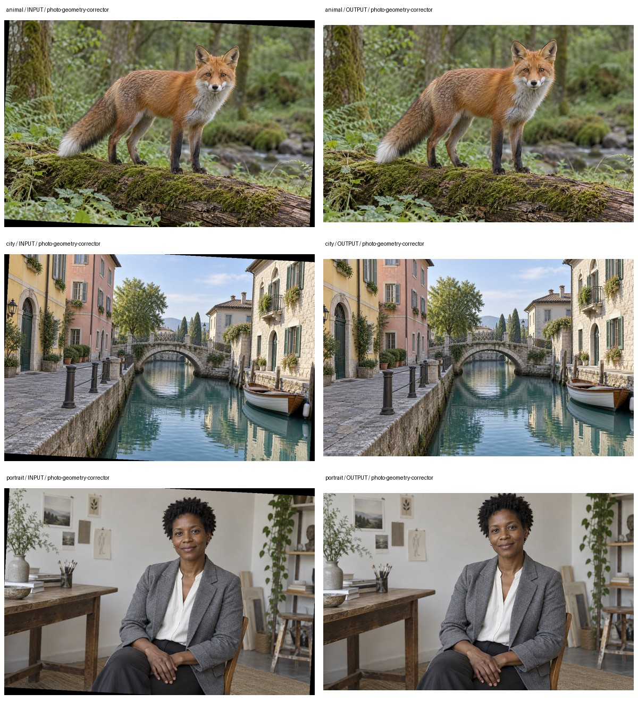

# 多题材处理案例

输入为已知顺时针3°倾斜，显式角度纠正并裁除无效边缘。不声称从动物或人物画面自动找到真实水平线。

## 输入与复现

[动物](animal/comparison.jpg)、[城市](city/comparison.jpg)、[人物](portrait/comparison.jpg)使用本仓库专门生成的合成摄影素材。每组input目录保存实际输入，output保存程序实际结果。对照板只缩放排版，不修饰处理结果。本地测试记录不随Skill发布。

在独立Python会话中加载[reproduce.py](reproduce.py)，调用reproduce_case("animal", 新输出目录)。case_name也可为city或portrait；依赖使用本Skill的requirements.txt，输出目录不得已存在。

报告中的review、blocked和警告均保留；退出码为0不等于所有业务条件通过。本案例仅覆盖本页说明的输入与处理模式，不代表全部能力验收。
