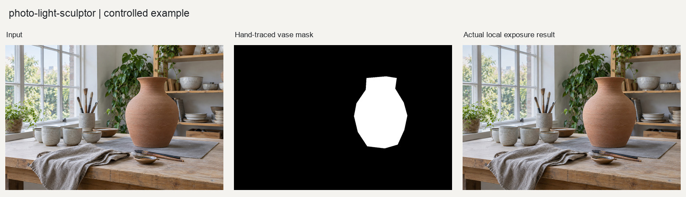
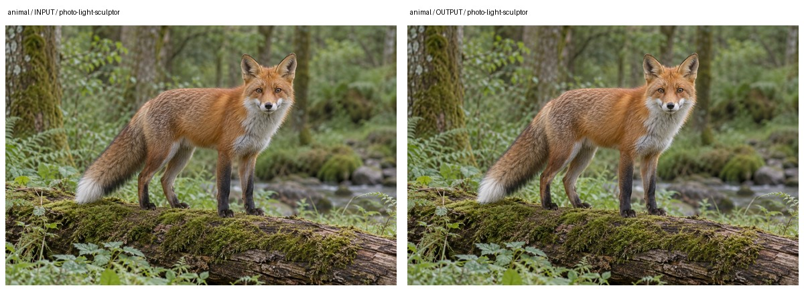
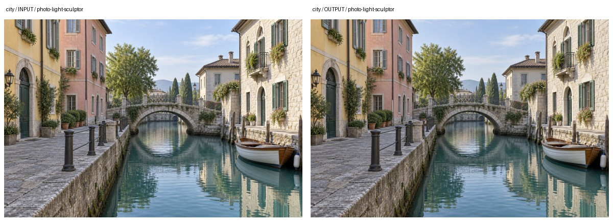
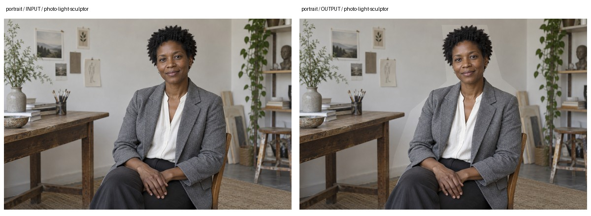

# 照片局部光影

对主体与背景分区提亮或压暗，调整照片中的注意力和明暗层次。保留原有物体，不新增光源、阴影或反射。



图示为随附案例的实际处理输出。素材、参数和验证范围见文末。

## 1. 输入要求

输入为照片和局部明暗目标，可附主体蒙版。没有蒙版时使用启发式区域估计，不能替代精细分割。执行规范见[SKILL.md](SKILL.md)。

> 让花瓶比背景稍亮，保留窗口光原有方向。使用我提供的主体蒙版，边缘柔和过渡，不增加光晕或新的投影。输出前后对照和调整分布图。

## 2. 处理流程与依赖

[photo_light_sculptor.py](scripts/photo_light_sculptor.py)执行局部曝光运算，不调用生成模型。调整由空间蒙版和EV分布共同控制。

1. 读取照片并分析主体区域与背景的亮度、剪切情况。
2. 优先使用用户蒙版；没有蒙版时，以边缘、对比度、饱和度等特征生成近似显著区域，并记录来源和置信度。
3. focus轻微提亮主体并压暗背景；depth依据主体已有的局部明暗残差强化层次；balance缓和低频亮度不均。
4. 将EV分布转换为线性RGB中的同通道增益，再编码回显示图像。三个通道使用相同增益，减少独立通道调整造成的综合色偏。
5. 检查新增高光剪切、暗部死黑和源文件哈希，另存结果与验证信息。技术检查通过后仍保留视觉复核状态。

NumPy承担EV与增益计算，OpenCV承担蒙版、平滑和图件生成，Pillow负责图像读写。运行要求为Python3.10+，版本见[requirements.txt](requirements.txt)，算法见[方法说明](references/method.md)。

## 3. 核心接口与参数

`analyze_light`返回区域来源与亮度分析；`sculpt_photo`生成局部曝光调整及相关图件。

下表列出关键参数。默认值与当前接口定义一致，完整参数以源码为准。

| 参数 | 默认值或要求 | 说明 |
| --- | --- | --- |
| `mode` | `focus` | 可选`focus`、`depth`、`balance`。 |
| `strength` | `1.0` | 局部曝光调整强度。 |
| `subject_mask_path` | `None` | 用户主体蒙版；提供后优先使用。 |

## 4. 调用示例

以下代码在本skill根目录的Python会话中运行，直接调用处理接口：

```python
from pathlib import Path
import sys

sys.path.insert(0, str(Path("scripts").resolve()))
from photo_light_sculptor import analyze_light, sculpt_photo

analysis = analyze_light("photo.jpg", subject_mask_path="subject-mask.png")
result = sculpt_photo(
    "photo.jpg", "light-review",
    mode="focus", strength=1.0, subject_mask_path="subject-mask.png",
)
```

该例调用`analyze_light`和`sculpt_photo`，使用focus模式、强度1.0。其他参数见[函数示例](examples/basic_usage.py)，随附对照的实际调用见[reproduce.py](examples/reproduce.py)。

## 5. 交付文件与质量控制

### 5.1 文件与结果解释

输出以原文件名及模式命名，包括处理图、`_mask.png`、`_light16.png`、`_preview.jpg`、配方和验证JSON。蒙版显示处理区域，EV图显示加减光分布，均不是场景深度。

### 5.2 参数选择与失败条件

`strength`接受0至1.5。增加强度前先检查蒙版，错误区域不会因为提高强度而变得正确。实际EV硬限制为负0.60至正0.45；16位图将该区间编码为整数，不应直接把灰度值当作EV。

自动区域置信度不足时应提供用户蒙版。毛发、枝叶和高反差边缘需检查光圈；提亮暗部可能暴露噪点。depth仅强化原有亮度层次，不估深，也不生成轮廓光、投影或新的反射。

## 6. 示例与应用

### 6.1 基础案例

基础示例使用人工绘制的花瓶蒙版，轻微提亮主体并压暗背景，不是自动分割能力展示。查看[蒙版与处理记录](examples/README.md)及[其他题材案例](examples/cases/README.md)。

### 6.2 多题材实际对照

下列图片来自仓库已有处理记录。输入为独立生成的合成摄影素材，对照板仅缩放排版；示例不等同于实拍验收。

| 动物 | 城市 | 人物 |
| --- | --- | --- |
|  |  |  |

实际设置：使用各题材明确绘制的主体蒙版执行focus局部调光。案例中的主体选择来自手绘蒙版，不是自动分割。

| 题材 | 看图重点 |
| --- | --- |
| 动物 | 检查毛发边界的明暗过渡，避免主体像贴在背景上。 |
| 城市 | 检查建筑与天空交界，不生成新的轮廓光或虚构光源。 |
| 人物 | 检查面部、头发和肩部边界，保留原照已有的光线方向。 |

验证范围：蒙版决定处理范围。蒙版偏差会传递到输出，成功执行局部调光不代表主体识别准确。

输入、输出与复现方式见[案例记录](examples/cases/README.md)及[实际调用](examples/cases/reproduce.py)。报告中的待复核、阻断与警告状态均应保留，不能以程序执行成功代替质量验收。

### 6.3 应用请求示例

以下请求用于新任务，不是上面案例的实际调用记录。应按自有素材、处理目标与确认状态调整。

#### 6.3.1 蒙版驱动的人像调光

> 使用我提供的人像蒙版，轻微提亮人物并压暗背景，保留原有侧光。先给调整分布图和边缘局部对照，不新增轮廓光、反射或投影。

复核重点：复核头发、肩部与背景接缝，以及面部高光是否被过度提亮。

#### 6.3.2 建筑主体突出

> 按我标注的建筑区域调整明暗，让主楼更容易辨识。天空与街道保持自然，避免楼体边缘形成光晕，输出预览和蒙版供确认。

复核重点：确认明暗层次改善来自分区调整，而不是改变了原场景的光源方向。
