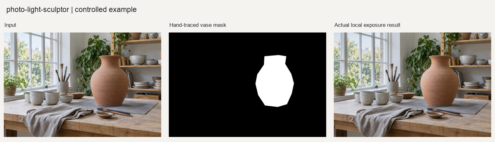

# 花瓶主体局部光影

新增[动物、城市、人物案例](cases/README.md)，含输入、实际输出和复现函数。

## 目的与输入

输入为陶器工作台及按可见花瓶轮廓手工描绘的蒙版。使用focus模式、强度1.0；不把手工蒙版误写成自动分割结果。

工作台底图是2026-09-12专为本仓库生成的合成摄影测试素材，不是相机实拍。输入随Skill保存在[input/](input/)，调用不依赖仓库外的本机文件。
## 可复现调用

在本Skill根目录的Python会话中执行；依赖见上一级requirements.txt。输出目录必须尚不存在。

```python
import runpy

example = runpy.run_path("examples/reproduce.py")
result = example["reproduce_example"]("example-review")
```

[reproduce.py](reproduce.py)是随附图片的完整参数调用；[basic_usage.py](basic_usage.py)保留通用接口演示。两者调用原有处理实现，没有用生成图充当处理后的结果。多帧模拟仅限受控测试，实际使用仍须遵守Skill的真实输入要求。

## 实际输出与复核

已核对蒙版与花瓶位置及输出，主体变化轻微，背景受到克制压暗，没有新增光源或对象。轮廓是近似多边形，需留意肩部和花瓶边缘；这不是精细分割能力验证。



[蒙版与光影预览](output/workbench_focus_preview.jpg)；[完整输出](output/)；[验证数据与输入哈希](verification.json)。

处理输出在2026-09-12实际生成。验证数据覆盖本例，不是所有模式的质量认证；程序中的待人工复核状态不被擅自升级。随附JSON和CSV中的文件路径按报告所在目录相对化，原始数值及警告保留。
