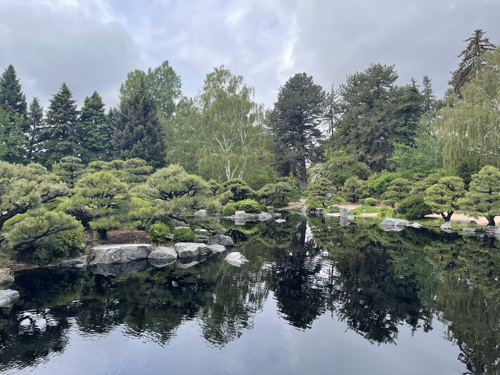
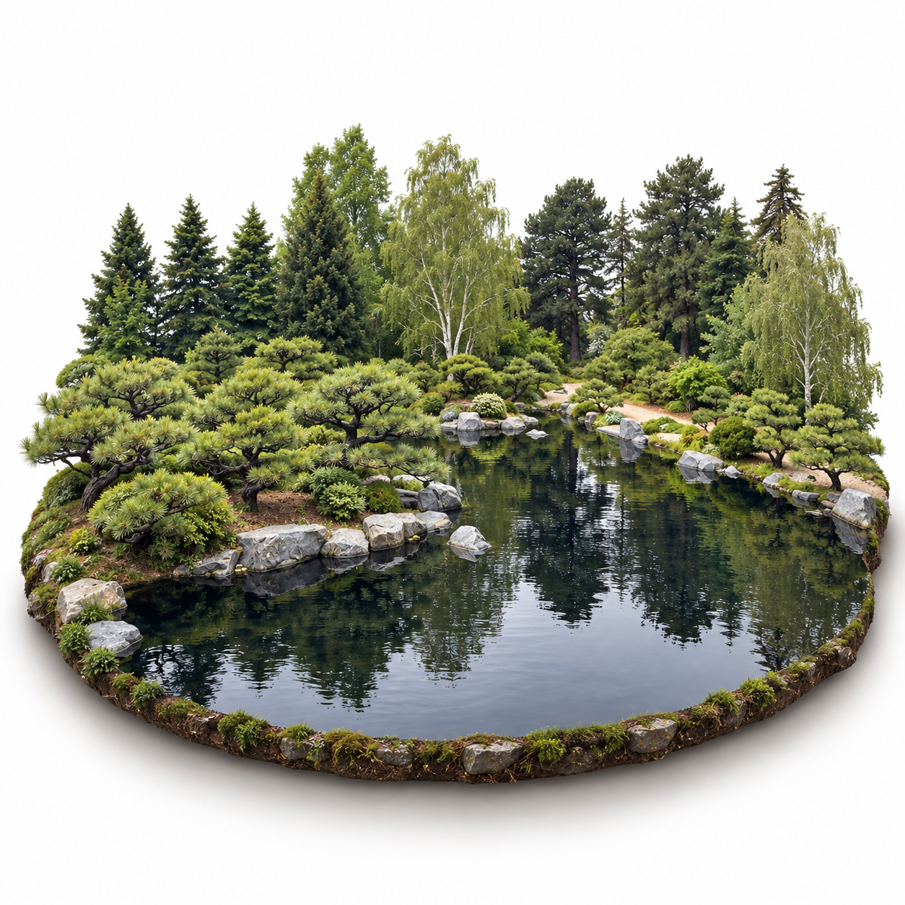
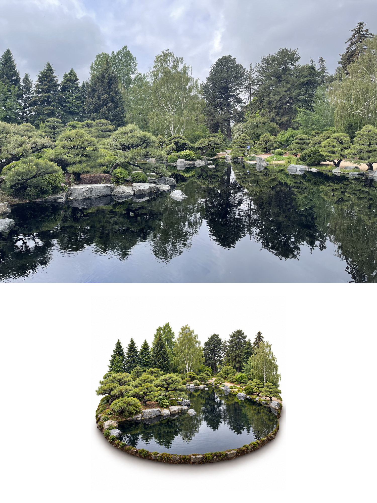

# 照片微缩景观

新增[多主题实际生成案例](examples/cases/README.md)，包含提示、图片与复核说明。

将照片中的一个地方收束为白底上的写实微缩景观。默认交付独立图片，可按需追加原照与微缩图对照海报。

## 使用

将完整目录交给能够读取图片并进行参考图生成的Agent，然后上传照片：

> 把这张照片做成写实微缩景观，白底，只补必要的侧面，保留原来的主要空间关系。

也可以要求：

> 保留车辆、护栏和后面的建筑立面，做成一个街角微缩场景，不要只抠出巴士。

> 用已经生成的微缩图和原照做上下对照海报，不要重新生成模型，不加地名。

执行规则见[SKILL.md](SKILL.md)。不要求特定模型、厂商账户或专属工具名。纯文本模型可以准备提示，但不能声称已经生成图片。

## 实际图片示例

原始庭园摄影：

基于原照生成的写实微缩图：

原照与微缩图的确定性排版：

来源、生成提示和复核结论见[示例记录](examples/README.md)。本例使用真实摄影，不是程序绘制的假照片。它证明一个庭园案例的生成与合成流程，不代表所有场景都已验证。

## 适合什么

建筑、街区、室内、海岸、山体湖泊、庭园器物、锦鲤池与车辆街景。根据照片选择地形切片、开放剖面或独立模型，不强制方形底座。

## 不做什么

- 不生成可旋转3D网格、扫描模型或真实尺寸资产。
- 不把照片加移轴模糊后称为微缩重建。
- 不做抽象色块海报、黏土或纸艺风格。
- 不承诺隐藏结构、精确小字和所有细节完全真实。

`photo-to-3d`生成深度、视差和浅浮雕；本Skill生成写实微缩观感的二维图片。两者不共享完成标准。

## 可选合成工具

生图不依赖Python。只有海报合成需要Python3.10+与Pillow；函数示例见[examples/basic_usage.py](examples/basic_usage.py)。合成工具只做排版，不调用生图服务，不修改原图，拒绝覆盖已有文件。中文标题需要自行提供包含中文字形的字体。
