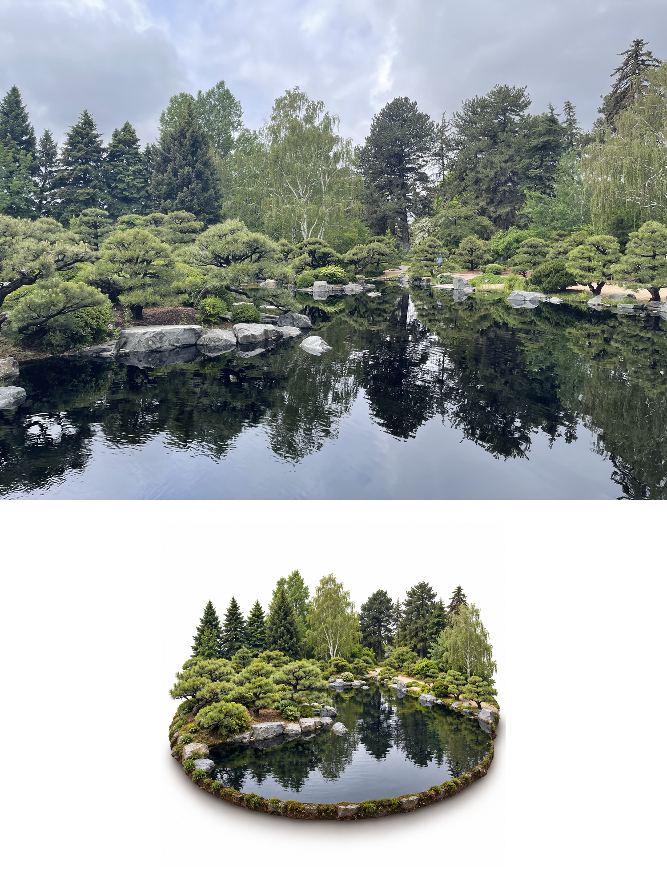

# 照片微缩景观

把照片中可见的场景重建为白底写实微缩景观。保留建筑、地形和主要物体的空间关系，同时表现模型厚度、材质与接触阴影。



庭园原照与生成微缩图的程序排版。原照作者及CC0许可见文末。

## 1. 输入与需求示例

提供一张照片，注明必须保留的主体、连接关系及可简化的背景。可选择独立微缩图或原照对照海报。执行流程见[SKILL.md](SKILL.md)。

> 把这张庭园照片重建为白底微缩景观。保留水池、岩石半岛、两岸低松和后方小路的相对位置，远景树林适度压缩。完整展示模型，留出白底和接触阴影，不增加桥梁或建筑。生成合格后，再制作上原照、下模型的对照海报。

默认微缩图为方形；对照海报为可选的3:4竖版，不自动添加地点或标题。

## 2. 视觉规格

以下为构图与生成约束，不是程序接口参数。

| 控制项 | 规范 | 作用 |
| --- | --- | --- |
| 微缩图 | 默认方形、适度俯视 | 完整展示模型，四周留白；特殊主体可调整比例。 |
| 场景结构 | 3至6项关键可见关系 | 保留桥路连接、水体走向、前后遮挡与辨识物体。 |
| 实体表现 | 有限地形厚度、材质与接触阴影 | 只补足模型成立所需的侧面和支撑。 |
| 对照海报 | 默认3:4，上原照、下微缩图 | 仅排版已验收图片，不为排版重新生成主体。 |

## 3. 生成与排版实现

微缩重建与海报排版是两个独立阶段，不能用排版工具或深度示意图冒充生成的微缩景观。

1. 从照片提取3至6项关键可见事实，包括主体、前后层次、连接、遮挡与材料。
2. 保留桥路、水体和建筑的主要关系，压缩远景，只补足模型成立所需的薄地形、侧面和支撑。
3. 通过参考图生成方形微缩景观，使用白底、适度俯视和接触阴影。重建体积，不将照片直接贴在底板上。
4. 检查物体数量、连接和主体完整度，最多两轮定向修正。被遮挡部分的补全保持推测属性。
5. 如需海报，复用已验收的微缩图，用Pillow等比适配照片和模型，另存PNG；这一阶段不重新生图。

生成阶段仅需参考图生成与看图能力，无Python依赖。排版入口为[compose_poster.py](scripts/compose_poster.py)，需要Python3.10+与Pillow，版本见[requirements.txt](requirements.txt)。以下代码在本skill根目录运行：

```python
from pathlib import Path
import sys

sys.path.insert(0, str(Path("scripts").resolve()))
from compose_poster import compose_poster

poster = compose_poster(
    "examples/garden-source.jpg",
    "examples/garden-miniature.png",
    "garden-poster-review.png",
    size=(1500, 2000),
    photo_fraction=0.5625,
    photo_fit="contain",
)
```

排版接口的`size`单位为像素，`photo_fraction`控制上方原照分区高度，范围0.3至0.65。`photo_fit`默认为`contain`，完整放入照片；`cover`采用居中裁切。添加标题时必须提供支持所需字形的`font_path`。该调用复用已有图片，不重新生图，完整示例见[调用示例](examples/basic_usage.py)。

## 4. 交付与质量控制

### 4.1 交付与质量判断

微缩结果为二维图片；海报是原照与生成图的程序排版。前者检查几何关系、材质、厚度与接触阴影，后者检查照片完整度、留白、分区及文字字形，二者分别验收。

微缩主体默认约占画面宽度的65%至80%，这是视觉目标而非精确像素蒙版。高塔、长街或贴边主体可调整画幅，不能通过截断关键结构满足占幅。

### 4.2 排版与使用边界

排版接口只接受新的PNG输出，拒绝覆盖输入或现有海报。contain保留完整照片，cover居中裁切，后者需检查关键内容。标题需单行，并提供支持相关字形的字体文件。

模型侧面、树木和池岸可能经过压缩或补全，不是对地点的真实扫描。独立微缩图与对照海报都不输出可旋转3D资产。

## 5. 示例与素材依据

庭园原照由XxTechnicianxX拍摄，以CC0授权；微缩图由模型生成，对照海报由程序排版。查看[原照来源、提示与复核](examples/README.md)及[其他场景](examples/cases/README.md)。
