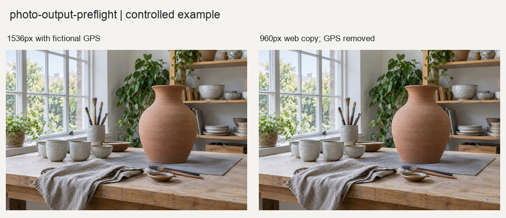

# 照片交付检查

检查照片文件是否适合网页、印刷或归档，重点覆盖尺寸、格式、有效PPI、ICC、透明通道、GPS元数据和文件完整性。

## 输入与输出

输入为照片列表和目标渠道。输出结构化质检报告；网页模式还可以生成机械性缩放和元数据处理副本。

## 使用示例

> 检查这组照片是否符合网页交付要求，列出尺寸、色彩和元数据问题。

提供照片与需求后，按[执行说明](SKILL.md)处理。Python调用方式见[函数示例](examples/basic_usage.py)。

## 图片示例

查看[输入、参数与处理结果](examples/README.md)，或使用[复现代码](examples/reproduce.py)运行随附案例。

## 使用说明

检查结论取决于目标规格。缺失ICC会如实报告，导出副本不等于视觉质量已验收。

## 适合什么任务

适合照片上传网站、交印厂或归档前的文件检查。将尺寸、格式、色彩配置、透明度、元数据及完整性问题转成明确报告。

## 如何准备素材和选择设置

提供照片列表及web、print或archive目标。印刷需给成品宽高厘米；网页应说明目标尺寸与体积要求。若有印厂ICC或渠道规范，应一并提供，缺失资料会限制结论。

## 完整请求示例

> 检查这些照片能否用于20×30厘米印刷，报告有效PPI和ICC情况。不要仅修改DPI标签，也不要在缺少目标ICC时自行转换CMYK。

这段请求可连同素材交给能读取本目录[执行说明](SKILL.md)的模型。图片处理需要相应Python依赖；生成式图片需要运行环境提供生图能力。文字对话本身不等于已经执行处理。

## 如何阅读和验收结果

有效PPI由实际像素和成品尺寸计算，修改标签不会增加细节。网页副本可进行缩放和GPS处理；归档以记录和检查为主。报告通过表示满足本次文件规则，不替代成片视觉复核。
