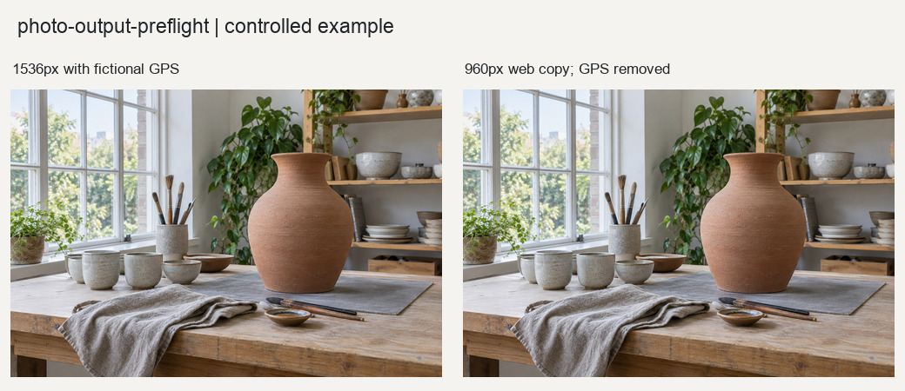

# 照片交付检查

在上传、送印或归档前检查文件规格，包括尺寸、格式、有效PPI、ICC、透明通道、GPS和文件可读性。网页模式还可生成缩放与元数据处理副本。



图示为随附案例的实际处理输出。素材、参数和验证范围见文末。

## 1. 输入要求

输入为照片列表与web、print或archive交付目标。印刷检查需明确成品宽高；已知的印厂色彩规范应一并提供。执行规范见[SKILL.md](SKILL.md)。

> 检查这些照片能否用于20×30厘米印刷，报告有效PPI、ICC和格式问题。不要只修改DPI标签，也不要在缺少印厂目标ICC时自行转换CMYK。

## 2. 处理流程与依赖

[photo_output_preflight.py](scripts/photo_output_preflight.py)先做规格检查，再按明确目标生成副本，不改变照片的创作内容。

1. 检查文件可读性，记录尺寸、格式、位深、透明度、ICC、GPS和SHA-256。
2. web检查网页兼容性；print根据成品厘米尺寸计算有效PPI；archive记录完整性及重复情况。
3. 汇总阻断项和警告。缺失ICC单独报告，不猜测未知文件的真实色彩空间。
4. 网页导出根据可用ICC做色彩处理，按长边等比缩小，并按设置移除GPS。
5. 记录导出动作和源文件哈希，确认原文件没有被覆盖。

仅依赖Pillow：Image完成读写与缩放，ExifTags处理元数据，ImageCms处理ICC转换。JSON、CSV和哈希使用Python标准库。运行要求为Python3.10+，版本见[requirements.txt](requirements.txt)。

## 3. 核心接口与参数

`inspect_delivery`生成目标规则检查报告；`prepare_web_copies`另存缩放与GPS处理副本。检查与导出是两个独立接口。

下表列出关键参数。默认值与当前接口定义一致，完整参数以源码为准。

| 参数 | 默认值或要求 | 说明 |
| --- | --- | --- |
| `target` | `web` | 检查目标，可选`web`、`print`或`archive`。 |
| `print_width_cm`、`print_height_cm` | `None` | 印刷成品宽高，单位为厘米，用于有效PPI计算。 |
| `long_edge` | `2400` | 网页副本最长边，单位为像素。 |
| `remove_gps` | `True` | 网页导出时移除GPS，不表示清理了所有元数据。 |

## 4. 调用示例

以下代码在本skill根目录的Python会话中运行，直接调用处理接口：

```python
from pathlib import Path
import sys

sys.path.insert(0, str(Path("scripts").resolve()))
from photo_output_preflight import inspect_delivery, prepare_web_copies

photos = ["photo-01.jpg", "photo-02.jpg"]
report = inspect_delivery(photos, "delivery-inspection", target="web")
if report["status"] != "blocked":
    exports = prepare_web_copies(
        photos, "delivery-copies", long_edge=2400, remove_gps=True
    )
```

该例先做web检查，无阻断项时再生成长边2400像素、移除GPS的副本。印刷检查需通过`inspect_delivery`另传物理尺寸，见[调用示例](examples/basic_usage.py)。随附图片的实际参数见[reproduce.py](examples/reproduce.py)。

## 5. 交付文件与质量控制

### 5.1 文件与结果解释

检查报告按目标生成`delivery_目标_report.json`，记录逐文件问题与总状态。网页副本附`web_export_report.json`，记录尺寸、色彩动作与GPS处理。

报告通过仅表示满足本次规则。缺少ICC、印厂条件不明确或要求超出规则范围时，应依据警告继续确认，不能将pass解释为视觉、印刷或隐私全部通过。

### 5.2 参数选择与失败条件

print必须给出正数成品宽高；网页`long_edge`至少320像素。现有导出只在输入长边超过目标时缩小，不通过放大增加清晰度。目标尺寸应与页面或渠道实际需求一致。

输入重复、网页输出同名或既有文件冲突时停止。GPS移除不清理全部EXIF；没有印厂目标ICC时不声称完成CMYK转换。

## 6. 示例与验证

基础示例生成长边960像素副本并移除测试GPS，原文件哈希不变。它不覆盖印刷ICC、CMYK或全部元数据隐私风险。查看[交付记录](examples/README.md)及[其他题材案例](examples/cases/README.md)。
