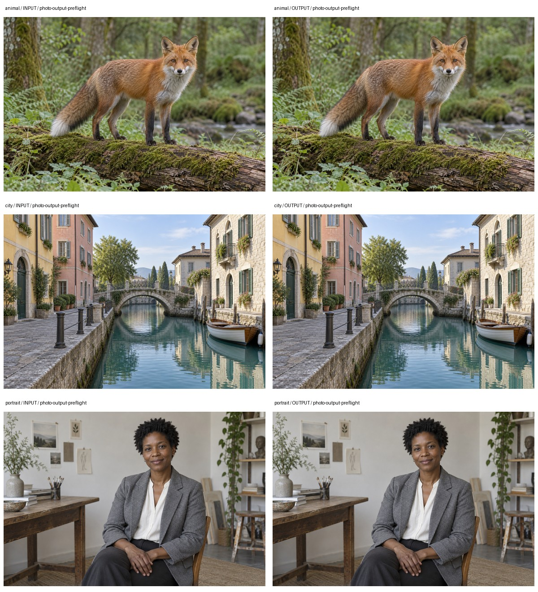

# 多题材处理案例

1152像素长边输入低于默认1200阈值，检查应当阻断；同时示范用户指定800像素网页副本导出。导出成功不消除原始交付规格的不合格结论。

## 输入与复现

[动物](animal/comparison.jpg)、[城市](city/comparison.jpg)、[人物](portrait/comparison.jpg)使用本仓库专门生成的合成摄影素材。每组input目录保存实际输入，output保存程序实际结果，verification.json记录源文件哈希与执行情况。对照板只缩放排版，不修饰处理结果。

在独立Python会话中加载[reproduce.py](reproduce.py)，调用reproduce_case("animal", 新输出目录)。case_name也可为city或portrait；依赖使用本Skill的requirements.txt，输出目录不得已存在。

报告中的review、blocked和警告均保留；退出码为0不等于所有业务条件通过。复核范围见[仓库审计](../../../AUDIT.md)。
