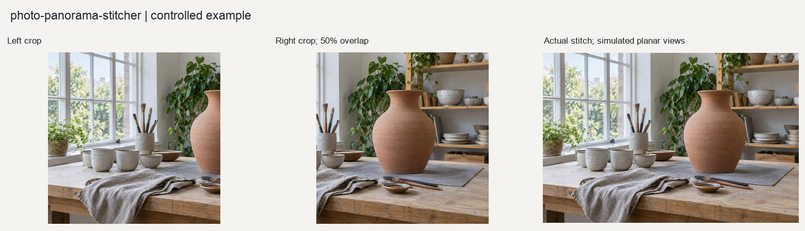

# 全景照片拼接

将两张及以上具有真实重叠、共同扩展视场的照片拼接为全景图。

## 输入与输出

输入照片必须按空间相邻顺序排列。输出TIFF、JPEG预览、有效区域蒙版、接缝图、联系表和JSON报告。

## 使用示例

> 按左右顺序拼接这组有重叠的照片，保留有效画面，并标出接缝风险。

提供照片与需求后，按[执行说明](SKILL.md)处理。Python调用方式见[函数示例](examples/basic_usage.py)。

## 图片示例

查看[输入、参数与处理结果](examples/README.md)，或使用[复现代码](examples/reproduce.py)运行随附案例。

## 使用说明

相邻照片需要可靠重叠和新增视场；不会生成未拍摄的区域，明显视差或运动需要人工复核。

## 适合什么任务

适合从左右或上下连续拍摄的照片获得更宽视场。通过真实重叠区域建立配准，在共同画布上拼接，并报告接缝与几何风险。

## 如何准备素材和选择设置

至少两张有可靠重叠且各自包含新增视场的照片，按空间相邻顺序提供。窄幅或平面主题可用planar，宽视角旋转拍摄可用cylindrical。近距离多平面场景与移动主体更难拼接。

## 完整请求示例

> 按左到右顺序拼接这组远景照片，采用圆柱投影，输出接缝图和有效区域蒙版。若焦距采用估计值，请在报告中注明。

这段请求可连同素材交给能读取本目录[执行说明](SKILL.md)的模型。图片处理需要相应Python依赖；生成式图片需要运行环境提供生图能力。文字对话本身不等于已经执行处理。

## 如何阅读和验收结果

检查栏杆、建筑边缘和移动人物是否错位，观察天空亮度过渡。有效区域蒙版说明哪些位置有源图支持；未拍摄的空白只会裁除，不会生成填充。裁边成功不代表接缝无误。
