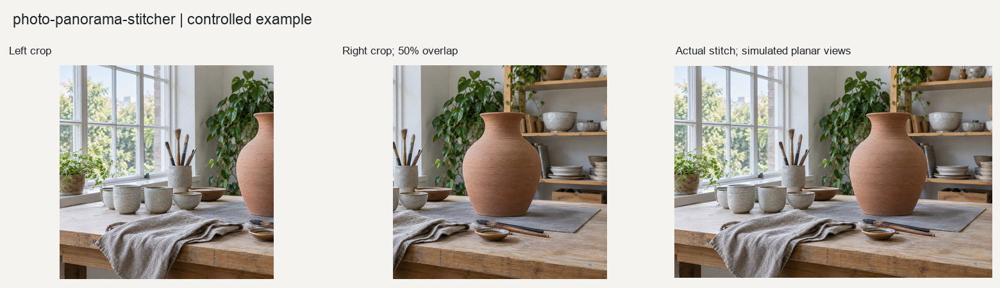
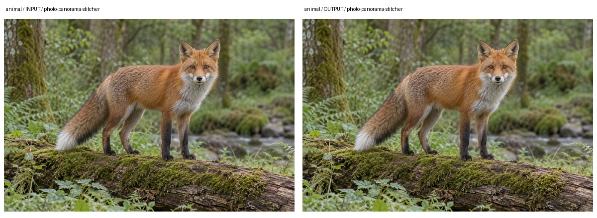
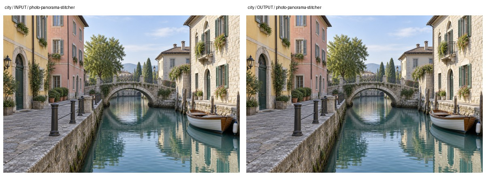
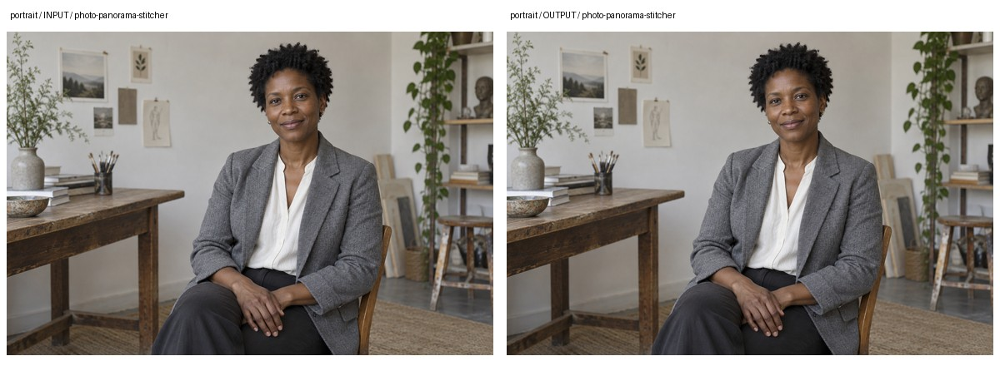

# 全景照片拼接

将具有真实重叠区域的相邻照片拼接为更宽的视场。基于源图配准与融合，不生成未拍摄内容。



图示为随附案例的实际处理输出。素材、参数和验证范围见文末。

## 1. 输入要求

输入至少两张有可靠重叠且包含新增视场的照片，按空间相邻顺序排列。圆柱投影可提供可靠焦距，参数单位为像素。执行规范见[SKILL.md](SKILL.md)。

> 按左到右顺序拼接这组远景照片，采用圆柱投影。保留有效画面，输出接缝图与有效区域蒙版。若焦距需要估计，请在报告中注明，不填补未拍摄区域。

## 2. 处理流程与依赖

[photo_panorama_stitcher.py](scripts/photo_panorama_stitcher.py)根据相邻照片的共同区域建立几何关系，再将新视场加入公共画布。

1. 检查空间顺序和投影参数。每张输入应与相邻帧有可匹配区域，并带来新增视场。
2. 提取SIFT特征；不可用时回退ORB。匹配经过比率筛选，RANSAC排除错误对应并估计单应变换。
3. 采用平面或圆柱投影组织公共画布，检查几何规模与有效覆盖。
4. 对重叠区进行亮度补偿，并以距离权重融合过渡。
5. 裁取完全有效区域，另存结果、接缝过渡图和配准记录。

NumPy承担变换及融合数组计算，OpenCV承担特征、匹配与投影，Pillow负责图像读写和联系表。运行要求为Python3.10+，版本见[requirements.txt](requirements.txt)。

## 3. 核心接口与参数

`analyze_panorama`检查相邻匹配与投影风险；`stitch_panorama`进行配准、融合和有效区域裁切。

下表列出关键参数。默认值与当前接口定义一致，完整参数以源码为准。

| 参数 | 默认值或要求 | 说明 |
| --- | --- | --- |
| `projection` | `planar` | 平面投影；宽视角旋转拍摄可选择`cylindrical`。 |
| `focal_length_px` | `None` | 圆柱投影使用的像素焦距；缺省时估计，需记录来源。 |

## 4. 调用示例

以下代码在本skill根目录的Python会话中运行，直接调用处理接口：

```python
from pathlib import Path
import sys

sys.path.insert(0, str(Path("scripts").resolve()))
from photo_panorama_stitcher import analyze_panorama, stitch_panorama

photos = ["left.jpg", "middle.jpg", "right.jpg"]
analysis = analyze_panorama(photos, projection="planar")
if not analysis["blockers"]:
    result = stitch_panorama(photos, "panorama-review", projection="planar")
```

基础示例使用planar模式，先调用`analyze_panorama`，有阻断项时停止；通过后调用`stitch_panorama`。更多参数见[调用示例](examples/basic_usage.py)，随附图片的实际调用见[reproduce.py](examples/reproduce.py)。

## 5. 交付文件与质量控制

### 5.1 文件与结果解释

`panorama_16bit.tif`与`panorama_preview.jpg`保存结果；`valid_area_mask.png`显示源图覆盖；`seam_transition_map.png`显示融合过渡；`stitch_contact_sheet.jpg`和`panorama_report.json`记录对齐与风险。

有效区域蒙版不是内容真实性认证。16位输出也不增加源图实际记录的细节。

### 5.2 参数选择与失败条件

planar用于较窄视角或近似平面主题；cylindrical用于宽视角旋转拍摄。圆柱焦距单位为像素，不能直接传毫米焦距；缺省估计值应在报告中说明。

匹配不足、空间顺序错误、画布规模异常或无完整有效裁切时停止。近距离多层景物和移动主体可能违反单应变换假设，表现为重影或断裂。空白区域只裁除，不生成补齐。

## 6. 示例与应用

### 6.1 基础案例

基础示例是同一底图的两个裁片，重叠50%，使用平面模型拼接。它验证特征匹配和接缝处理，不验证真实多视角、视差或圆柱投影。查看[匹配与输出记录](examples/README.md)及[其他题材案例](examples/cases/README.md)。

### 6.2 多题材实际对照

下列图片来自仓库已有处理记录。输入为独立生成的合成摄影素材，对照板仅缩放排版；示例不等同于实拍验收。

| 动物 | 城市 | 人物 |
| --- | --- | --- |
|  |  |  |

实际设置：从同一底图裁出两个有50%重叠的区域，使用平面模型拼接。

| 题材 | 看图重点 |
| --- | --- |
| 动物 | 观察毛发与主体边界在接缝处是否连续，不代表移动动物的拼接已验证。 |
| 城市 | 观察建筑直线、岸线和重复结构，检查重叠区域的匹配与融合。 |
| 人物 | 观察人物轮廓是否在接缝中重复；这组静态裁片不覆盖真实人物移动。 |

验证范围：裁片具有相同视点，不包含真实近景视差。手持旋转、圆柱投影与动态主体需用独立实拍序列复核。

输入、输出与复现方式见[案例记录](examples/cases/README.md)及[实际调用](examples/cases/reproduce.py)。报告中的待复核、阻断与警告状态均应保留，不能以程序执行成功代替质量验收。

### 6.3 应用请求示例

以下请求用于新任务，不是上面案例的实际调用记录。应按自有素材、处理目标与确认状态调整。

#### 6.3.1 远景横向全景

> 按左到右顺序拼接这组有真实重叠的远景照片，采用圆柱投影。提供已知焦距或注明估计值，输出有效区域蒙版与接缝图，不生成未拍摄内容。

复核重点：检查地平线、建筑直线和画面边缘拉伸，核对有效范围是否覆盖真正拍摄的区域。

#### 6.3.2 近景栏杆拼接风险

> 先评估这组含近景栏杆的照片是否适合拼接。检查栏杆与远景能否同时对齐；若视差导致错位，指出具体区域，先给预览，不自动补画或隐藏问题。

复核重点：检查栏杆、地面及远景的相对位移，不能只以某一层匹配成功判定全景可用。
