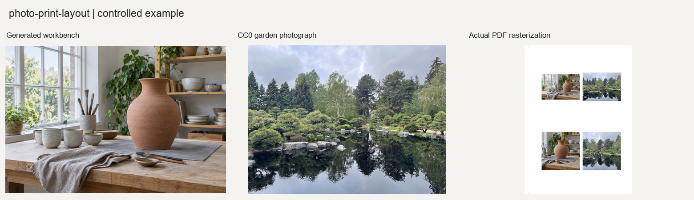

# 照片印刷拼版

把已经定稿的照片按毫米纸张、网格、边距、出血和装订安全区放入物理页面。

## 输入与输出

输入为已定稿照片和页面几何参数。输出高分辨率页面PNG、印刷尺寸PDF、低分辨率预览、JSON和CSV放置清单。

## 使用示例

> 把这些定稿照片排成A4双栏页面，保留完整画面，给出PDF和页面预览。

提供照片与需求后，按[执行说明](SKILL.md)处理。Python调用方式见[函数示例](examples/basic_usage.py)。

## 图片示例

查看[输入、参数与处理结果](examples/README.md)，或使用[复现代码](examples/reproduce.py)运行随附案例。

## 使用说明

页面按物理尺寸与有效PPI检查；当前输出为RGB，送印前仍需确认印厂的色彩要求。
