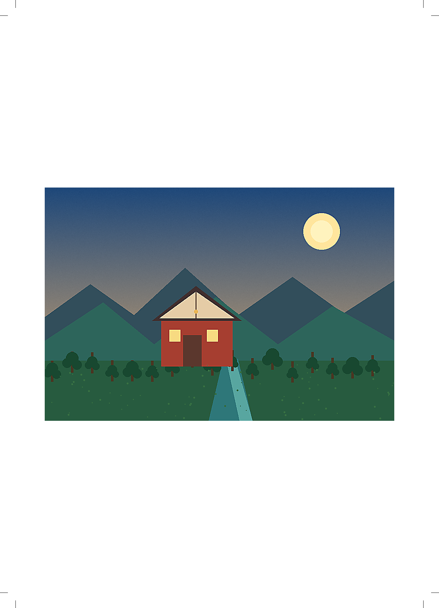

# photo-print-layout

## 功能定位

把已经定稿的照片按毫米纸张、网格、边距、出血和装订安全区放入物理页面。它不重新裁图、调色或制作报告文档。

## 适用场景

- 摄影集内页和照片墙排版
- 联系印样与多图印刷拼版
- 需要明确有效PPI、出血和裁切标记的PDF交付

## 输入与输出

输入为已定稿照片和页面几何参数。输出高分辨率页面PNG、印刷尺寸PDF、低分辨率预览、JSON和CSV放置清单。

## 使用示例

A4双栏拼版示例见[`examples/basic_usage.py`](examples/basic_usage.py)：

```python
result = run_example(input_paths, "print-layout")
```

## 图片示例

输入：[`sample_scene.png`](../example-assets/sample_scene.png)



## 验收重点

- `contain`不裁图，`cover-*`才允许裁切
- 有效PPI低于最低阈值时默认停止
- PDF生成后必须实际渲染检查
- 当前输出是RGB，不包含印厂ICC和CMYK转换

完整物理坐标和出血规则见[`SKILL.md`](SKILL.md)。
