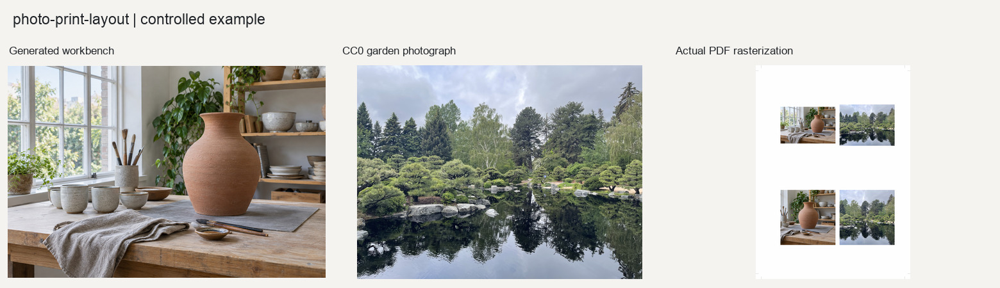
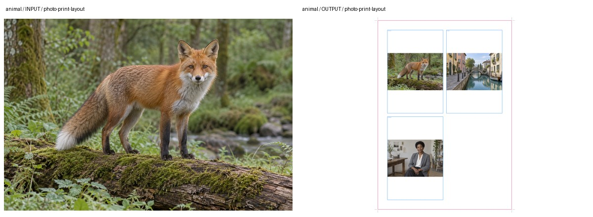
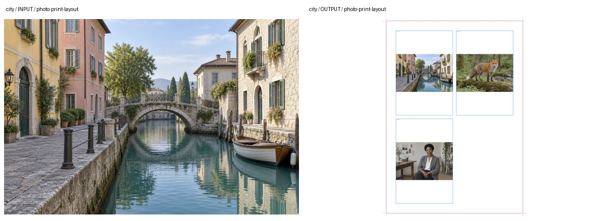
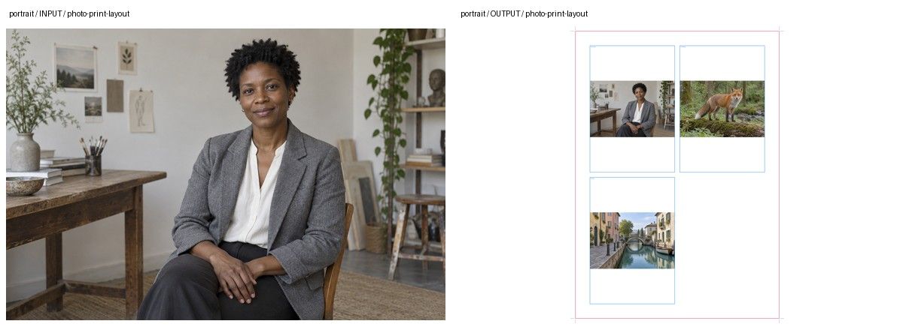

# 照片印刷拼版

把定稿照片按物理尺寸排入页面，控制网格、边距、间距、出血和装订安全区。适合联系页、照片展示页和多页版面。



图示为随附案例的实际处理输出。素材、参数和验证范围见文末。

## 1. 输入要求

输入为有序定稿照片、纸张尺寸、行列数与放置策略。纸张、边距、间距、出血和装订参数均采用毫米，需按实际制作要求设置。执行规范见[SKILL.md](SKILL.md)。

> 将这8张照片按顺序排成A4两行两列，每张完整放入，图间距6毫米。目标300dpi，最低有效PPI为240。生成多页PDF和槽位预览，列出分辨率不足的照片；出血与装订参数按印厂要求设置。

## 2. 处理流程与依赖

[photo_print_layout.py](scripts/photo_print_layout.py)将毫米页面规划转换为栅格画面与物理尺寸PDF，排版规划与文件渲染分离。

1. 检查纸张、边距、间距、出血和装订区域是否留下可用版心。
2. 按有序输入分配网格槽位，计算contain留白或cover裁切范围。
3. 根据实际使用的源图像素与放置厘米尺寸计算有效PPI，标记低分辨率照片。
4. 用Pillow按页面DPI渲染高分辨率RGB页面，并生成带参考线的低分辨率预览。
5. 用ReportLab将已渲染页面写入物理尺寸PDF，另存JSON和CSV放置清单。

Pillow负责图像适配、栅格页面与预览；ReportLab负责PDF封装。运行要求为Python3.10+，版本见[requirements.txt](requirements.txt)。PDF中嵌入的是页面图像，不是每张照片独立可编辑的版面对象。

## 3. 核心接口与参数

`analyze_print_layout`返回页面规划与警告；`create_print_layout`按规划生成页面、PDF及放置清单。

下表列出关键参数。默认值与当前接口定义一致，完整参数以源码为准。

| 参数 | 默认值或要求 | 说明 |
| --- | --- | --- |
| `paper_size_mm` | 必填 | 纸张宽高，如A4为`(210, 297)`。 |
| `grid` | 必填 | 顺序为`(rows, columns)`，不是宽高。 |
| `fit_strategy` | 必填 | `contain`或`cover-center`、`cover-top`、`cover-bottom`。 |
| `margins_mm` | `10` | 单值或按上、右、下、左排列的四值。 |
| `dpi`、`minimum_ppi` | `300`、`240` | 页面栅格分辨率与源图最低有效PPI，两者含义不同。 |
| `allow_low_ppi` | `False` | 是否允许低PPI继续导出；开启不增加源图细节。 |

## 4. 调用示例

以下代码在本skill根目录的Python会话中运行，直接调用处理接口：

```python
from pathlib import Path
import sys

sys.path.insert(0, str(Path("scripts").resolve()))
from photo_print_layout import analyze_print_layout, create_print_layout

photos = ["photo-01.jpg", "photo-02.jpg", "photo-03.jpg", "photo-04.jpg"]
settings = {
    "paper_size_mm": (210, 297),
    "grid": (2, 2),
    "fit_strategy": "contain",
    "margins_mm": (15, 15, 18, 20),
    "gap_mm": 6,
    "bleed_mm": 3,
    "binding_edge": "left",
    "binding_safe_mm": 8,
    "dpi": 300,
    "minimum_ppi": 240,
}
plan = analyze_print_layout(photos, **settings)
if not any("below minimum" in warning for warning in plan["warnings"]):
    result = create_print_layout(photos, "print-review", **settings)
```

该例使用A4、2×2网格、contain、300dpi及最低240PPI，先调用`analyze_print_layout`，检查通过后调用`create_print_layout`。边距、3毫米出血和左侧装订安全区均在[调用示例](examples/basic_usage.py)中明确；自有任务需按实际要求修改。[reproduce.py](examples/reproduce.py)保存随附图片的调用。

## 5. 交付文件与质量控制

### 5.1 文件与结果解释

输出`photo_print_layout_page_序号.png`、`photo_print_layout_preview_序号.png`、`photo_print_layout.pdf`及manifest JSON、CSV。命名可通过`output_basename`调整。

页面尺寸包含出血时，应区分成品裁切尺寸与实际输出媒体尺寸。预览用于检查槽位和安全区，不替代高分辨率页面或印刷色彩打样。

### 5.2 参数选择与失败条件

contain保留完整照片并允许留白；cover-center、cover-top和cover-bottom填满槽位并按对应锚点裁切。人物和建筑应检查裁掉的区域。出血是裁切余量，装订安全区是内容保护距离，不能互相替代。

默认低于最低PPI时不导出，除非显式允许。边距和间距耗尽版心、输出冲突或页面渲染规模过大时停止。当前为RGB栅格PDF，不含完整PDF/X生产规范，送印前需核对印厂要求。

## 6. 示例与应用

### 6.1 基础案例

基础示例使用生成工作台与CC0庭园照片，实际输出A4四格PDF并经独立渲染查看。它验证页面放置与尺寸，不是印厂色彩打样。查看[PDF、参数与素材许可](examples/README.md)及[其他版面案例](examples/cases/README.md)。

### 6.2 多题材实际对照

下列图片来自仓库已有处理记录。输入为独立生成的合成摄影素材，对照板仅缩放排版；示例不等同于实拍验收。

| 动物 | 城市 | 人物 |
| --- | --- | --- |
|  |  |  |

实际设置：每个案例将同一组3张不同题材照片按相应顺序放入2×2的A4页面，第四格留空。使用contain完整放入，边距15毫米、目标300dpi、最低有效PPI为240。

| 题材 | 看图重点 |
| --- | --- |
| 动物 | 动物照片优先排入，检查完整轮廓和槽位留白。 |
| 城市 | 城市照片优先排入，检查横向照片在网格中的放置尺寸。 |
| 人物 | 人物照片优先排入，检查竖向照片比例和未使用槽位。 |

验证范围：已有PDF经过渲染检查，但仍保留缺ICC警告。排版尺寸正确不代表色彩打样通过，也不能代替印厂文件规范。

输入、输出与复现方式见[案例记录](examples/cases/README.md)及[实际调用](examples/cases/reproduce.py)。报告中的待复核、阻断与警告状态均应保留，不能以程序执行成功代替质量验收。

### 6.3 应用请求示例

以下请求用于新任务，不是上面案例的实际调用记录。应按自有素材、处理目标与确认状态调整。

#### 6.3.1 保留完整画面的联系页

> 将这8张定稿照片按顺序排为A4两行两列，采用contain完整放入，边距15毫米，图间距6毫米。目标300dpi、最低有效PPI240，生成多页PDF并列出低分辨率项。

复核重点：逐页检查顺序、空槽位和完整边缘，再结合实际槽位尺寸核对有效PPI。

#### 6.3.2 明确裁切的展示页

> 将这些照片制作成统一满格展示页，采用cover-center填满槽位。我会确认可裁切区域；先输出带槽位范围的预览，发现人像或建筑主体被截断时暂停定稿。

复核重点：区分满格布局与主体完整性；出血、装订和印厂规范必须按实际要求确认。
