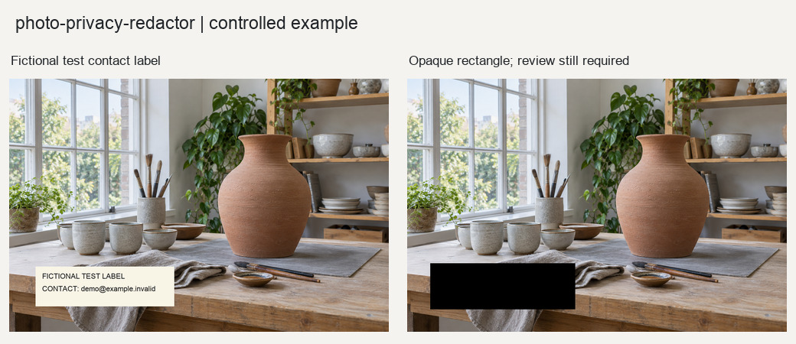

# 照片隐私遮挡

对用户确认的画面敏感区域进行不可逆实心遮挡。

## 输入与输出

输入为照片、矩形、蒙版和候选决策。输出遮挡PNG、二值蒙版、标记预览和复核JSON。GPS和EXIF风险不属于本Skill。

## 使用示例

> 把我标出的敏感区域做实心遮挡，输出无损图片，并保留复核预览。

提供照片与需求后，按[执行说明](SKILL.md)处理。Python调用方式见[函数示例](examples/basic_usage.py)。

## 图片示例

查看[输入、参数与处理结果](examples/README.md)，或使用[复现代码](examples/reproduce.py)运行随附案例。

## 使用说明

自动人脸检测仅提供候选，可能漏检或误报。需人工确认区域并检查遗漏；本流程不处理EXIF元数据。

## 适合什么任务

适合对已确认的脸部、票据文字、屏幕或其他敏感区域进行实心覆盖。最终PNG将对应像素替换为不透明色块，原图单独保留。

## 如何准备素材和选择设置

提供照片及矩形或蒙版，明确需要遮挡的区域。自动检测仅提供正面人脸候选，每个候选需确认遮挡或排除；车牌、二维码、文字等不能依赖自动识别。

## 完整请求示例

> 遮挡我标出的姓名和二维码区域，使用不透明实心块。列出人脸候选供确认，并生成最终PNG、遮挡蒙版和标记预览。

这段请求可连同素材交给能读取本目录[执行说明](SKILL.md)的模型。图片处理需要相应Python依赖；生成式图片需要运行环境提供生图能力。文字对话本身不等于已经执行处理。

## 如何阅读和验收结果

逐一检查小脸、侧脸、边缘和遗漏区域，确认遮挡覆盖完整。结果保留源EXIF和ICC，画面遮挡不代表GPS等元数据已清理。不要将带敏感信息的源图或复核材料当作公开成片。
