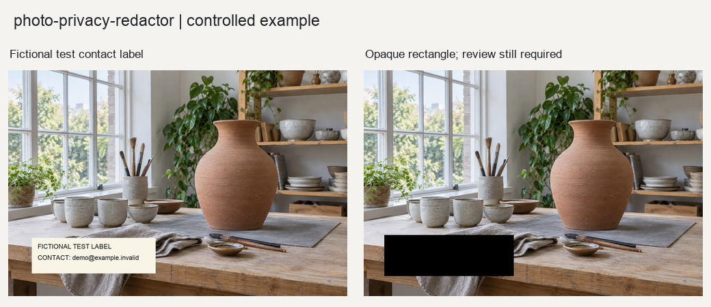
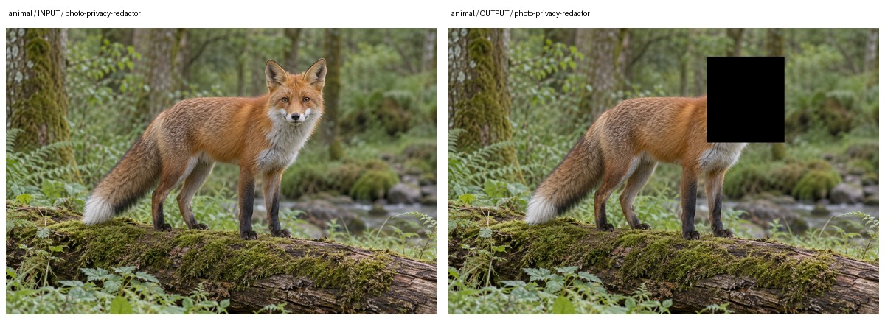
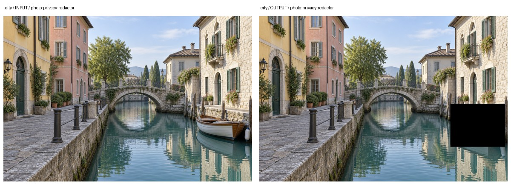
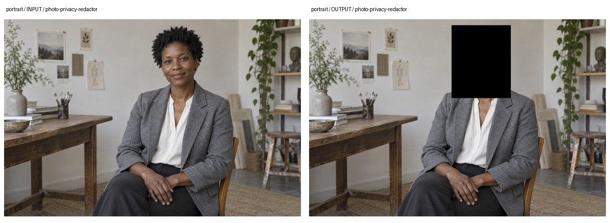

# 照片隐私遮挡

对已确认的敏感区域使用不透明实心块，输出无损PNG。适合遮挡人脸、姓名、二维码和屏幕内容，但需要用户确认区域。



图示为随附案例的实际处理输出。素材、参数和验证范围见文末。

## 1. 输入要求

输入为照片，以及用户确认的矩形、蒙版或人脸候选决定。候选检测只覆盖正面人脸，其他敏感内容由用户指定。执行规范见[SKILL.md](SKILL.md)。

> 遮挡我标出的姓名和二维码，使用不透明实心块，不用模糊或马赛克。列出人脸候选供我确认，输出遮挡PNG、蒙版和复核预览。未确认的候选保留待复核状态。

## 2. 处理流程与依赖

[photo_privacy_redactor.py](scripts/photo_privacy_redactor.py)区分候选检测、区域确认和像素覆盖，未确认的人脸候选不会自动进入遮挡区域。

1. 读取照片与元数据，透明图先合成到不透明白底，避免透明通道保留的内容意外显现。
2. 使用Haar级联提供正面人脸候选，并记录检测器是否可用。不可用与检测结果为零是不同状态。
3. 对候选明确记录redact或reject；未决定者保持pending。用户指定矩形与蒙版直接进入合并区域。
4. 将区域内像素替换为实心RGB值，保存为无损PNG，不用模糊、马赛克或可逆图层。
5. 生成二值蒙版、候选标记预览及复核记录，按整张原图检查遗漏。

NumPy承担区域并集与像素替换，OpenCV承担Haar候选与蒙版处理，Pillow负责方向、透明度和PNG输出。运行要求为Python3.10+，版本见[requirements.txt](requirements.txt)，决策规则见[复核规范](references/review-policy.md)。

## 3. 核心接口与参数

`detect_face_candidates`提供候选，不完成隐私审批；`redact_photo`按确认区域替换像素并输出复核记录。

下表列出关键参数。默认值与当前接口定义一致，完整参数以源码为准。

| 参数 | 默认值或要求 | 说明 |
| --- | --- | --- |
| `rectangles` | 空集合 | 显式区域；通过`unit`注明像素或归一化坐标。 |
| `mask_paths` | 空集合 | 用户提供的遮挡蒙版。 |
| `candidate_decisions` | `None` | 仅接受`redact`或`reject`，未决定的候选保持pending。 |
| `manual_review_confirmed` | `False` | 记录整张图是否完成敏感信息复核。 |
| `fill_rgb` | `(0, 0, 0)` | 实心覆盖颜色，默认黑色。 |

## 4. 调用示例

以下代码在本skill根目录的Python会话中运行，直接调用处理接口：

```python
from pathlib import Path
import sys

sys.path.insert(0, str(Path("scripts").resolve()))
from photo_privacy_redactor import detect_face_candidates, redact_photo

candidates = detect_face_candidates("photo.jpg")
result = redact_photo(
    "photo.jpg", "redaction-review",
    rectangles=[{
        "left": 0.10, "top": 0.20, "right": 0.35, "bottom": 0.55,
        "unit": "normalized",
    }],
    manual_review_confirmed=False,
)
```

示例中的归一化矩形仅供演示，需替换为实际区域；调用设置`manual_review_confirmed=False`。必须按实际敏感区域修改坐标、检查整张图并完成复核，不能直接把示例输出当作可公开文件。参数见[调用示例](examples/basic_usage.py)与[图片复现函数](examples/reproduce.py)。

## 5. 交付文件与质量控制

### 5.1 文件与状态解释

输出遮挡PNG、`_redaction_mask.png`、`_redaction_preview.jpg`和复核JSON。原图单独保留，输出中的实心覆盖不删除其他副本。

尚有候选未决定时为`needs-candidate-review`；候选已处理但漏检复核未确认时为`needs-manual-review`；本次画面复核确认后才可记录`content-redaction-reviewed`。这些状态不代表所有隐私风险已经消除。

### 5.2 参数选择与失败条件

`candidate_decisions`只接受redact或reject，pending通过不传决定表示。未知候选编号和无效区域应先纠正。矩形应留足边缘余量，并检查小脸、侧脸、反射、边缘文字和二维码。

输出规范化方向后保留源EXIF和ICC，不移除GPS。含敏感内容的源图、蒙版和复核材料不应作为公开示例；画面遮挡与元数据清理是不同操作。

## 6. 示例与应用

### 6.1 基础案例

基础示例遮挡人工加入的虚构联系标签。区域内像素被替换为黑色，区域外不变；人工复核状态仍未确认，不能视为发布批准。查看[像素验证记录](examples/README.md)、[候选确认流程](examples/candidate-review/README.md)及[其他题材案例](examples/cases/README.md)。

### 6.2 多题材实际对照

下列图片来自仓库已有处理记录。输入为独立生成的合成摄影素材，对照板仅缩放排版；示例不等同于实拍验收。

| 动物 | 城市 | 人物 |
| --- | --- | --- |
|  |  |  |

实际设置：按用户明确指定的归一化矩形执行实心遮挡。自动检测另列候选，包括误报；manual_review为False，仍需候选确认。

| 题材 | 看图重点 |
| --- | --- |
| 动物 | 仅展示任意区域的像素替换，不意味着动物本身需要隐私遮挡。 |
| 城市 | 仅展示指定区域的遮挡，不能自动证明标牌或屏幕文字已全部识别。 |
| 人物 | 检查人脸候选、漏检及误报，需要人工分别确认是否遮挡。 |

验证范围：实心遮挡与发布批准是两件事。已有[候选确认案例](examples/candidate-review/README.md)说明人工决定流程；图片区域已遮挡也不代表全部元数据已清理。

输入、输出与复现方式见[案例记录](examples/cases/README.md)及[实际调用](examples/cases/reproduce.py)。报告中的待复核、阻断与警告状态均应保留，不能以程序执行成功代替质量验收。

### 6.3 应用请求示例

以下请求用于新任务，不是上面案例的实际调用记录。应按自有素材、处理目标与确认状态调整。

#### 6.3.1 截图姓名与二维码遮挡

> 将我标出的姓名、二维码和屏幕内容用不透明实心块遮挡，输出无损PNG、蒙版与复核预览。只处理已确认区域，不用模糊或马赛克，不覆盖原图。

复核重点：检查敏感内容是否完整覆盖、区域外是否保持不变，并另行检查元数据。

#### 6.3.2 多人照片候选复核

> 列出这张多人照片的人脸候选，供我逐项确认遮挡或保留。未确认候选保持待复核，不把检测成功当作隐私审核完成；确认后才输出发布副本。

复核重点：人工检查侧脸、遮挡人脸和误报；机器候选列表不构成完整隐私清单。
