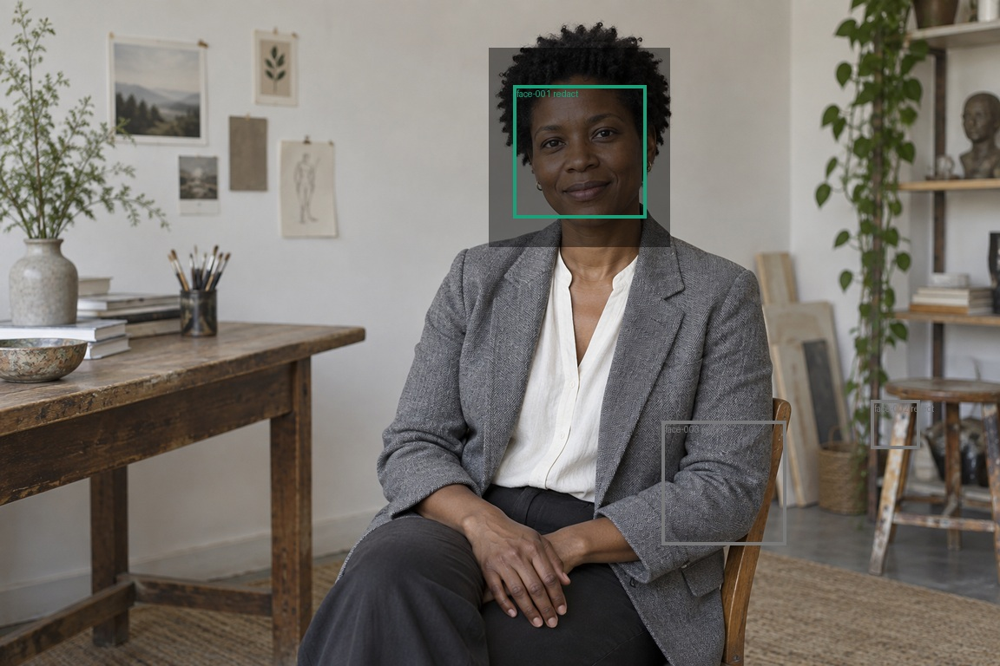

# 人脸候选确认示例

OpenCV4.11对随附1152×768合成人像给出3个候选：一处真实人脸，两处分别位于椅子和衣袖的误报。示例明确接受face-001，拒绝face-002和face-003，验证候选确认流程，而非自动批准所有框。

[reproduce.py](reproduce.py)锁定本例已复核的候选坐标；检测结果变化时返回待确认，不复用旧ID猜测。原始图片见[cases/portrait/input/source.png](../cases/portrait/input/source.png)。

状态为needs-manual-review：本例没有用户的全图漏检确认，不声称已经安全发布。仅遮挡像素，元数据另行检查。
