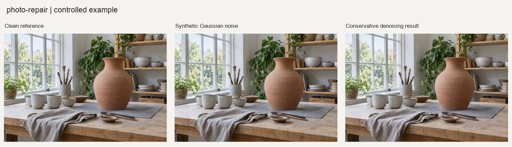

# 照片技术修复

诊断并修复照片采集阶段的技术缺陷，包括高ISO噪点、径向暗角、横向色差、坏点和热噪点。

## 输入与输出

输入为一张或多张照片。流程先输出诊断，再生成100%裁切预览，确认力度后写入独立修复目录。原文件始终只读。

## 使用示例

> 给这张高感照片做降噪，先提供局部对照，尽量保留毛发和纹理。

提供照片与需求后，按[执行说明](SKILL.md)处理。Python调用方式见[函数示例](examples/basic_usage.py)。

## 图片示例

查看[输入、参数与处理结果](examples/README.md)，或使用[复现代码](examples/reproduce.py)运行随附案例。

## 使用说明

降噪强度需要结合细节预览确认；已经剪切的高光信息无法凭空恢复。

## 适合什么任务

适合高感噪点、暗角和色差等技术缺陷处理。先测量问题，再用局部原尺寸预览判断力度，减少降噪造成的蜡感和细节损失。

## 如何准备素材和选择设置

提供原图及拍摄题材，可选high_iso、landscape、astro或wildlife预设。需要精确暗角校正时补充平场照片或对应镜头资料；单张场景亮度不一定能可靠区分自然明暗与暗角。

## 完整请求示例

> 诊断这张高感动物照片，先展示中心、边缘和边角100%修复预览。优先保留毛发细节，说明降噪和暗角建议，确认力度后再输出成片。

这段请求可连同素材交给能读取本目录[执行说明](SKILL.md)的模型。图片处理需要相应Python依赖；生成式图片需要运行环境提供生图能力。文字对话本身不等于已经执行处理。

## 如何阅读和验收结果

检查噪点减少是否以细节涂抹为代价，锐化有无边缘光圈，角部提亮是否自然。输出与报告记录处理设置及元数据保留状态；不要把清晰度改善解释为恢复了未记录的真实纹理。
