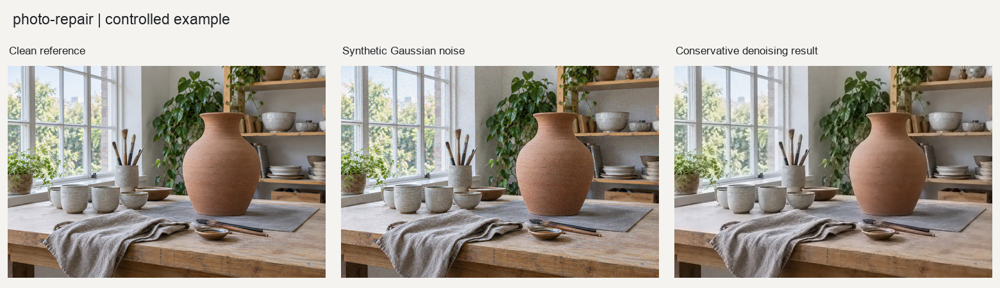

# 照片技术修复

处理高ISO噪点、径向暗角、横向色差及坏点。先诊断，再查看100%局部预览，确认力度后输出修复副本；原文件保持只读。



图示为随附案例的实际处理输出。素材、参数和验证范围见文末。

## 1. 输入要求

输入为原始照片，补充题材与需要保留的细节。精确暗角校正需提供平场图或镜头资料；预设可选high_iso、landscape、astro和wildlife。执行规范见[SKILL.md](SKILL.md)。

> 诊断这张高感动物照片，先生成中心、边缘和边角的100%修复对照。以保留毛发为优先，说明降噪力度和暗角建议，确认后再输出成片。

## 2. 处理流程与依赖

入口为[photo_repair.py](scripts/photo_repair.py)，诊断与处理模块使用同一套配置。实际参数来自题材预设、用户覆盖及自动诊断，不能只按ISO决定降噪力度。

1. 解码输入并记录元数据。RAW进入线性处理路径，位图依据其已有编码和处理痕迹进行诊断。
2. 分别估计亮度与色度噪声、径向暗角、横向色差及剪切情况。单张图的暗角估计依赖场景假设，置信度不足时不强行校正。
3. 生成中心、边缘和边角的100%局部对照，确认纹理与噪点的取舍。
4. 按坏点、色差、暗角、降噪、锐化的顺序处理。先校正暗角再降噪，是为了让被提亮的边角噪声进入后续估计与处理。
5. 将修复图、实际参数和元数据复制状态写入独立目录。视觉验收以局部对照为准，不以降噪比例替代。

NumPy、OpenCV和scikit-image承担像素运算，rawpy负责RAW，ExifRead与piexif负责元数据读取及复制，PyYAML负责配置。BM3D仅在选择该亮度降噪方法时需要。运行要求为Python3.10+，版本见[requirements.txt](requirements.txt)，细节见[算法说明](references/algorithms.md)与[参数说明](references/parameters.md)。

## 3. 核心接口与参数

`diagnose_photos`返回诊断；`build_repair_preview`输出局部对照和实际参数；确认后调用`repair_photos`批量另存。`build_lens_profile`用于建立镜头校正资料。

下表列出关键参数。默认值与当前接口定义一致，完整参数以源码为准。

| 参数 | 默认值或要求 | 说明 |
| --- | --- | --- |
| `preset` | 可选 | 选择修复预设；各步骤与强度由配置决定。 |
| `overrides` | `None` | 覆盖降噪、色差、暗角及锐化等设置。 |
| `auto` | `True` | 允许流程依据诊断调整处理方案。 |
| `crop_size` | `420` | 预览局部的边长，单位为像素，仅用于预览接口。 |

## 4. 调用示例

以下代码在本skill根目录的Python会话中运行，直接调用处理接口：

```python
from pathlib import Path
import sys

sys.path.insert(0, str(Path("scripts").resolve()))
from photo_repair import diagnose_photos, build_repair_preview

diagnosis = diagnose_photos(["photo.jpg"], preset="high_iso")
preview = build_repair_preview(
    "photo.jpg", "repair-preview", preset="high_iso", crop_size=420
)
```

查看预览后，再使用同一组参数调用`repair_photos`写入新目录。随附[基础函数示例](examples/basic_usage.py)演示完整调用，[reproduce.py](examples/reproduce.py)保存展示图片的实际设置。

## 5. 交付文件与质量控制

### 5.1 文件与结果解释

诊断返回噪声、色差、暗角置信度等信息；预览返回实际处理参数和局部对照。RAW修复结果为16位TIFF，JPEG输入输出JPEG并记录EXIF复制状态。元数据保留失败时，以报告为准，不能仅凭文件存在认定复制成功。

### 5.2 参数选择与失败条件

亮度降噪决定细纹保留，色度降噪主要压制彩色斑点，两者需分开控制。`denoise.detail_recovery`用于回补边缘细节；锐化不能补偿过强降噪造成的纹理损失。调参后应保持预览与最终处理配置一致。

自然场景的径向明暗可能与暗角混淆，精确校正需采用[平场校准](references/calibration.md)。纵向色差、严重失焦和已剪切高光不在可恢复范围。输出同名冲突应在写入前解决，不覆盖原图或已有修复记录。

## 6. 示例与验证

基础示例在生成底图上添加人工噪声，对比强降噪与保守降噪。保守方案保留更多陶器纹理，但叶片仍有涂抹。本例不验证RAW、暗角、色差或坏点处理。查看[原尺寸局部与参数](examples/README.md)及[其他题材案例](examples/cases/README.md)。
