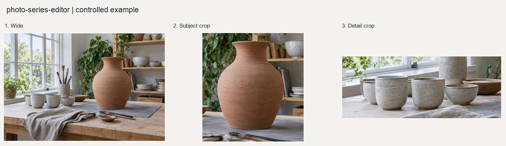

# 组照编排

为已经完成筛选的多张照片建立顺序、节奏、开场、转场和收束。

## 输入与输出

输入为已选照片列表。输出包括编号联系表、序列JSON、CSV和非破坏性文件清单。

## 使用示例

> 把这组已经选好的照片编排成一个有开场、转场和收束的序列，先给我看联系表。

提供照片与需求后，按[执行说明](SKILL.md)处理。Python调用方式见[函数示例](examples/basic_usage.py)。

## 图片示例

查看[输入、参数与处理结果](examples/README.md)，或使用[复现代码](examples/reproduce.py)运行随附案例。

## 使用说明

自动顺序只是草稿；最终顺序由人工确认，原文件不移动、不重命名。

## 适合什么任务

适合已选照片的旅行故事、活动回顾、作品集或社交轮播编排。重点是开场、画面之间的节奏、转场和结尾，而非单张处理。

## 如何准备素材和选择设置

提供已选照片及叙事目标。chronology保留时间顺序，visual-rhythm形成视觉节奏草稿，manual遵循指定顺序。若某张必须开场或事件必须按时间展开，应明确说明。

## 完整请求示例

> 把这组已选旅行照片编为轮播，以到达场景开场、夜景收束，中间交替远景和细节。先给编号联系表，再确定最终顺序。

这段请求可连同素材交给能读取本目录[执行说明](SKILL.md)的模型。图片处理需要相应Python依赖；生成式图片需要运行环境提供生图能力。文字对话本身不等于已经执行处理。

## 如何阅读和验收结果

输出联系表、序列JSON与CSV清单。自动颜色和明暗排序不能判断事件意义，需要实际查看整组照片。最终清单保留原路径，原文件不移动、不重命名。
