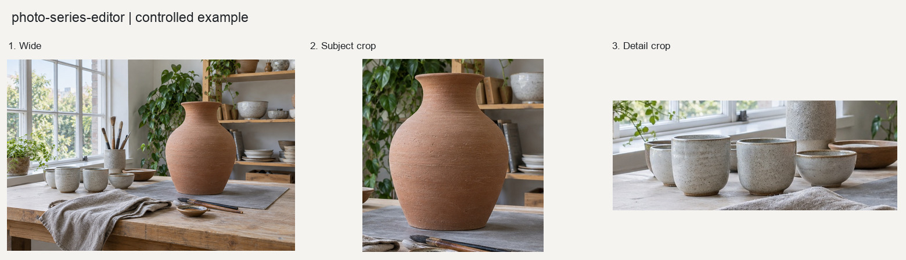

# 组照编排

为已经选好的照片建立顺序与视觉节奏，输出编号联系表和非破坏性清单。适合轮播、作品集和旅行组照的初稿编排。



图示为随附案例的实际处理输出。素材、参数和验证范围见文末。

## 1. 输入要求

输入为已经选定的照片和编排要求。固定开场、结尾及事件时序由用户说明，再结合联系表人工调整。执行规范见[SKILL.md](SKILL.md)。

> 编排这组旅行照片，以到达场景开场、夜景收束，中间交替远景与细节。先给编号联系表供我调整，确认后输出最终顺序，不移动或重命名原文件。

## 2. 处理流程与依赖

[photo_series_editor.py](scripts/photo_series_editor.py)建立非破坏性顺序草案，不修改单张照片。

1. 读取方向、EXIF时间和文件哈希，保留原始路径。
2. 计算画幅、亮度、饱和度、Lab颜色、边缘密度及基于DCT的感知哈希。
3. chronology按可用时间排序，visual-rhythm依据特征变化组织节奏，manual保留用户给定顺序。
4. 标记相似照片及相邻重复风险，生成编号联系表。
5. 人工查看整体节奏并调整顺序后，使用manual记录终稿状态。

NumPy承担特征与距离计算，OpenCV承担颜色空间、边缘和DCT运算，Pillow负责EXIF读取与联系表。运行要求为Python3.10+，版本见[requirements.txt](requirements.txt)。

## 3. 核心接口与参数

`build_series`统一生成序列与联系表。人工确认后的终稿使用已排好顺序的路径列表，选择`manual`并记录复核状态，不让自动草稿直接成为终稿。

下表列出关键参数。默认值与当前接口定义一致，完整参数以源码为准。

| 参数 | 默认值或要求 | 说明 |
| --- | --- | --- |
| `strategy` | `visual-rhythm` | 可选`chronology`、`visual-rhythm`或`manual`。 |
| `visual_review_confirmed` | `False` | 记录人工复核；只有`manual`策略允许设置为`True`。 |

## 4. 调用示例

以下代码在本skill根目录的Python会话中运行，直接调用处理接口：

```python
from pathlib import Path
import sys

sys.path.insert(0, str(Path("scripts").resolve()))
from photo_series_editor import build_series

draft = build_series(
    ["arrival.jpg", "detail.jpg", "night.jpg"],
    "series-draft", strategy="visual-rhythm",
    visual_review_confirmed=False,
)
```

查看联系表并调整路径顺序后，使用`manual`策略生成终稿。完整草稿与确认流程见见[调用示例](examples/basic_usage.py)及[图片复现函数](examples/reproduce.py)。

## 5. 交付文件与质量控制

### 5.1 文件与结果解释

`series_contact_sheet.jpg`提供顺序预览；`series_sequence.json`与CSV记录原路径、编号及画面特征。初稿保持`draft-review-required`，人工确认后的manual结果才可记录为`series-reviewed`。

### 5.2 参数选择与失败条件

事件顺序重要时采用chronology并核对EXIF；需要比较画幅、颜色及密度变化时采用visual-rhythm；已有编辑方案时采用manual。用户要求的开场和结尾需要通过实际顺序落实，不能假定程序自动理解文件名。

检查连续相似画面、远近景交替及转场是否合理。缺少时间、重复路径或不存在文件需先解决；自动视觉距离不能判断照片的事件意义，原文件不移动、不改名。

## 6. 示例与验证

基础示例来自同一底图的全景、近景和细节取景，结果仍保持待复核草稿状态。它不是独立实拍故事，也不证明程序理解了事件叙事。查看[序列记录](examples/README.md)及[其他题材案例](examples/cases/README.md)。
