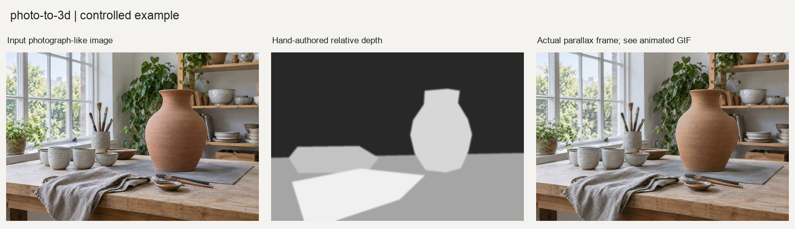

# 单张照片立体化

从单张照片与相对深度生成2.5D视差图片、交互HTML、循环GIF或正面浅浮雕网格。适合照片展示，不是完整三维重建。



图示为随附案例的实际处理输出。素材、参数和验证范围见文末。

## 1. 输入要求

输入为单张照片，可选与其对齐的相对深度图。深度使用近白远黑约定，方向相反时明确反转；无深度图时需具备本地模型推理条件。执行规范见[SKILL.md](SKILL.md)。

> 用这张照片和对应深度图生成轻微鼠标视差及循环GIF。保留原照颜色和构图，检查人物、栏杆及遮挡边缘。不需要完整环绕模型，也不下载新的模型权重。

可选`depth`、`parallax`、`relief`或`bundle`，分别输出深度、视差、浮雕或整套文件。

## 2. 处理流程与依赖

入口为[photo_to_3d.py](scripts/photo_to_3d.py)，深度处理与模型推理见[depth_engine.py](scripts/depth_engine.py)，浮雕导出见[mesh_export.py](scripts/mesh_export.py)。

1. 读取照片并记录方向、尺寸与哈希，保留原照颜色和正面纹理。
2. 优先读取用户深度图；缺省时加载本地Depth Anything V2 Small推理相对深度。下载默认关闭。
3. 用稳健分位范围规范化深度，再做边缘保留平滑；确认近白远黑方向及有效动态范围。
4. parallax根据深度改变局部位移，输出交互HTML和循环GIF；relief把深度转换为规则高度场，建立UV并关联原照纹理。
5. 验证深度、帧变化和导出结构，保存配方与验证记录。自动检查不代替人物和遮挡边缘的视觉复核。

NumPy负责深度与几何数值，OpenCV负责平滑和重映射，Pillow负责照片及动画。自动估深额外需要PyTorch、Transformers和本地权重，用户深度图路径不触发模型推理。运行要求为Python3.10+，依赖见[requirements.txt](requirements.txt)，方法见[深度说明](references/depth-estimation.md)、[输出模式](references/output-modes.md)与[限制说明](references/limitations.md)。

## 3. 核心接口与参数

`analyze_photo`分析输入；`estimate_depth`获取相对深度；`convert_photo_to_3d`组织深度、视差或浮雕导出。

下表列出关键参数。默认值与当前接口定义一致，完整参数以源码为准。

| 参数 | 默认值或要求 | 说明 |
| --- | --- | --- |
| `mode` | `bundle` | 可选`depth`、`parallax`、`relief`或`bundle`。 |
| `depth_map_path` | `None` | 外部深度图路径；提供后不调用自动估深。 |
| `allow_model_download` | `False` | 是否允许下载估深权重。 |
| `invert_depth` | `False` | 反转深度方向。 |
| `parallax_strength` | `0.02` | 视差幅度系数；增大会提高遮挡边缘失真风险。 |
| `mesh_resolution` | `256` | 浮雕网格采样分辨率，不等于几何精度。 |

## 4. 调用示例

以下代码在本skill根目录的Python会话中运行，直接调用处理接口：

```python
from pathlib import Path
import sys

sys.path.insert(0, str(Path("scripts").resolve()))
from photo_to_3d import analyze_photo, convert_photo_to_3d

analysis = analyze_photo("photo.jpg")
result = convert_photo_to_3d(
    "photo.jpg", "parallax-review",
    mode="parallax",
    depth_map_path="depth.png",
    allow_model_download=False,
    parallax_strength=0.02,
)
```

该例调用`analyze_photo`和`convert_photo_to_3d`，使用parallax模式、强度0.02，并关闭模型下载。参数见[调用示例](examples/basic_usage.py)，随附图片的实际调用见[reproduce.py](examples/reproduce.py)。

## 5. 交付文件与质量控制

### 5.1 文件与结果解释

depth输出16位深度与检查图；parallax额外交付独立HTML和GIF；relief交付OBJ、MTL和纹理；bundle组合上述内容。JSON记录深度来源、方向、视差幅度、网格分辨率及文件路径。

16位深度编码保留相对层次，不提供米制距离。OBJ顶点和面有效仅表示文件结构可用，不证明真实几何已恢复。

### 5.2 参数选择与失败条件

深度图应与原照保持同一视点和宽高比，仅允许等比尺寸适配。不能把原照灰度直接当作可靠深度。位移以轻微视差为主，放大幅度会加重人物边缘、细杆和遮挡处的拉伸。

深度范围塌缩、非有限值、宽高比不一致或本地模型不可用时先解决输入条件。透明体和反射容易估错远近；浮雕不包含背面与被遮挡表面，不适用于完整环绕模型或真实尺寸制造。

## 6. 示例与验证

基础示例使用人工分层深度图，实际生成24帧GIF与独立HTML。它验证外部深度到视差输出，不证明自动估深或真实3D重建；本例未导出网格。查看[动态结果与深度来源](examples/README.md)及[其他题材案例](examples/cases/README.md)。
