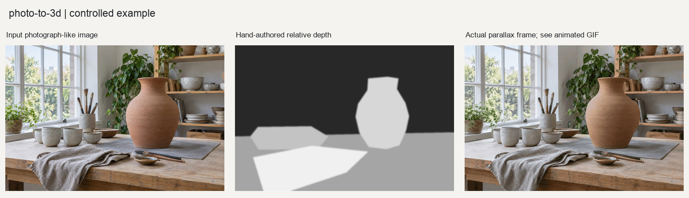

# 手工深度驱动的2.5D视差

新增[动物、城市、人物案例](cases/README.md)，含输入、实际输出和复现函数。

## 目的与输入

按可见场景分层绘制背景、桌面、杯组、花瓶和前景布料，得到近白远黑的近似相对深度。使用parallax模式、强度0.012，关闭模型下载。

工作台底图是2026-09-12专为本仓库生成的合成摄影测试素材，不是相机实拍。输入随Skill保存在[input/](input/)，调用不依赖仓库外的本机文件。
## 可复现调用

在本Skill根目录的Python会话中执行；依赖见上一级requirements.txt。输出目录必须尚不存在。

```python
import runpy

example = runpy.run_path("examples/reproduce.py")
result = example["reproduce_example"]("example-review")
```

[reproduce.py](reproduce.py)是随附图片的完整参数调用；[basic_usage.py](basic_usage.py)保留通用接口演示。两者调用原有处理实现，没有用生成图充当处理后的结果。多帧模拟仅限受控测试，实际使用仍须遵守Skill的真实输入要求。

## 实际输出与复核

生成24帧GIF、独立HTML及16位深度图，已验证帧间像素变化并查看关键帧。深度层次经过人工设计，边缘仍可能拉伸，无法揭示被遮挡表面。本例只验证外部深度到2.5D输出，不证明自动估深或真实3D重建，未导出网格。



[24帧动态示例](output/workbench_parallax.gif)；[完整输出](output/)。

处理输出在2026-09-12实际生成。验证数据覆盖本例，不是所有模式的质量认证；程序中的待人工复核状态不被擅自升级。随附JSON和CSV中的文件路径按报告所在目录相对化，原始数值及警告保留。
