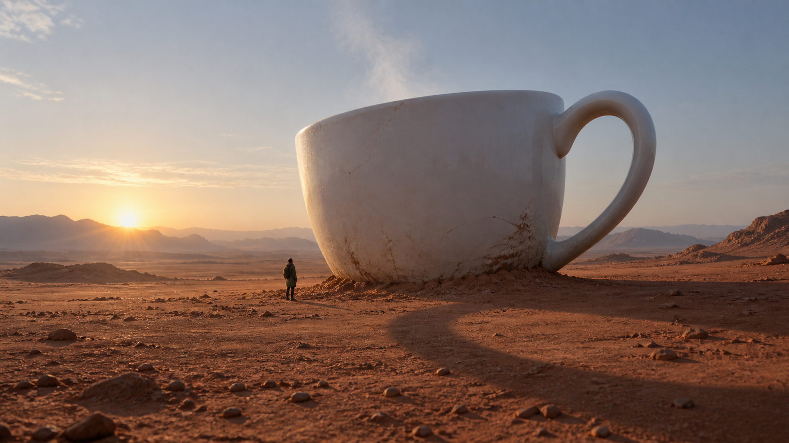

# 超现实尺度电影画面

新增[多主题实际生成案例](examples/cases/README.md)，包含提示、图片与复核说明。

通过一个明确的尺度异常，将普通物体置于可信的摄影环境中生成电影感超现实画面。适用于巨大日常物、微小人物和尺度叙事，不用于白底微缩模型、奇幻元素堆叠或简单电影调色。

## 使用

将完整目录交给能够生图与看图的Agent，输入主题或提供参考：

> 一只三层楼高的白瓷茶杯半埋在清晨沙漠，旁边一个很小的人，只有尺度超现实，其他都像摄影。

详细执行规则见[SKILL.md](SKILL.md)。默认直接生成图片，不只返回提示。没有相应工具的纯文本模型只能准备制作规格，不能假装已经生图。

## 实际示例

完整实际提示见[prompt.txt](examples/prompt.txt)。此图为主题生成，不使用他人的照片或艺术作品作素材；保存提示可以复现方向，不保证不同模型逐像素一致。

## 复核与限制

已看到巨大白瓷杯与小人物、沙地接触、低角度晨光和宽幅摄影构图。限制：提示要求的杯柄巨大环形阴影不明确，蒸汽也不突出；核心尺度叙事成立，但不能宣称所有提示细节逐项实现。

目前仅完成这一个主题实例的视觉检查，不代表跨主体稳定性已验证。本Skill无脚本、无专属厂商配置，不自动发布或推送。
