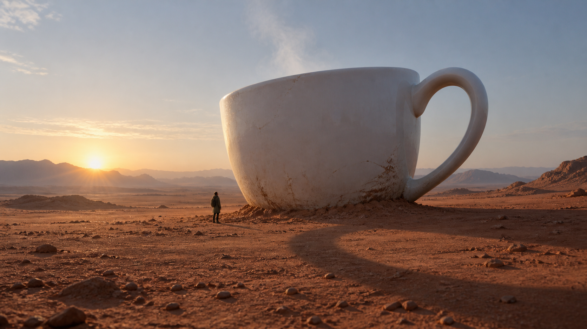

# 超现实尺度电影画面

把一个日常物体放大到异常尺度，其余场景保持可信的摄影关系。以人物、道路或建筑提供尺度参照，形成安静、压迫或荒诞的电影画面。

虚构尺度场景生成示例。提示与不同主题的处理记录见文末。

## 1. 输入与需求示例

提供日常物体、地点和尺度关系，可补充情绪、时间、天气或摄影参考。执行流程见[SKILL.md](SKILL.md)。

> 一副巨大的眼镜静卧雪原，远处一名徒步者提供尺度参照。阴天冷光，远景电影构图。镜框压入积雪，接触处有真实阴影，其余环境保持正常尺度和摄影质感，不加文字。

默认16:9横幅，输出一张图片。物体放大是主要异常，不叠加多个无关奇观。

## 2. 视觉规格

以下为构图与生成约束，不是程序接口参数。

| 控制项 | 规范 | 作用 |
| --- | --- | --- |
| 构图 | 默认16:9横幅 | 通过远近距离和留白组织电影画面。 |
| 尺度 | 一个主要尺度异常 | 人物、道路或门窗提供1至2种明确参照。 |
| 透视 | 统一摄影机与空间关系 | 放大物体的透视缩短、遮挡和投影保持一致。 |
| 接触 | 承托、压痕、反射或接触阴影 | 物体对环境产生合理影响，避免悬浮贴图感。 |
| 风格 | 其余环境保持真实摄影逻辑 | 不叠加无关奇观，默认无文字。 |

## 3. 生成流程

本目录通过Markdown场景设计与生成规范构建虚构画面，不使用Python放大贴图。图像生成同时处理主体、摄影机和环境关系。

1. 用一句明确概念定义唯一的尺度异常，确认物体轮廓与日常材质。
2. 选择人物、道路、门窗或植被作为尺度参照。参照应在画面中可读，不只在提示里声称物体巨大。
3. 根据情绪确定视点与距离：低视点强调体量，远景强调孤立。物体与环境采用同一镜头和透视关系。
4. 建立统一光向、天气和接触条件，处理压痕、遮挡、反射和大尺度阴影。
5. 查看整体空间与局部接地关系，最多两轮定向修正。粗糙拼贴优先修光照和接触，不靠颗粒或色调掩盖错误。

参考照片可用于环境或物体身份；用户要求保留的结构应明确写入生成约束，不将参考中的所有元素同时复制。

## 4. 交付与质量控制

### 4.1 交付与质量判断

默认交付16:9无字图片。缩略图中应同时读出主体和尺度参照，完整图中应能解释物体如何处于地面、沙土或其他承托环境。

接触阴影、投影方向和空气透视需一致。若画面像玩具沙盘，应检查棚拍俯视、底座和环境尺度；若只有电影色调而缺少明确比例关系，则未完成尺度表达。

### 4.2 使用边界

虚构场景不作为真实事件记录。物体材质与轮廓仍需人工复核，不提供物理仿真或工程尺寸。默认不叠加悬浮、门户和多重奇观，除非用户另行指定创作方向。

## 5. 示例与素材依据

示例为虚构影像。查看[生成提示](examples/prompt.txt)及[其他场景](examples/cases/README.md)。
