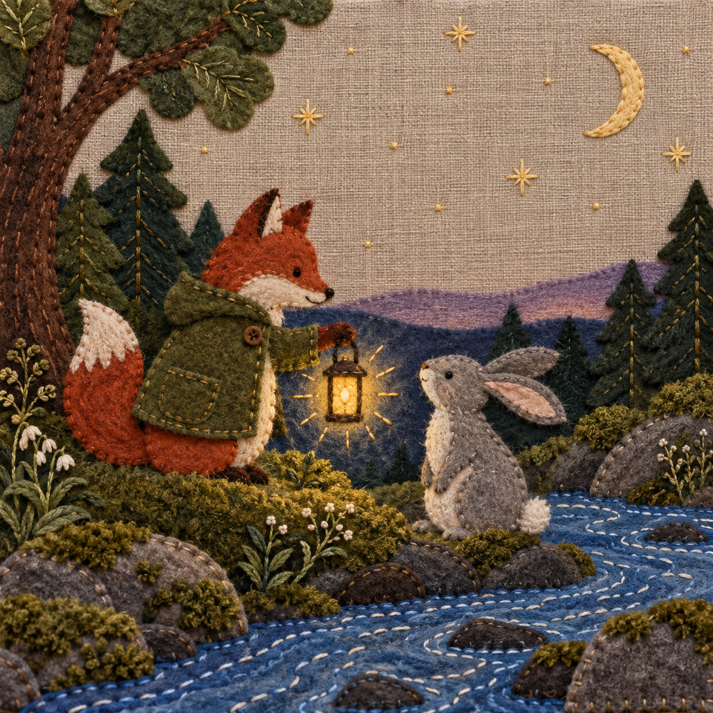

# 布艺刺绣故事场景

将短故事、角色或主题表现为毛毡、布贴和刺绣构成的场景插画，以针脚、纤维和角色动作营造手工绘本质感。

## 输入与输出

输入故事主题或角色参考，可指定动作、配色和画幅。输出一张布艺叙事插画。

## 使用示例

> 做一个狐狸把灯笼递给兔子的布艺故事场景，溪流用蓝布和针脚表现。

使用时提供主题或参考图片，由具备图像生成与查看能力的模型按[执行说明](SKILL.md)完成。

## 图片示例

查看[生成提示](examples/prompt.txt)和[更多主题图片](examples/cases/README.md)。

## 使用说明

角色和环境都以织物造型表达；参考中的细节会根据布片与针脚的表现方式重新组织。
