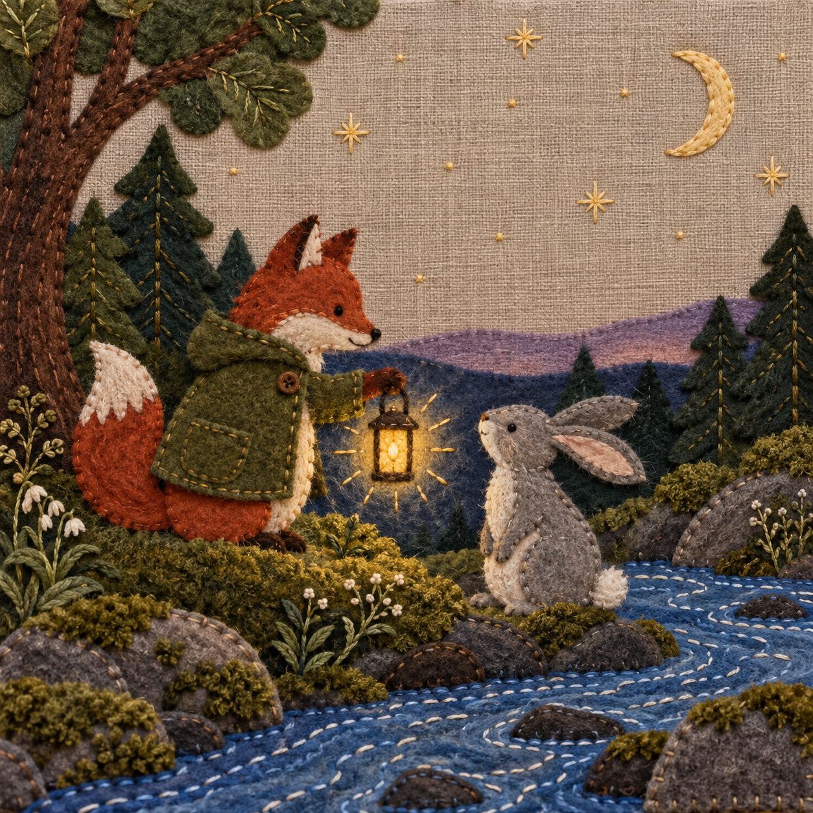
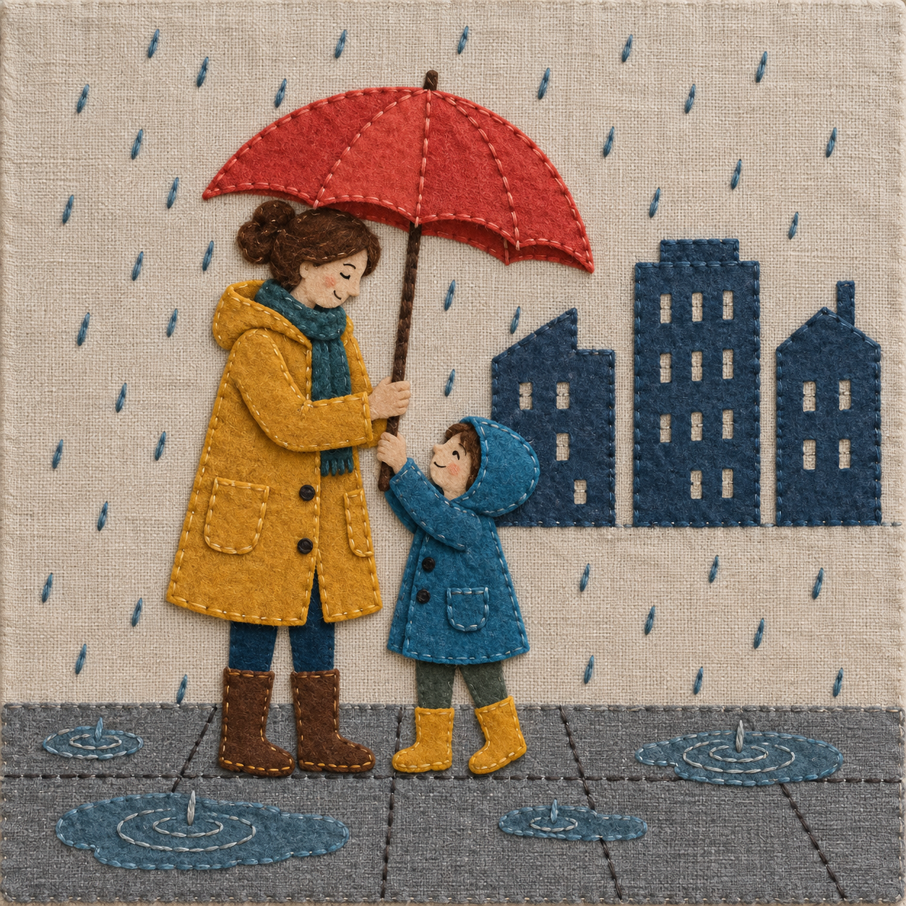
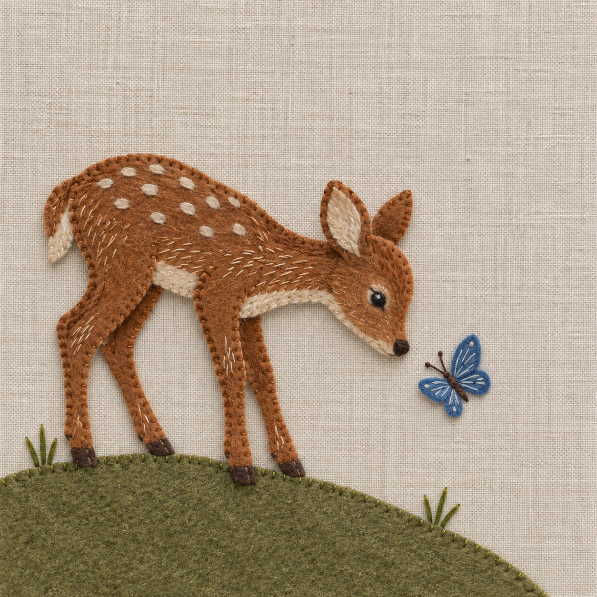

# 布艺刺绣故事场景

用毛毡、布贴和针脚表现一个有动作的小故事。角色和环境都由织物构成，适合绘本插画、角色场景和手工材料主题视觉。

布艺风格数字生成示例。故事提示与其他场景见文末。

## 1. 输入与需求示例

提供一句故事、一个动作或角色参考，可指定角色辨识色和场景配色。叙事围绕一个清楚的主要动作展开。执行流程见[SKILL.md](SKILL.md)。

> 一只小鹿把红围巾递给树下的兔子。角色用毛毡和布贴表现，雨丝用细针脚，溪流由蓝布拼接。背景留出纯布空白，柔和侧光显出纤维，不加文字。

默认1:1方形、无文字，交付一张布艺叙事插画。

## 2. 视觉规格

以下为构图与生成约束，不是程序接口参数。

| 控制项 | 规范 | 作用 |
| --- | --- | --- |
| 画幅 | 默认1:1，无文字 | 围绕主要动作安排角色与留白。 |
| 主体材料 | 毛毡与布贴 | 布片本身形成角色和地形，而非覆盖普通插画。 |
| 细节材料 | 刺绣针脚 | 眼睛、细枝、雨丝等细节具有可读的缝合或描绘关系。 |
| 层叠 | 布片厚度与柔和侧光 | 通过纤维、叠压与轻微阴影形成材料质感。 |
| 叙事 | 动作、视线与物体交接 | 角色关系可辨，避免只展示静态布偶。 |

## 3. 生成流程

本目录以Markdown叙事与材料规范指导生图，不含织物滤镜、缝制程序或实体纸样。目标是所有主要形体由织物构成的画面。

1. 确定一个主要动作与必要角色，例如递交物品、遮雨或相伴行走。已有角色参考时保留轮廓、服装与辨识色。
2. 为形体分配材料：亚麻或棉布承托背景，毛毡或布贴构成角色与地形，针脚表达小尺度细节。
3. 按视线、手势与身体朝向组织叙事，保留纯布空白，不依靠文字解释动作。
4. 用布片切缘、层叠、缝合和柔和侧光表现材料。水流、天空与光也使用织物语言，不混入照片元素。
5. 检查角色动作和材质，最多两轮局部修正。画面过密时减少支撑物与装饰，而不是把针脚整体磨平。

水流可用定向针迹，树皮可用长短线，光线可用放射或亮色线。这些材料选择随故事变化，不固定为同一套配色和纹理。

## 4. 交付与质量控制

### 4.1 交付与质量判断

默认交付一张1:1无字图片。故事检查关注角色关系、肢体和物品交接；材料检查关注主要形体是否由布片构成，针脚是否有连接或描绘作用。

布片可以适度蓬松和层叠，但层次主要来自材料，不应变成玻璃盒中的立体模型。柔和侧光需显出纤维与厚度，不能用强景深或眩光隐藏细节。

### 4.2 使用边界

生成图不提供可直接制作的尺寸纸样、针法、用料或缝合步骤。实物生产需要另外设计。素材仅用于数字参考，未查看的候选不能作为已完成布艺视觉交付。

## 5. 示例与应用

### 5.1 基础案例与素材依据

图片为数字生成，并非实物摄影。查看[生成提示](examples/prompt.txt)及[雨天城市、小鹿等案例](examples/cases/README.md)。

### 5.2 扩展图片案例

下列为仓库已有的生成结果，各自保留实际提示与复核记录。题材变化用于展示构图和材料处理差异，不代表所有新请求都能一次生成合格结果。

#### 5.2.1 雨中城市

表现重点：以两人共用一把红伞为主要动作，红色承担叙事焦点，雨滴与房屋也转为织物。

结果与限制：已有复核确认共伞动作明确，人物、雨滴和房屋保持统一布艺语言。

[实际提示与复核记录](examples/cases/rainy-city/README.md)

#### 5.2.2 小鹿与蝴蝶

表现重点：以小鹿注视蝴蝶为单一关系，主体附近较密，周围保留亚麻空白。

结果与限制：已有结果四肢完整、注视关系明确，毛毡、缝线与亚麻留白一致；不是实物手工成品。

[实际提示与复核记录](examples/cases/deer/README.md)

### 5.3 应用请求示例

以下为重新组织的使用请求，供新任务参考；不作为已有图片的逐字生成提示，实际提示以上方案例记录为准。

#### 5.3.1 人物动作与环境统一

> 两个人共用一把红伞穿过雨中街道，做成方形布艺故事图。人物用毛毡布贴，红伞作为唯一显著暖色，雨滴由细针脚表现，房屋也用织物拼接，不混入真实摄影背景。

复核重点：先看共伞动作与角色数量，再检查所有环境元素是否延续同一材料语言。

#### 5.3.2 动物关系与留白

> 一只小鹿安静注视面前的蝴蝶，制作方形布艺故事场景。四肢完整，视线关系清楚，角色用毛毡，草地用布贴，针脚自然；周围保留亚麻空白，不增加复杂支线故事或标题。

复核重点：检查小鹿和蝴蝶是否形成明确关系，纤维与针脚应支持造型，而不是堆满装饰。
